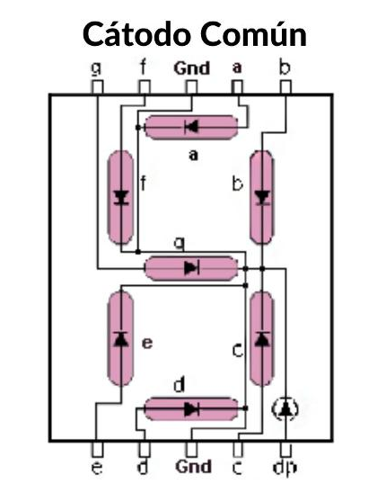
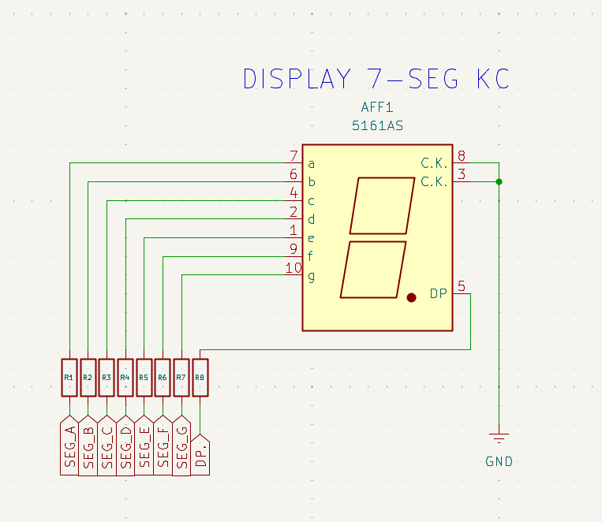

# 07_Display_7_Segmentos - Decodificación y Tablas de Búsqueda 🔢

Este proyecto consolida el manejo de salidas digitales paralelas mediante la integración de Estructuras, Arreglos, Lógica de Bits y Funciones para controlar un display de 7 segmentos de **Cátodo Común**.

<center>

</center>

## 📍 Objetivos
- Implementar una **Lookup Table** (LUT) para optimizar la decodificación numérica.
- Aplicar **Bit Masking** y **Bit Shifting** para la extracción de datos desde un bus virtual.
- Reutilizar la arquitectura de **Mapeo Genérico** de hardware definida en módulos anteriores.

---

## 💡 Concepto Físico: Cátodo Común (CC)
En un display de Cátodo Común, todos los terminales negativos (cátodos) de los segmentos están cortocircuitados internamente a un punto común conectado a **GND**.

* **Lógica Activa:** Para iluminar un segmento, el pin del STM32 debe entregar un **1 lógico (HIGH)**.
* **Protección de Hardware:** Es imperativo utilizar resistencias de limitación (220Ω - 330Ω) en cada segmento. La **STM32F439ZI** tiene un límite de corriente por pin que debe respetarse para evitar daños permanentes.

---

## 🏗️ Arquitectura del Software

### 🛠️ Estructuras y Tablas
Se han determinado dos estructuras:
- `GPIO_Config_t`: encargada de definir los pines y sus respectivos puerto a usar.
- `LedBar_t`: encargado de definir al display de 7 segmentos.
```c
/* USER CODE BEGIN PTD */

// Representa un pin físico individual
typedef struct {
    GPIO_TypeDef* port;  // GPIOA, GPIOB, etc.
    uint16_t pin;       // GPIO_PIN_0, etc.
} GPIO_Config_t;

// Representa el display de catado comun
typedef struct {
    GPIO_Config_t* leds; // Puntero a un arreglo de configuraciones
    uint8_t count;       // Cantidad de LEDs
} LedBar_t;

/* USER CODE END PTD */
```

```c
/* USER CODE BEGIN PV */

/* Mapa de bits para Cátodo Común (1 = Encendido) */
/* Orden de bits: 0 g f e d c b a */
const uint8_t segmento_map[] = {
    0x3F, // 0: 0011 1111
    0x06, // 1: 0000 0110
    0x5B, // 2: 0101 1011
    0x4F, // 3: 0100 1111
    0x66, // 4: 0110 0110
    0x6D, // 5: 0110 1101
    0x7D, // 6: 0111 1101
    0x07, // 7: 0000 0111
    0x7F, // 8: 0111 1111
    0x6F  // 9: 0110 1111
};

#define MAX_DIGITOS (sizeof(segmento_map) / sizeof(segmento_map[0]))    //De forma automática se calcula la cantidad de dígitos que se puede representar.

// Mapeo físico: Conecta los segmentos A-G a los pines que prefieras
GPIO_Config_t pines_display[] = {
    {GPIOB, GPIO_PIN_8}, // Segmento A
    {GPIOB, GPIO_PIN_9}, // Segmento B
    {GPIOA, GPIO_PIN_5}, // Segmento C
    {GPIOA, GPIO_PIN_6}, // Segmento D
    {GPIOA, GPIO_PIN_7}, // Segmento E
    {GPIOD, GPIO_PIN_14}, // Segmento F
    {GPIOD, GPIO_PIN_15}  // Segmento G
};
#define SEGMENT_COUNT (sizeof(pines_display) / sizeof(pines_display[0]))    //De forma automática se calcula la cantidad de segmentos a manejar

LedBar_t miDisplay = {pines_display, SEGMENT_COUNT};    //Se crea el display según la cantidad de pines y segmentos

/* USER CODE END PV */
```

### 🛠️ La Tabla de Búsqueda (Lookup Table)
En lugar de procesar lógica pesada con `if` o `switch-case`, almacenamos los patrones en un arreglo `const` en la memoria Flash. El número que deseamos mostrar actúa directamente como el **índice** del arreglo, reduciendo la latencia de ejecución.

#### 📋 Tabla de Caracteres (Cátodo Común)
Esta tabla solo es valida para display de 7 segmentos `cátodo común`, en caso de usar un display de 7 segmentos `ánodo común` se deben invertir los valores del patrón en binario.

| Dígito | Patrón Binario (gfedcba) | Hexadecimal |
| :---: | :---: | :---: |
| **0** | `0011 1111` | `0x3F` |
| **1** | `0000 0110` | `0x06` |
| **2** | `0101 1011` | `0x5B` |
| **3** | `0100 1111` | `0x4F` |
| **4** | `0110 0110` | `0x66` |
| **5** | `0110 1101` | `0x6D` |
| **6** | `0111 1101` | `0x7D` |
| **7** | `0000 0111` | `0x07` |
| **8** | `0111 1111` | `0x7F` |
| **9** | `0110 1111` | `0x6F` |

---

## 💻 Lógica de Extracción de Bits (Bit-Banging)
Para enviar el patrón de un byte a los 7 pines físicos distribuidos en la estructura genérica, aplicamos una técnica de extracción bit a bit mediante la función `Display_Write`:

```c
void Display_Write(uint8_t numero) {
    if (numero >= MAX_DIGITOS) return; // Protección
    uint8_t patron = segmento_map[numero]; // Acceso directo por índice

        for (int i = 0; i < 7; i++) {
    // 1. Desplazamos el bit de interés (i) hacia la posición del LSB (derecha).
    // 2. Aplicamos una máscara AND 0x01 para aislar el estado de ese segmento.
        uint8_t estado = (patron >> i) & 0x01;
    
    // 3. Escribimos el estado en el hardware mapeado en nuestra estructura.
        HAL_GPIO_WritePin(miDisplay.leds[i].port, miDisplay.leds[i].pin, estado);
        }
}
```

##  Aplicación
Mediante un ciclo for recorremos uno a uno el mapa de patrones mediante la función `Display_Write(i)`

```c
  while (1)
  {
	  // Contador simple de 0 a 9
	      for (uint8_t i = 0; i < MAX_DIGITOS; i++) {
	          char msg[32];
	          sprintf(msg, "Mostrando: %u\r\n", i);
	          Debug_Log(msg);

	          Display_Write(i);
	          HAL_Delay(1000);
	      }
  }
```
---

## 💻 Circuito de Prueba

<center>

</center>


### 🎛️ Mapeo de Hardware

| Pin (MCU) | Puerto | Descripción |
| :--- | :--- | :--- |
| **PB8** | GPIOB | **SEG_A** |
| **PB9** | GPIOB | **SEG_A** |
| **PA5** | GPIOA | **SEG_A** |
| **PA6** | GPIOA | **SEG_A** |
| **PA7** | GPIOA | **SEG_A** |
| **PD14** | GPIOD | **SEG_A** |
| **PD15** | GPIOD | **SEG_A** |

---


## 🔬 Hacia la Arquitectura de Software

Aunque este laboratorio permite mostrar información numérica, todavía dependemos de la multiplexación manual y retardos bloqueantes.

---
*La eficiencia en sistemas embebidos reside en elegir las estructuras de datos que permitan al hardware hablar el lenguaje de la lógica con el menor costo de CPU posible*

🛠️ **Carlos** | Estudiante de Ing. Electrónica @UTN_FRT.  
🚀 Apasionado Autodidacta por los Sistemas Embebidos.