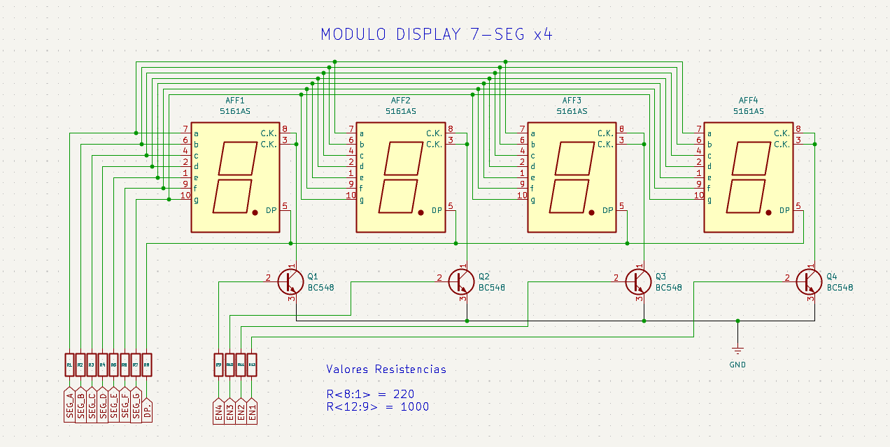

# 08_Multiplex_7Seg: Control Multiplexado e Introducción al uso de funciones 🔢

Este proyecto implementa la técnica de **Persistencia de Visión (POV)** para controlar 4 displays de 7 segmentos compartiendo un único bus de datos, optimizando drásticamente el uso de pines GPIO en la **Nucleo-F439ZI** a traves de funciones que nos irá preparando para la creación y manejo de drivers.

<center>

</center>


## 📍 Objetivos del Proyecto
- Implementar **Multiplexación por División de Tiempo** (TDM).
- Gestionar hardware mediante **Bus de Datos** compartido y pines de habilitación (*Enable*).
- Gestionar funciones para el manejo simple de hardware.
- Integrar **User Labels** en STM32CubeIDE para mejorar la portabilidad del firmware.
- Introducir la lógica de **Tiempo No Bloqueante** con `HAL_GetTick()`.


---

## 🧠 El Fenómeno POV (Persistence of Vision)
Dado que los segmentos (A-G) de todos los displays están unidos físicamente en el mismo bus, no es posible mostrar números distintos en cada dígito de forma estática. 
La solución es el **Barrido (Scan)**: encendemos un solo dígito a la vez, cargamos su valor, y pasamos al siguiente a una frecuencia superior a los **60 Hz**. El ojo humano no logra percibir el apagado intermedio, integrando la imagen como si todos los displays estuvieran encendidos simultáneamente.

---

## 🛠️ Particularidades Técnicas

### 🔌 Gestión de Hardware mediante funciones.
Este proyecto fue pensado con la idea de implementar *funciones* que facilitan el manejo de **hardware externo.** Recordando que la idea es *manejar* un **bloque de 4 displays de cátodo común** mediante la técnica de *multiplexación*, debemos tener en cuenta que se manejaran 4 transistores NPN (BC548), encargados de encender o apagar cada display. También se debe destacar que se controla un bus de 7 líneas (A-G) correspondiente a cada segmento de los displays. Lo que nos da una idea de que se deben controlar 11 salidas desde la placa hacia el exterior.

```c

/* USER CODE BEGIN PV */

// Tabla de segmentos para cátodo común (0-9)
uint8_t tabla_segmentos[] = {0x3F, 0x06, 0x5B, 0x4F, 0x66, 0x6D, 0x7D, 0x07, 0x7F, 0x6F};

// Array para guardar los 4 números que queremos mostrar (ej: {1, 2, 3, 4})
uint8_t valores_display[4] = {0, 0, 0, 0};


/* USER CODE END PV */

```

```c
/* USER CODE BEGIN PFP */
//Prototipos de Funciones

void Display_WriteBus(uint8_t byte);    //Función encargada de preparar el dígito a escribir en la linea de datos.
void Display_Mux_Scan(void);            //Función encargada de escribir dígitos en la línea de datos.

/* USER CODE END PFP */
```

```c

/* USER CODE BEGIN 0 */
// Definición de las funciones utilizadas

/**
 * @brief  Descompone un byte y actualiza los segmentos individuales del display.
 * * Esta función toma un mapa de bits (representando un carácter o número) y 
 * extrae cada bit mediante operaciones de desplazamiento (bit-shifting) y 
 * enmascaramiento para escribir el estado correspondiente en los pines GPIO.
 * * @note   Se asume una configuración de hardware donde:
 * - Bit 0: Segmento A
 * - Bit 1: Segmento B
 * - ...
 * - Bit 6: Segmento G
 * * @param  byte: Valor de 8 bits que contiene la codificación del dígito a mostrar.
 * @retval None
 */
void Display_Digit(uint8_t byte) {
    HAL_GPIO_WritePin(SEG_A_GPIO_Port, SEG_A_Pin, (byte >> 0) & 0x01);
    HAL_GPIO_WritePin(SEG_B_GPIO_Port, SEG_B_Pin, (byte >> 1) & 0x01);
    HAL_GPIO_WritePin(SEG_C_GPIO_Port, SEG_C_Pin, (byte >> 2) & 0x01);
    HAL_GPIO_WritePin(SEG_D_GPIO_Port, SEG_D_Pin, (byte >> 3) & 0x01);
    HAL_GPIO_WritePin(SEG_E_GPIO_Port, SEG_E_Pin, (byte >> 4) & 0x01);
    HAL_GPIO_WritePin(SEG_F_GPIO_Port, SEG_F_Pin, (byte >> 5) & 0x01);
    HAL_GPIO_WritePin(SEG_G_GPIO_Port, SEG_G_Pin, (byte >> 6) & 0x01);
}

/**
 * @brief  Gestiona la multiplexación de 4 dígitos de 7 segmentos.
 * * Implementa la técnica de Persistencia de Visión (POV) mediante un ciclo de 
 * barrido. La función realiza una limpieza de los habilitadores (Common Cathode/Anode), 
 * carga el valor desde el buffer 'valores_display' usando una tabla de búsqueda 
 * y activa el dígito correspondiente secuencialmente.
 * * @details El proceso sigue el algoritmo:
 * 1. Apagado total (prevención de ghosting).
 * 2. Carga de datos en el bus de segmentos.
 * 3. Activación del habilitador específico (EN1-EN4).
 * 4. Retardo de visualización (5ms).
 * * @warning Esta función es bloqueante debido al uso de HAL_Delay(). Para 
 * aplicaciones de tiempo real, se recomienda migrar a un esquema 
 * basado en interrupciones de Timer.
 * * @retval None
 */
void Display_Mux_Control(void) {
    for (int i = 0; i < 4; i++) {
        // 1. Apagar todos los habilitadores (Limpieza)
        HAL_GPIO_WritePin(EN1_GPIO_Port, EN1_Pin, GPIO_PIN_RESET);
        HAL_GPIO_WritePin(EN2_GPIO_Port, EN2_Pin, GPIO_PIN_RESET);
        HAL_GPIO_WritePin(EN3_GPIO_Port, EN3_Pin, GPIO_PIN_RESET);
        HAL_GPIO_WritePin(EN4_GPIO_Port, EN4_Pin, GPIO_PIN_RESET);
        
        // 2. Cargar el número en el bus
        Display_Digit(tabla_segmentos[valores_display[i]]);

        // 3. Encender solo el transistor que corresponde
        if (i == 0) HAL_GPIO_WritePin(EN1_GPIO_Port, EN1_Pin, GPIO_PIN_SET);
        if (i == 1) HAL_GPIO_WritePin(EN2_GPIO_Port, EN2_Pin, GPIO_PIN_SET);
        if (i == 2) HAL_GPIO_WritePin(EN3_GPIO_Port, EN3_Pin, GPIO_PIN_SET);
        if (i == 3) HAL_GPIO_WritePin(EN4_GPIO_Port, EN4_Pin, GPIO_PIN_SET);

        // 4. Retardo muy corto para que el ojo lo vea (Persistencia de Visión)
        HAL_Delay(5);
    }
}

/* USER CODE END 0 */

```

### ⏱️ Gestión de Tiempo Asíncrono con `HAL_GetTick()`
Este proyecto marca un hito: el inicio del abandono de `HAL_Delay()`. Utilizamos el contador de milisegundos interno del microcontrolador para crear tareas con diferentes ritmos.

* **Tarea 1 (Rápida):** El barrido del display (debe ser constante para evitar parpadeos).
* **Tarea 2 (Lenta):** El incremento de un contador o proceso lógico (ej. cada 100ms).

```c
/* Ejemplo de temporización no bloqueante */
if (HAL_GetTick() - ultimo_tiempo >= 100) {
    ultimo_tiempo = HAL_GetTick();
    contador_global++; // La lógica avanza sin detener el refresco visual
}
```

---

### 🎛️ Mapeo de Hardware

| Componente | Pin (MCU) | Puerto | Descripción |
| :--- | :--- | :--- | :--- |
| **SEG_A** | **PB8** | GPIOB | Segmento Superior |
| **SEG_B** | **PB9** | GPIOB | Segmento Lat. Sup. Der. |
| **SEG_C** | **PA5** | GPIOA | Segmento Lat. Inf. Der. |
| **SEG_D** | **PA6** | GPIOA | Segmento Inferior |
| **SEG_E** | **PA7** | GPIOA | Segmento Lat. Inf. Izq. |
| **SEG_F** | **PD14** | GPIOD | Segmento Lat. Sup. Izq. |
| **SEG_G** | **PD15** | GPIOD | Segmento Central |
| **EN1** | **PC8** | GPIOC | Habilitador Dígito 1 |
| **EN2** | **PC9** | GPIOC | Habilitador Dígito 2 |
| **EN3** | **PC10** | GPIOC | Habilitador Dígito 3 |
| **EN4** | **PC11** | GPIOC | Habilitador Dígito 4 |

---

## 🏷️ Abstracción con User Labels

Se configuraron etiquetas directamente en el archivo .ioc del CubeIDE. Esto permite que el código sea independiente de si el pin es el PA5 o el PB10:

* SEG_A ... SEG_G: Bus de datos para los segmentos.
* EN1, EN2, EN3, EN4: Control de transistores de habilitación (Dígitos).

## 📊 Algoritmo de Barrido (Display Scan)

Para un refresco limpio y sin "efecto fantasma" (Ghosting), se sigue este orden estrictamente:

   * 1. Apagar todos los habilitadores (EN1=0, EN2=0, EN3=0, EN4=0).
   * 2. Actualizar el bus de datos con el patrón del nuevo dígito.
   * 3. Encender el habilitador correspondiente al dígito actual.
   * 4. Pequeño delay (1-2ms) o salto de ciclo para permitir que el hardware conmute.

## ⚠️ Análisis de Limitaciones

Actualmente, la función Display_Mux_Control() vive dentro del bucle principal while(1). Esto significa que si el CPU se ocupa en una tarea pesada o bloqueante, el display comenzará a parpadear o perderá brillo.
- Hacia el Nivel Intermedio: En el futuro, moveremos este barrido a una Interrupción de Timer (Timer-IT) para que el display brille de forma autónoma, independientemente de lo que haga el programa principal.

---

*La multiplexación no es solo ahorro de pines; es el arte de sincronizar el tiempo del software con los límites de la percepción humana.*

🛠️ **Carlos** | Estudiante de Ing. Electrónica @UTN_FRT.  
🚀 Apasionado Autodidacta por los Sistemas Embebidos.