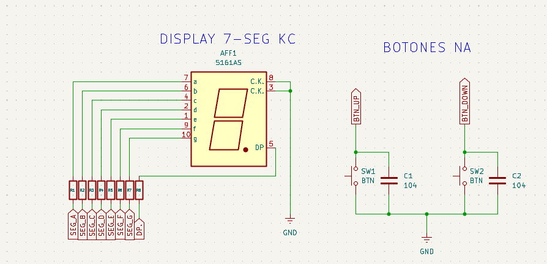
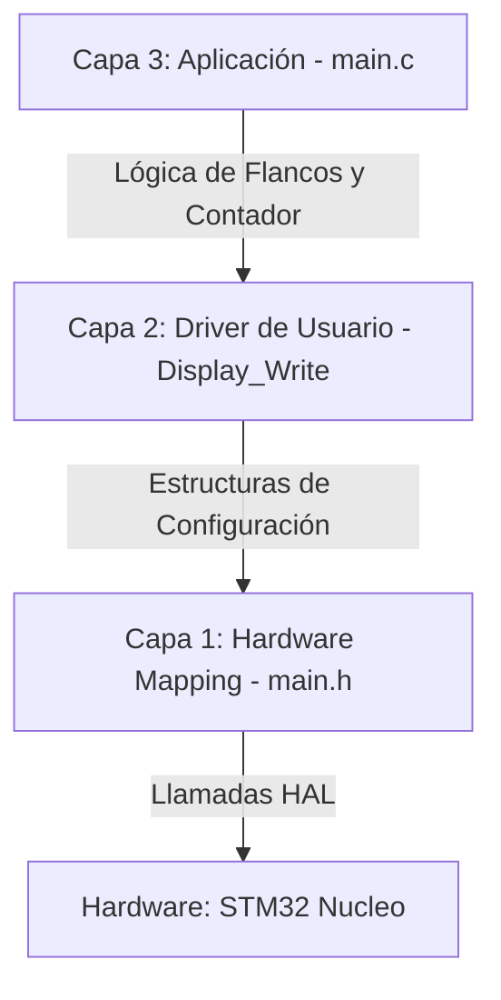

# EI_1: Contador Pro UP/DOWN

Este es el primer proyecto integrador del **Nivel Básico**. Representa la consolidación de los pilares fundamentales: manejo avanzado de GPIO, estructuras de datos reentrantes, lógica de bits, etiquetas y diseño de **Experiencia de Usuario (UX)** en sistemas embebidos.

## 📍 Objetivos del Proyecto
- Realizar un contador ascendente y descendente con un display de 7 segmentos (cátodo común) y dos pulsadores conectados a GND.
- Resolver la programación usando el **método polling** de manera robusta.
- Gestionar el hardware y programación mediante estructuras, funciones genéricas indiferentes del pin elegido gestionado mediante etiquetas(**Abstracción de Hardware**), y minimizar el uso de `hal_delay()`. 
- Gestionar entradas digitales con **Lógica Invertida (Active-Low)** y pull-up interno para minimizar debounce.
- Implementar una **Ventana de Sincronización** temporal para detección de eventos simultáneos (Reset Dual).
- Crear un sistema de **Feedback Visual** mediante patrones de parpadeo (*Blink*) para alertar sobre límites de conteo.
- Preparar el cimiento para la creación de drivers personalizados.

---

## 🔌 Especificaciones de Circuito

<center>

</center>


* **Pulsadores:** Conectados directamente a **GND** (Se recomienda el uso de capacitores en paralelo para minimizar el debounce de forma física). 
* **Display 7 Segmentos:** Cátodo Común (CC) con resistencias de limitación de 220Ω por segmento para proteger los pines del MCU.
* **Configuración del Micro:** Entradas con **Pull-Up interna** habilitada (evita estados flotantes).

---

## 🧠 Teoría de Operación Completa

El funcionamiento del sistema se rige por un ciclo cerrado de **Muestreo, Validación, Decodificación y Serialización**. A continuación, se detallan los pilares físicos y lógicos que permiten el control del contador.

### 1. Gestión de Entradas y Condicionamiento de Señal (UX & Robustez)
El sistema interactúa con el mundo físico mediante dos pulsadores configurados en lógica de **Pull-Up Interno**. Esto establece un estado de reposo en "Alto" ($VCC$), garantizando inmunidad al ruido eléctrico y evitando estados flotantes en los pines.

Para garantizar una operación profesional, se consideran dos fenómenos críticos:
* **Debounce por Software:** Debido a que los contactos metálicos de los pulsadores generan rebotes elásticos al cerrarse, se implementa un retardo de **50ms**. Este actúa como un filtro de "paso bajo" temporal, asegurando que la lógica solo procese señales estables y confirmadas.
* **Detección por Flanco (Falling Edge):** En lugar de evaluar niveles de voltaje constantes, el firmware compara el estado actual (`now`) con el estado anterior (`last`). La acción solo se dispara cuando ocurre una transición de $1 \rightarrow 0$. Esto previene que el contador se incremente descontroladamente si el usuario mantiene el botón presionado (detección de disparo único).

### 2. Ventana de Sincronización Temporal (Lógica de Reset)
Dado que es físicamente imposible para un ser humano presionar dos botones en el mismo microsegundo, el sistema implementa una **Ventana de Sincronización**. 

Al detectar la caída de tensión en cualquiera de los pines (`UP` o `DOWN`), el microcontrolador abre una ventana de guardia. Si durante este intervalo ambos botones son detectados en estado `RESET`, el firmware prioriza la acción de **Reset Global** ($contador = 0$), descartando cualquier intención de incremento o decremento individual.

### 3. Abstracción de Hardware y Deserialización de Datos
Una vez que la lógica de aplicación determina el nuevo valor del contador, se inicia el proceso de traducción de **Binario a Siete Segmentos**:

* **Búsqueda en Tabla (Look-up Table):** El valor decimal (0-9) actúa como índice para acceder a una tabla en memoria Flash que contiene los patrones de bits necesarios para el display de cátodo común.
* **Mapeo de Bits (Bit-Shifting):** El byte recuperado representa el estado de los segmentos `g-f-e-d-c-b-a`. El sistema descompone este byte bit por bit mediante operaciones de desplazamiento y máscaras (`& 0x01`), extrayendo la información booleana de cada segmento de forma individual.
* **Capa de Transporte (UHAL):** Los bits son enviados a una **Capa de Abstracción de Usuario**. Esta utiliza estructuras que contienen las direcciones base de los puertos (`GPIOA`, `GPIOB`, `GPIOD`) y los offsets de los pines, permitiendo que la información se distribuya de forma transparente por el hardware del MCU sin acoplar la lógica al pin físico.

### 4. Retroalimentación Visual (UX Feedback)
Para mejorar la experiencia del usuario, el sistema proporciona respuestas visuales ante límites operativos. Cuando el contador alcanza sus valores extremos (**0** o **9**), el firmware ejecuta una subrutina de **Blink**. Esta función alterna el estado de los segmentos a una frecuencia de **3.3 Hz** (150ms ON/OFF), comunicando visualmente que se ha alcanzado el límite del rango sin necesidad de periféricos adicionales.

---

### 🛠️ Aspectos de Diseño Considerados
* **Modularidad:** La lógica es agnóstica a los pines; se puede remapear el hardware en la Capa 1 sin alterar la lógica de aplicación.
* **Determinismo:** El tiempo de respuesta desde la pulsación hasta la actualización del display es constante y predecible.
* **Eficiencia:** El uso de desplazamientos de bits optimiza los ciclos de instrucción del CPU, evitando estructuras condicionales extensas.

---


## 🏗️ Arquitectura del Software (3 Capas)

El proyecto se estructura bajo un modelo de capas para desacoplar la lógica de aplicación del hardware específico de la HAL de ST. Esto permite que el sistema sea escalable, mantenible y portable.



### Detalle de Capas e Implementación

#### Capa 1: Hardware Mapping (Abstracción de Pines)
Se utilizan estructuras personalizadas para referenciar el hardware. Esto permite que el driver sea **reentrante**, facilita el mantenimiento ante cambios en el diseño del PCB y abstrae la complejidad de la HAL.

Al utilizar un puntero al puerto (`GPIO_TypeDef*`), la función puede acceder a cualquier puerto del microcontrolador (A, B, C, D, etc.) de manera genérica, eliminando la necesidad de múltiples funciones `if/else` para cada pin.

```c
/**
 * @brief Estructura que representa un pin físico individual.
 * Permite agrupar el puerto y el número de pin en una sola entidad lógica.
 */
typedef struct {
    GPIO_TypeDef* port;  // Dirección base del puerto (ej. GPIOA)
    uint16_t pin;        // Máscara del pin (ej. GPIO_PIN_5)
} GPIO_Config_t;
```

#### Capa 2: Driver de Display (Serialización / Deserialización)
La función `Display_Write()` actúa como un puente lógico que "esparce" un byte (patrón de bits) sobre pines físicos que pueden estar dispersos en diferentes puertos. Este proceso se conoce como **deserialización de datos**.

Al utilizar **Bit-Shifting**, el driver extrae la información de cada bit del patrón recuperado de la tabla de segmentos y la direcciona al pin correspondiente almacenado en la estructura de la Capa 1.

```c
/**
 * @brief Traduce un número decimal a señales físicas en el display.
 * @param numero: Valor a mostrar (0-9).
 */
void Display_Write(uint8_t numero) {
    if (numero >= MAX_DIGITOS) return; // Protección contra desbordamiento
    
    uint8_t patron = segmento_map[numero];
    
    for (int i = 0; i < SEGMENT_COUNT; i++) {
        // Extraemos el bit 'i' usando desplazamiento a la derecha y máscara 0x01
        uint8_t estado = (patron >> i) & 0x01;
        
        // Acceso indirecto al hardware mediante la estructura de abstracción
        HAL_GPIO_WritePin(miDisplay.leds[i].port, miDisplay.leds[i].pin, estado);
    }
}
```

---

## 🔌 Mapeo de Hardware

### 🗺️ Tabla de Conexiones
Se detalla la asignación de pines del microcontrolador. Gracias a la **Abstracción de Hardware**, estos pines pueden ser remapeados en el archivo de configuración sin alterar la lógica del driver.

| Componente | Etiqueta (Software) | Pin (MCU) | Puerto | Descripción |
| :--- | :--- | :--- | :--- | :--- |
| **SEG_A** | `SEG_A_Pin` | **PB8** | GPIOB | Segmento Superior |
| **SEG_B** | `SEG_B_Pin` | **PB9** | GPIOB | Segmento Lat. Sup. Der. |
| **SEG_C** | `SEG_C_Pin` | **PA5** | GPIOA | Segmento Lat. Inf. Der. |
| **SEG_D** | `SEG_D_Pin` | **PA6** | GPIOA | Segmento Inferior |
| **SEG_E** | `SEG_E_Pin` | **PA7** | GPIOA | Segmento Lat. Inf. Izq. |
| **SEG_F** | `SEG_F_Pin` | **PD14** | GPIOD | Segmento Lat. Sup. Izq. |
| **SEG_G** | `SEG_G_Pin` | **PD15** | GPIOD | Segmento Central |
| **BTN_UP** | `BTN_UP_Pin` | **PB10** | GPIOB | Pulsador Incremento |
| **BTN_DOWN**| `BTN_DOWN_Pin` | **PB11** | GPIOB | Pulsador Decremento |

### 📊 Tabla de Caracteres (Cátodo Común)
Mapeo lógico para la formación de números en el display. El bit menos significativo (LSB) corresponde al segmento **A**.

| Dígito | Patrón Binario (gfedcba) | Hexadecimal |
| :---: | :---: | :---: |
| **0** | `0011 1111` | `0x3F` |
| **1** | `0000 0110` | `0x06` |
| **2** | `0101 1011` | `0x5B` |
| **...** | `...` | `...` |
| **9** | `0110 1111` | `0x6F` |

---

## 🛠️ Detalles de Robustez y UX

### Gestión de Límites (Blink Feedback)
Para una UX profesional, el sistema informa proactivamente cuando una acción es inválida. Si el usuario intenta decrementar por debajo de 0 o incrementar sobre 9:
* Se dispara la función `Display_Blink()`.
* El dígito parpadea a una frecuencia de **3.3Hz** durante **2 ciclos**.
* Esto proporciona una respuesta clara al usuario indicando que el sistema ha alcanzado un **límite de software**.

### Detección de Eventos No Bloqueante
El uso de variables de **estado anterior** (`btn_up_last`) permite que el bucle principal `while(1)` no se detenga en esperas infinitas. Esta arquitectura prepara el código para futuras integraciones, como la multiplexación de más dígitos o comunicaciones serie, sin degradar el tiempo de respuesta del sistema.

---

## 🚀 Roadmap: Mejoras Futuras

Para evolucionar este prototipo hacia un estándar de nivel industrial y maximizar el aprovechamiento de los recursos del MCU, se plantean las siguientes líneas de mejora:

### 1. Migración a Código No Bloqueante (FSM + Timers)
Actualmente, el sistema depende de `HAL_Delay()` para el antirrebote (*debounce*) y el parpadeo (*blink*), lo que detiene la ejecución total del programa.
* **Objetivo:** Eliminar todos los retardos bloqueantes para permitir multitasking.
* **Implementación:** Utilizar una **Máquina de Estados Finitos (FSM)** junto al periférico **SysTick** o un **Timer básico (TIM6/7)**. Esto permitirá que el CPU realice tareas secundarias (como sensado o comunicaciones) mientras se gestionan los tiempos de parpadeo de forma asíncrona.

### 2. Gestión de Entradas por Interrupción (EXTI)
Sustituir el método de *polling* actual por interrupciones externas para optimizar el consumo de energía.
* **Objetivo:** Aumentar la eficiencia energética y la velocidad de respuesta del sistema.
* **Implementación:** Configurar los pines de los pulsadores como `EXTI_Line` con detección de flanco de bajada. Esto permitiría al microcontrolador entrar en modos de bajo consumo (**Sleep Mode**), despertando instantáneamente solo ante la interacción del usuario.

### 3. Multiplexación Dinámica de "N" Dígitos
Escalar el sistema para controlar un display de 4 dígitos (o más) utilizando el mismo bus de datos.
* **Objetivo:** Representar valores superiores a 9 (ej. cronómetros, termómetros, contadores de 4 cifras).
* **Implementación:** Implementar una técnica de **Persistencia de Visión (POV)** controlada por una interrupción periódica de Timer (ej. cada 5ms), conmutando los habilitadores de forma cíclica para reducir el uso de pines GPIO.

### 4. Comunicación y Monitoreo Remoto (UART/CLI)
Integrar una interfaz de comandos simple (Command Line Interface) a través de la UART3.
* **Objetivo:** Monitorear el estado del contador y permitir el control remoto (Set/Reset) desde una PC.
* **Implementación:** Desarrollar un **Parser de Comandos** que procese cadenas de texto recibidas por la UART, permitiendo la interacción mediante terminales serie como PuTTY o TeraTerm.

### 5. Debounce por Hardware
Reforzar la robustez del sistema ante ruido eléctrico severo o pulsadores de baja calidad mecánica.
* **Objetivo:** Eliminar el ruido transitorio antes de que la señal ingrese al microcontrolador.
* **Implementación:** Incorporar filtros **RC (Resistor-Capacitor)** y comparadores **Schmitt Trigger** en las líneas de entrada, reduciendo la dependencia de filtros por software y liberando ciclos de instrucción.

---

## 🏁 Conclusión
Este proyecto demuestra que la simplicidad de un contador no es excusa para prescindir de **buenas prácticas de ingeniería**. La implementación de una arquitectura basada en capas, la gestión de eventos por flancos y el enfoque en el feedback de usuario posicionan este desarrollo como una base sólida y profesional para sistemas embebidos de mayor complejidad.

---
*"La robustez de este contador no radica en los pines utilizados, sino en la arquitectura de capas que permite al software gobernar el hardware sin quedar encadenado a él."*

🛠️ **Carlos** | Estudiante de Ing. Electrónica @UTN_FRT.  
🚀 Apasionado Autodidacta por los Sistemas Embebidos.