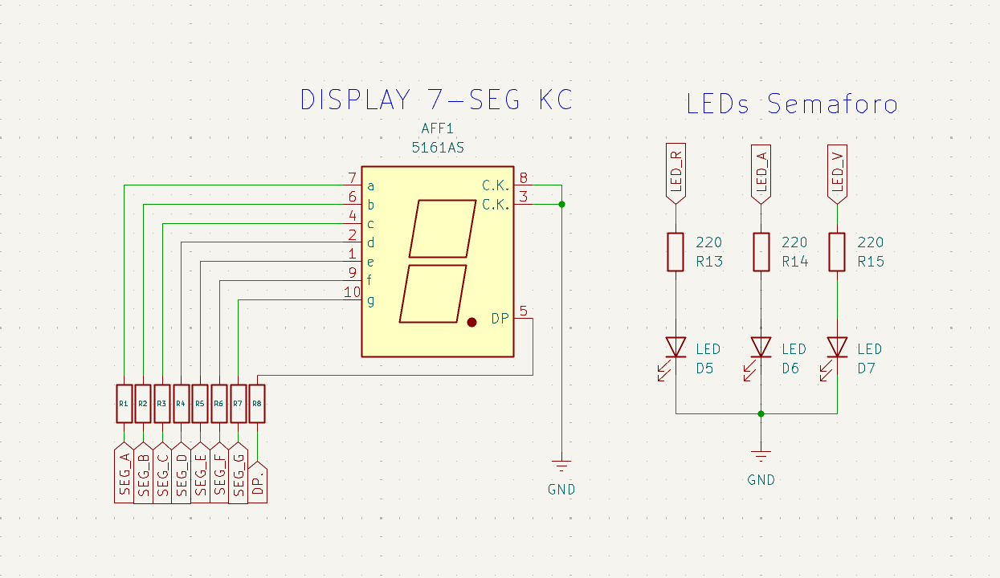
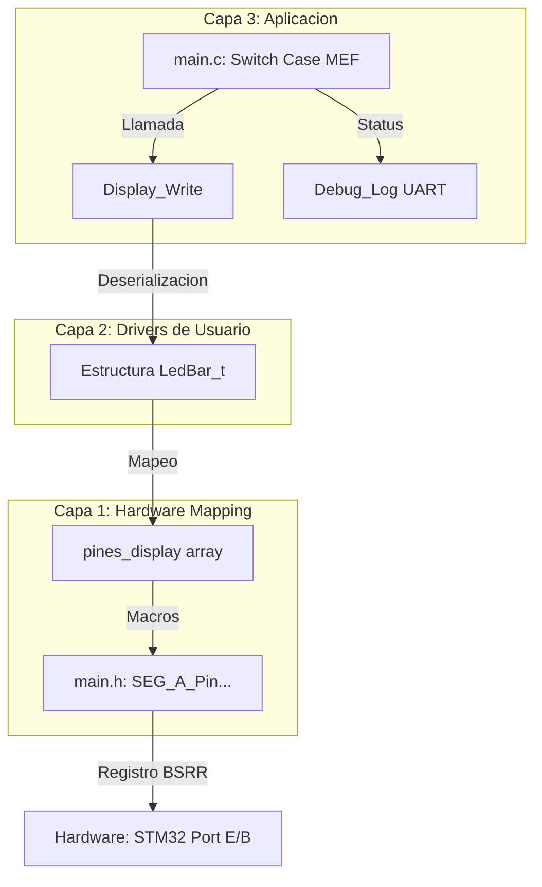

# EI_2: Semáforo Automático con Arquitectura FSM y Temporizador Visual 🚦

Este proyecto integrador del **Nivel Básico** demuestra el control de un sistema secuencial crítico mediante una **Máquina de Estados Finitos (FSM)**. Se coordina la señalización vial vehicular con un contador regresivo de seguridad para el cruce peatonal, garantizando un flujo determinista y seguro.

## 📍 Objetivos del Proyecto
- Implementar una **Máquina de Estados Finitos (MEF)** robusta para la gestión de procesos.
- Sincronizar periféricos de salida simple (LEDs) con salidas decodificadas (Display 7-Seg).
- Implementar **UART** para el monitoreo de transiciones y tiempos de ciclo.
- Aplicar secuencias de seguridad vial estándar.

---

## 🔌 Especificaciones de Circuito

<center>

</center>


- **Leds:** 4 LEDs de alta luminosidad con resistencias de limitación calculadas para operación continua.
- **Botones:** 4 botones NA conectados a gnd con capacitores de 100 nF en paralelo para minimizar debounce.
- **Telemetría:** Interfaz UART3 a **115200 bps** para logs de diagnóstico.

---

## 🧠 Teoría de Operación

### 1. Máquina de Estados (MEF)
A diferencia de un programa secuencial lineal, el semáforo utiliza una **Máquina de Estados Finitos (MEF)**. Al segmentar el programa en estados definidos, logramos:

1. **Determinismo:** El sistema siempre reside en un estado conocido, eliminando comportamientos erráticos.
2. **Seguridad:** Las transiciones están validadas; no es posible saltar de un estado de "Verde" a "Rojo" sin pasar por la advertencia del "Amarillo".
3. **Mantenibilidad:** Facilita la expansión (ej: agregar un botón de pedido de cruce peatonal) sin reescribir la lógica principal.

### Estados del Ciclo Vial utilizado en la MEF:
* **ROJO:** Alto total. Se activa el **Temporizador Visual** para informar al peatón/conductor el tiempo restante de espera.
* **PRE-VERDE:** Seguridad reforzada (Amarillo + Rojo simultáneos) según normativas específicas.
* **VERDE:** Flujo vehicular habilitado (Prioridad de paso).
* **AMARILLO:** Transición de advertencia (Precaución y despeje de intersección).

Aplicación en la máquina de estados.
```c
    //Enum para determinar tareas de la MEF
    typedef enum {
	    ESTADO_ROJO,
	    ESTADO_PREVERDE,
	    ESTADO_VERDE,
	    ESTADO_AMARILLO,
    } Semaforo_State_t;

    // --- Se crea una Instancia de estado inicial para la MEF a partir del enum Semaforo_state_t ---
    Semaforo_State_t estadoActual = ESTADO_ROJO;

    //Dentro del while (1)
	switch (estadoActual){
		case ESTADO_ROJO:
            /*Acciones a ejecutar en estado Rojo (Alto vehicular, avance peaton) */
			estadoActual = ESTADO_PREVERDE;
			break;
		case ESTADO_PREVERDE:
            /* Acciones a ejecutar en estado Pre-verde (Prepare para avanzar) */
			HAL_Delay(2000);
			estadoActual = ESTADO_VERDE;
			break;

		case ESTADO_VERDE:
            /* Acciones a ejecutar en estado verde (Avance vehicular) */
			HAL_Delay(8000);
			estadoActual = ESTADO_AMARILLO;
			break;

		case ESTADO_AMARILLO:
            /* Acciones a ejecutar en estado Amarillo (Precaución) */
			HAL_Delay(3000); // Tiempo normal de verde
			estadoActual = ESTADO_ROJO;
			break;
		}

```

### 2. Abstracción de Hardware (Estructuras de Capa 1)
El firmware implementa un modelo de **objetos en C** para desacoplar el software del silicio. Mediante la estructura `GPIO_Config_t` y `LedBar_t`, la lógica de aplicación no manipula números de pines o registros de forma directa, sino que interactúa con **"instancias de hardware"**.

```c
/* --- Estructura para definir puertos y pines a usar --- */
typedef struct {
    GPIO_TypeDef* port;  // GPIOA, GPIOB, etc.
    uint16_t pin;       // GPIO_PIN_0, etc.
} GPIO_Config_t;

/* --- Estructura para definir un display de 7 segmentos--- */
typedef struct {
    GPIO_Config_t* leds; // Puntero a un arreglo de configuraciones
} LedBar_t;


// --- Mapeo físico: Conecta los segmentos A-G a los pines definidos en el .ioc ---
GPIO_Config_t pines_display[] = {
    {SEG_A_GPIO_Port, SEG_A_Pin}, // Segmento A
    {SEG_B_GPIO_Port, SEG_B_Pin}, // Segmento B
    {SEG_C_GPIO_Port, SEG_C_Pin}, // Segmento C
    {SEG_D_GPIO_Port, SEG_D_Pin}, // Segmento D
    {SEG_E_GPIO_Port, SEG_E_Pin}, // Segmento E
    {SEG_F_GPIO_Port, SEG_F_Pin}, // Segmento F
    {SEG_G_GPIO_Port, SEG_G_Pin}  // Segmento G
};

// --- Calcula automaticamente la cantidad de segmentos del display ---
#define SEGMENT_COUNT (sizeof(pines_display) / sizeof(pines_display[0]))
```

> **Ventaja Ingenieril:** Si el diseño del PCB cambia y el Segmento A se reasigna del Puerto E al Puerto B, el desarrollador solo debe modificar la tabla de mapeo en la Capa 1. La lógica de control y los drivers permanecen intactos, reduciendo drásticamente el tiempo de mantenimiento y el riesgo de errores por remapeo.

### 3. Algoritmo de Deserialización (Display Write)
Para la visualización de datos, el sistema realiza una **transmisión paralela segmentada** mediante un proceso de **deserialización**:
* **Búsqueda (Look-up):** Recupera el byte correspondiente desde el `segmento_map` (ej. `0x3F` para el carácter '0').
* **Iteración:** Recorre bit a bit el patrón obtenido mediante un bucle indexado.
* **Procesamiento de Bits:** Mediante operaciones de **Bit-Shifting** (`patron >> i`) y la aplicación de máscaras lógicas (`& 0x01`), extrae el estado booleano de cada segmento de forma individual.
* **Transporte:** Direcciona cada estado resultante al puerto y pin físico almacenado en la estructura de abstracción `miDisplay`, logrando una actualización transparente del hardware.

```c
/* Mapa de bits para Cátodo Común (1 = Encendido) */
/* Orden de bits: 0 g f e d c b a */
const uint8_t segmento_map[] = {
    0x3F, // 0: 0011 1111
    0x06, // 1: 0000 0110
    0x5B, // 2: 0101 1011
    0x4F, // 3: 0100 1111
    0x66, // 4: 0110 0110
    0x6D, // 5: 0110 1101
    0x7D, // 6: 0111 1101
    0x07, // 7: 0000 0111
    0x7F, // 8: 0111 1111
    0x6F  // 9: 0110 1111
};

// --- Calcula automaticamente la cantidad de datos en el mapa de bits del display ---
#define MAX_DIGITOS (sizeof(segmento_map) / sizeof(segmento_map[0]))

void Display_Write(uint8_t numero) {
    if (numero >= MAX_DIGITOS) return; // Protección

    uint8_t patron = segmento_map[numero];

    for (int i = 0; i < SEGMENT_COUNT; i++) {
        // Extraemos el bit 'i' usando desplazamiento y máscara
        uint8_t estado = (patron >> i) & 0x01;
        HAL_GPIO_WritePin(miDisplay.leds[i].port, miDisplay.leds[i].pin, estado);
    }
}

```
---

## 🏗️ Arquitectura del Software (3 Capas)

El proyecto se estructura bajo un modelo de desacoplamiento estricto. Esta organización permite que la lógica de la **Máquina de Estados (MEF)** sea totalmente independiente de los pines físicos utilizados, facilitando la portabilidad y el mantenimiento del sistema.



### Descripción de la Estructura:

* **Capa 3 (Aplicación):** Contiene la lógica de control de alto nivel (**MEF**) y la gestión de tiempos. Es la capa de inteligencia encargada de arbitrar los estados del sistema, decidiendo "qué" acción ejecutar y "cuándo" realizar las transiciones de fase.
* **Capa 2 (Funciones):** Implementa la lógica de traducción y procesamiento de datos. Su función principal es transformar un valor numérico abstracto en una secuencia de estados lógicos para el display, operando de forma agnóstica a la ubicación física de los cables.
* **Capa 1 (Hardware Mapping):** Define la interfaz física del sistema. Utiliza estructuras de datos especializadas que vinculan las etiquetas de software con los recursos del silicio, gestionando la interacción directa con los registros y pines del microcontrolador.

---


## 🔌 Mapeo de Hardware

### 🗺️ Tabla de Conexiones
Se detalla la asignación de pines del microcontrolador. Gracias a la **Abstracción de Hardware**, estos pines pueden ser remapeados en el archivo de configuración sin alterar la lógica de la aplicación.

| Componente | Etiqueta (Software) | Pin (MCU) | Puerto | Descripción |
| :--- | :--- | :--- | :--- | :--- |
| **SEG_A** | `SEG_A_Pin` | **PE7** | GPIOE | Segmento Superior |
| **SEG_B** | `SEG_B_Pin` | **PE10** | GPIOE | Segmento Lat. Sup. Der. |
| **SEG_C** | `SEG_C_Pin` | **PE12** | GPIOE | Segmento Lat. Inf. Der. |
| **SEG_D** | `SEG_D_Pin` | **PE14** | GPIOE | Segmento Inferior |
| **SEG_E** | `SEG_E_Pin` | **PE15** | GPIOE | Segmento Lat. Inf. Izq. |
| **SEG_F** | `SEG_F_Pin` | **PB10** | GPIOB | Segmento Lat. Sup. Izq. |
| **SEG_G** | `SEG_G_Pin` | **PB11** | GPIOB | Segmento Central |
| **LED_V** | `LED_V_Pin` | **PB8** | GPIOB | Led Verde |
| **LED_A** | `LED_A_Pin` | **PB9** | GPIOB | Led Amarillo |
| **LED_R** | `LED_R_Pin` | **PA5** | GPIOA | Led Rojo |

---

## 🚀 Roadmap: Futuras Mejoras

Para evolucionar este prototipo hacia un estándar de nivel industrial y optimizar el aprovechamiento de los recursos del MCU, se plantean las siguientes líneas de mejora:

* **Migración a MEF No Bloqueante (Timers):** Sustituir el uso de `HAL_Delay()` por interrupciones periódicas de un **Timer de Hardware** (ej. TIM6). Esto liberará al CPU para realizar tareas concurrentes (multitasking) mientras transcurre el ciclo vial de forma asíncrona.
* **Gestión de Pedido Peatonal (Interrupts):** Incorporar un botón de cruce gestionado mediante **EXTI** (Interrupciones Externas). Esto permitiría que el semáforo responda de forma instantánea a la demanda del usuario, optimizando el flujo vehicular sin esperas innecesarias en el bucle principal.
* **Modos de Bajo Consumo:** Implementar estados de *Sleep* o *Stop* durante los periodos de espera largos, configurando el microcontrolador para que despierte únicamente ante eventos de hardware específicos, maximizando así la eficiencia energética del sistema.
* **Configuración Remota vía CLI:** Desarrollar una interfaz de comandos simple (**Command Line Interface**) a través de la UART, que permita modificar los tiempos de cada fase (Rojo, Verde, Amarillo) en tiempo real y en caliente, sin necesidad de reflashear el firmware.

---
*“Este proyecto marca la transición de 'encender luces' a 'diseñar sistemas de control'. La implementación de la MEF garantiza que el semáforo sea predecible y profesional, sentando las bases para la automatización industrial.”*

🛠️ **Carlos** | Estudiante de Ing. Electrónica @UTN_FRT.  
🚀 Apasionado Autodidacta por los Sistemas Embebidos.