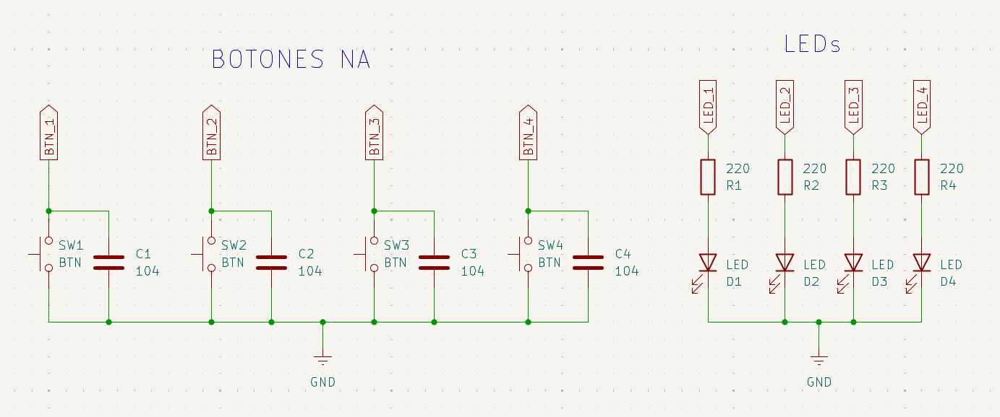
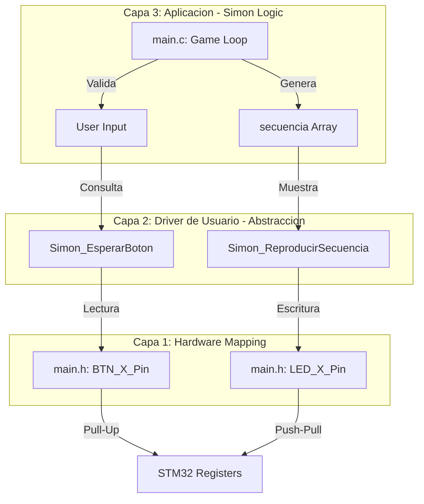

# EI_03: Simón Dice - Lógica Algorítmica y Gestión de Memoria 🎮

Este proyecto integrador del **Nivel Básico** representa un desafío de alta complejidad lógica. Aquí se integran el manejo de arreglos estáticos, la generación de números pseudoaleatorios y la gestión de periféricos de entrada/salida (I/O) en tiempo real sobre la placa **Nucleo-F439ZI**.

## 📍 Objetivos del Proyecto

- Implementar un motor de juego basado en **Arreglos Estáticos** y comparación de índices en memoria.
- Gestionar la aleatoriedad mediante la función `rand()` y generar una semilla `srand` a partir del `HAL_GetTick()` para garantizar aleatoriedad.
- Diseñar una **Interfaz (HMI)** completa con 4 canales de entrada (Pulsadores) y 4 de salida (LEDs).
- Programar rutinas de **Feedback Visual** diferenciadas para los estados de *Éxito*, *Error* y *Victoria*.

---

## 🔌 Especificaciones de Circuito

<center>

</center>


- **Leds:** 4 LEDs de alta luminosidad con resistencias de limitación calculadas para operación continua.
- **Botones:** 4 botones NA conectados a gnd con capacitores de 100 nF en paralelo para minimizar debounce.
- **Telemetría:** Interfaz UART3 a **115200 bps** para logs de diagnóstico.

---

## 🧠 Teoría de Operación

El "Simon Dice" es un sistema de control basado en el desafío de **Memoria Secuencial**. El funcionamiento del firmware se desglosa en tres pilares fundamentales que garantizan robustez y una experiencia de usuario fluida:

### 1. Generación y Azar (Semilla de Tiempo)
Para garantizar que cada partida sea única y no predecible, el sistema utiliza la función `srand()` alimentada por `HAL_GetTick()`. Dado que el tiempo transcurrido desde el inicio del MCU hasta que el usuario presiona el botón de inicio es variable e impredecible (en el orden de milisegundos), se logra una **semilla de entropía real** para generar los números pseudo-aleatorios que determinan la secuencia de juego.
```c
srand(HAL_GetTick());

//Dentro del while(1)
if (nivel_actual < MAX_NIVEL) {
	              secuencia[nivel_actual] = (rand() % 4) + 1;
	              nivel_actual++;
}
```

### 2. Gestión de Secuencia y Niveles
El motor de juego utiliza un arreglo estático de tipo `uint8_t` de 100 posiciones. En cada nivel superado, el MCU genera un nuevo valor (1-4), lo concatena a la secuencia existente e incrementa el puntero de `nivel_actual`. El sistema opera en dos fases críticas:

* **Fase de Reproducción:** El microcontrolador asume el control del bus de salida (LEDs), iterando el arreglo y aplicando retardos de sincronización para la visualización del patrón.
* **Fase de Validación:** El sistema entra en un estado de espera activa, comparando cada entrada del usuario contra el valor almacenado en el índice correspondiente del arreglo. Un solo error en la entrada dispara la rutina de interrupción de juego (**Game Over**).

### 3. Control de Flujo y Antirrepetidor
Para evitar lecturas erróneas por rebote mecánico o presión prolongada de los pulsadores, se implementa una lógica de **bloqueo por estado**. El sistema no solo detecta el flanco de bajada (`GPIO_PIN_RESET`), sino que obliga al programa a esperar que el botón sea liberado mediante un bucle de consulta:
`while(Simon_CualquierBotonPresionado());` 

Este mecanismo de **antirrepetidor** garantiza que un toque físico equivalga exactamente a una acción lógica en el contador de la secuencia, eliminando falsos positivos.

---

## 🏗️ Arquitectura del Software (3 Capas)

El proyecto mantiene un desacoplamiento estricto, permitiendo que la lógica del juego sea independiente de la configuración física de los botones. Esta estructura facilita la portabilidad y el mantenimiento del código ante cambios en el hardware.



### Descripción de la Estructura:

* **Capa 3 (Aplicación):** Actúa como el cerebro del sistema, gestionando el estado global del juego (Control de Nivel, lógica de Victoria y secuencia de Fallo). Administra el motor de aleatoriedad y arbitra la sincronización temporal, determinando los intervalos de respuesta del usuario y las fases de visualización del sistema.
```c
  while (1)
  {

	  	  	  // 1. Aumentar nivel
	          if (nivel_actual < MAX_NIVEL) {
	              secuencia[nivel_actual] = (rand() % 4) + 1;
	              nivel_actual++;
	          }

	          char buffer[50];
	          sprintf(buffer, "\r\n--- NIVEL %d ---\r\n", nivel_actual);
	          Debug_Log(buffer);

	          HAL_Delay(800);

	          // 2. Mostrar la secuencia con los LEDs
	          Simon_ReproducirSecuencia();

	          // 3. Fase de respuesta del usuario
	          uint8_t fallo = 0;
	          Debug_Log("Tu turno...");

	          for (int i = 0; i < nivel_actual; i++) {
	              // Esperar a que el usuario presione un botón
	              uint8_t botonUser = Simon_EsperarBoton();

	              // Feedback: Encender el LED que corresponde al botón apretado
	              Simon_EncenderUno(botonUser);

	              // Log del botón presionado
	              char b_log[15];
	              sprintf(b_log, " [BTN %d]", botonUser);
	              Debug_Log(b_log);

	              // IMPORTANTE: Esperar a que suelte el botón (Antirrepetidor)
	              while(Simon_CualquierBotonPresionado());
	              HAL_Delay(50); // Debounce
	              LED_All_Off();

	              // 4. Validar contra la secuencia
	              if (botonUser != secuencia[i]) {
	                  fallo = 1;
	                  break;
	              }
	          }

	          // 5. Resultado
	          if (fallo) {
	              Debug_Log("\r\nERROR: Secuencia incorrecta!\r\n");
	              Game_Over_Anim();
	              nivel_actual = 0; // Reiniciar progreso
	              HAL_Delay(2000);
	              Debug_Log("Reiniciando juego...");
	          }
	          else {
	              // Si no falló, verificamos si alcanzó la meta
	              if (nivel_actual == NIVEL_VICTORIA) {
	                  Win_Animation(); // ¡La coreografía de luces!
	                  nivel_actual = 0; // Reiniciar después de la gloria
	                  Debug_Log("\r\nReiniciando nuevo desafio...");
	                  HAL_Delay(3000);
	              }
	              else {
	                  // Solo pasó de nivel, seguimos jugando
	                  Debug_Log("\r\nCORRECTO! Siguiente nivel.");
	                  HAL_Delay(800);
	              }
	          }
  }
```


* **Capa 2 (Drivers de Usuario):** Proporciona una interfaz de funciones de alto nivel como `Simon_EncenderUno()` o `Simon_EsperarBoton()`. Su objetivo es abstraer por completo la complejidad de la **HAL de ST**, permitiendo que la lógica del juego sea altamente legible, modular y fácil de debugear.
```c
/**
 * @brief  Bloquea la ejecución hasta que se presiona uno de los 4 botones.
 * @note   Implementa una espera activa con un pequeño delay para reducir el consumo de CPU.
 * @retval uint8_t ID del botón presionado (1 a 4).
 */
uint8_t Simon_EsperarBoton(void);

/**
 * @brief  Verifica de forma no bloqueante si algún botón está siendo presionado.
 * @note   Útil para detectar el inicio del juego o flancos de bajada.
 * @retval uint8_t 1 si hay al menos un botón presionado, 0 en caso contrario.
 */
uint8_t Simon_CualquierBotonPresionado(void);

/**
 * @brief  Muestra la secuencia generada hasta el nivel actual utilizando los LEDs.
 * @details Itera sobre el arreglo 'secuencia', encendiendo el LED correspondiente
 * con tiempos de encendido (600ms) y apagado (200ms).
 * @retval None
 */
void Simon_ReproducirSecuencia(void);

/**
 * @brief  Enciende un LED específico y asegura que los demás estén apagados.
 * @param  num: ID del LED a encender (1 a 4).
 * @retval None
 */
void Simon_EncenderUno(uint8_t num);

/**
 * @brief  Apaga todos los LEDs del juego de forma simultánea.
 * @note   Utiliza operaciones de bits (OR) para manejar múltiples pines en una sola llamada HAL.
 * @retval None
 */
void LED_All_Off(void);

/**
 * @brief  Ejecuta una animación de parpadeo rápido (flash) para indicar la pérdida del juego.
 * @retval None
 */
void Game_Over_Anim(void);

/**
 * @brief  Ejecuta una coreografía de luces circular y un flash final al ganar.
 * @details Envía un mensaje de felicitaciones por UART y realiza una animación de "giro"
 * con los 4 LEDs antes de reiniciar el contador de niveles.
 * @retval None
 */
void Win_Animation(void);

/**
 * @brief  Envía una cadena de caracteres a través del periférico USART3.
 * @param  mensaje: Puntero a la cadena de texto (string) a transmitir.
 * @retval None
 */
void Debug_Log(char* mensaje);
```
* **Capa 1 (Hardware Mapping):** Representa la base de abstracción del sistema. Contiene las definiciones (`#define`) y etiquetas que vinculan los nombres lógicos de los componentes (LEDs y Pulsadores) con los puertos y pines reales del MCU. Esta capa es la que garantiza la **portabilidad** del proyecto hacia otras plataformas como la BluePill (STM32F103) o la EDU-CIAA (LPC4337).
```c
//en main.h
#define BTN_1_Pin GPIO_PIN_8
#define BTN_1_GPIO_Port GPIOB
#define BTN_2_Pin GPIO_PIN_9
#define BTN_2_GPIO_Port GPIOB
#define BTN_3_Pin GPIO_PIN_5
#define BTN_3_GPIO_Port GPIOA
#define BTN_4_Pin GPIO_PIN_6
#define BTN_4_GPIO_Port GPIOA
#define LED_1_Pin GPIO_PIN_14
#define LED_1_GPIO_Port GPIOE
#define LED_2_Pin GPIO_PIN_15
#define LED_2_GPIO_Port GPIOE
#define LED_3_Pin GPIO_PIN_10
#define LED_3_GPIO_Port GPIOB
#define LED_4_Pin GPIO_PIN_11
#define LED_4_GPIO_Port GPIOB

//Funciones robustas e independientes 
uint8_t Simon_EsperarBoton(void) {
    while (1) {
        // Asumiendo Pulsadores con Pull-Up interna (Active Low)
        if (HAL_GPIO_ReadPin(BTN_1_GPIO_Port, BTN_1_Pin) == GPIO_PIN_RESET) return 1;	//Boton 1
        if (HAL_GPIO_ReadPin(BTN_2_GPIO_Port, BTN_2_Pin) == GPIO_PIN_RESET) return 2;	//Boton 2
        if (HAL_GPIO_ReadPin(BTN_3_GPIO_Port, BTN_3_Pin) == GPIO_PIN_RESET) return 3;	//Boton 3
        if (HAL_GPIO_ReadPin(BTN_4_GPIO_Port, BTN_4_Pin) == GPIO_PIN_RESET) return 4;	//Boton 4
        HAL_Delay(10); // Respiro para el CPU
    }
}

void Game_Over_Anim(void) {
    for(int i=0; i<6; i++) {
        HAL_GPIO_WritePin(LED_1_GPIO_Port, LED_1_Pin | LED_2_Pin, 1);
        HAL_GPIO_WritePin(LED_3_GPIO_Port, LED_3_Pin | LED_4_Pin, 1);
        HAL_Delay(150);
        LED_All_Off();
        HAL_Delay(150);
    }
}

void Win_Animation(void) {
    Debug_Log("\r\n🏆 ¡FELICIDADES! HAS COMPLETADO EL JUEGO 🏆\r\n");
    for (int i = 0; i < 10; i++) { // Repetir el giro 10 veces
        HAL_GPIO_WritePin(LED_1_GPIO_Port, LED_1_Pin, 1); // LED 1
        HAL_Delay(50);
        HAL_GPIO_WritePin(LED_1_GPIO_Port, LED_1_Pin, 0);

        HAL_GPIO_WritePin(LED_2_GPIO_Port, LED_2_Pin, 1); // LED 2
        HAL_Delay(50);
        HAL_GPIO_WritePin(LED_2_GPIO_Port, LED_2_Pin, 0);

        HAL_GPIO_WritePin(LED_3_GPIO_Port, LED_3_Pin, 1); // LED 3
        HAL_Delay(50);
        HAL_GPIO_WritePin(LED_3_GPIO_Port, LED_3_Pin, 0);

        HAL_GPIO_WritePin(LED_4_GPIO_Port, LED_4_Pin, 1); // LED 4
        HAL_Delay(50);
        HAL_GPIO_WritePin(LED_4_GPIO_Port, LED_4_Pin, 0);
    }
    // Flash final de victoria
    for(int j=0; j<3; j++){
        HAL_GPIO_WritePin(LED_1_GPIO_Port, LED_1_Pin | LED_2_Pin, 1);
        HAL_GPIO_WritePin(LED_3_GPIO_Port, LED_3_Pin | LED_4_Pin, 1);
        HAL_Delay(200);
        LED_All_Off();
        HAL_Delay(200);
    }
}
```

---

## 🛠️ Desafíos de Ingeniería Superados

### 1. Detección de Entrada y Debounce
Se configuraron 4 pines en modo `INPUT` con **Pull-up interna**. La detección se realiza por nivel bajo (`GPIO_PIN_RESET`). Se incluyó un `HAL_Delay(10)` dentro del bucle de espera para reducir el consumo de recursos del CPU y un delay de `50ms` post-pulsación para absorber el rebote mecánico.

### 2. Telemetría por UART
El sistema utiliza la `USART3` a **115200 bps** para informar el estado del juego en tiempo real:
- Nivel actual alcanzado.
- Botón detectado por el microcontrolador.
- Notificación de *Game Over* o *Victoria* con mensajes ASCII.

### 3. Animaciones de Estado
Las animaciones de victoria y error manipulan directamente los registros de los puertos de salida, demostrando un control preciso de los periféricos sin interferir con la lógica de memoria.

```c
 // 5. Resultado
	          if (fallo) {
	              Debug_Log("\r\nERROR: Secuencia incorrecta!\r\n");
	              Game_Over_Anim();
	              nivel_actual = 0; // Reiniciar progreso
	              HAL_Delay(2000);
	              Debug_Log("Reiniciando juego...");
	          }
	          else {
	              // Si no falló, verificamos si alcanzó la meta
	              if (nivel_actual == NIVEL_VICTORIA) {
	                  Win_Animation(); // ¡La coreografía de luces!
	                  nivel_actual = 0; // Reiniciar después de la gloria
	                  Debug_Log("\r\nReiniciando nuevo desafio...");
	                  HAL_Delay(3000);
	              }
	              else {
	                  // Solo pasó de nivel, seguimos jugando
	                  Debug_Log("\r\nCORRECTO! Siguiente nivel.");
	                  HAL_Delay(800);
	              }
	          }
```

---

## 🔌 Mapeo de Hardware

### 🗺️ Tabla de Conexiones
Se detalla la asignación de pines del microcontrolador. Gracias a la **Abstracción de Hardware**, estos pines pueden ser remapeados en el archivo de configuración sin alterar la lógica de la aplicación.

| Componente | Etiqueta (Software) | Pin (MCU) | Puerto | Configuración |
| :--- | :--- | :--- | :--- | :--- |
| **LED_1** | `LED_1_Pin` | **PE14** | GPIOE | Output Push Pull |
| **LED_2** | `LED_2_Pin` | **PE15** | GPIOE | Output Push Pull |
| **LED_3** | `LED_3_Pin` | **PB10** | GPIOB | Output Push Pull |
| **LED_4** | `LED_4_Pin` | **PB11** | GPIOB | Output Push Pull |
| **BTN_1** | `BTN_1_Pin` | **PB8** | GPIOB | Input Pull-Up |
| **BTN_2** | `BTN_2_Pin` | **PB9** | GPIOB | Input Pull-Up |
| **BTN_3** | `BTN_3_Pin` | **PA5** | GPIOA | Input Pull-Up |
| **BTN_4** | `BTN_4_Pin` | **PA6** | GPIOA | Input Pull-Up |

---
## 🚀 Roadmap: Futuras Mejoras

Para escalar este prototipo hacia una versión de producción industrial y maximizar el aprovechamiento de los recursos del hardware, se proponen las siguientes actualizaciones:

* **Audio-Feedback (PWM):** Incorporar un Buzzer piezoeléctrico gestionado por un periférico de **Timer en modo PWM**. Esto permitiría generar tonos de frecuencia distintos para cada color, mejorando la accesibilidad (UX) y proporcionando una experiencia inmersiva mediante señales acústicas.
* **Dificultad Dinámica:** Implementar un algoritmo de aceleración que reduzca progresivamente los retardos de la secuencia a medida que el nivel aumenta. Esto permite desafiar no solo la memoria, sino también la velocidad de respuesta del usuario.
* **Persistencia de High-Score (Flash/EEPROM):** Desarrollar una rutina de escritura en la memoria **Flash interna** del MCU para persistir el récord de nivel alcanzado. Esto permitiría mantener el puntaje máximo guardado incluso después de desconectar la alimentación de la placa.
* **Modo Multijugador (UART/CLI):** Utilizar la interfaz **UART3** para interconectar dos placas Nucleo. Esto habilitaría un modo "Versus" donde un jugador genera la secuencia en tiempo real desde una terminal (o desde su propia placa) para que el otro la resuelva.
* **Optimización Energética (Sleep Mode):** Configurar el sistema para entrar en modo **Low Power** mientras espera la pulsación del botón de inicio, utilizando interrupciones externas para despertar el núcleo y reducir el consumo de corriente total.

---

*Este proyecto consolida el `dominio` de la **Lógica Programable.** Hemos agotado las posibilidades del código secuencial y estamos listos para el último paso del nivel: la Integración de APIs, donde uniremos todos estos conceptos bajo una arquitectura modular de drivers antes de saltar al mundo de las Interrupciones.*

🛠️ **Carlos** | Estudiante de Ing. Electrónica @UTN_FRT.  
🚀 Apasionado Autodidacta por los Sistemas Embebidos.

