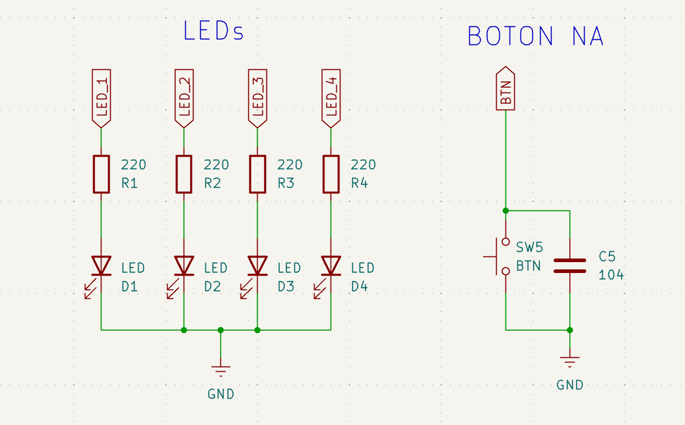

# Proyecto Integrador Final: Secuenciador Maestro de 6 Efectos 🚀

Este proyecto representa la culminación del **Nivel Básico** en mi formación sobre sistemas embebidos. En él se integran de forma sinérgica los pilares de la arquitectura de software profesional: modularidad por capas, abstracción de periféricos y máquinas de estados finitas (MEF) sobre la plataforma **STM32 (Nucleo-F439ZI)**.

## 🎯 Objetivo del Proyecto
Diseñar un controlador de efectos lumínicos de grado industrial que gestione 6 secuencias complejas mediante un único pulsador de usuario. El sistema utiliza una **arquitectura asíncrona no bloqueante**, garantizando que el reporte por UART y la detección de eventos ocurran en tiempo real, independientemente del efecto visual activo.

---

## 🔌 Especificaciones de Circuito

<center>

</center>


- **Leds:** 4 LEDs de alta luminosidad con resistencias de limitación calculadas para operación continua.
- **Boton NA:** 1 boton NA conectado a gnd con capacitor de 100 nF en paralelo para minimizar debounce.
- **Telemetría:** Interfaz UART3 a **115200 bps** para logs de diagnóstico.

---

## 🧠 Teoría de Operación: El Secuenciador Modular

Este proyecto representa la consolidación de la arquitectura de sistemas embebidos avanzada, migrando de una ejecución lineal y bloqueante a una **Ejecución Basada en Eventos y Tiempos No Bloqueantes**.

### 1. Gestión de Tiempos Asíncronos (`API_delay`)
A diferencia de las versiones iniciales, el sistema utiliza una abstracción del timer de sistema basada en `HAL_GetTick()`. La implementación de la estructura `delay_t` permite que el CPU consulte si un intervalo de tiempo ha expirado (`delayRead`) sin detener la ejecución de otras tareas. Esta gestión asíncrona garantiza que la capacidad de respuesta del sistema (latencia) sea mínima, permitiendo que acciones como el cambio de modo sean instantáneas.
```c
/**
 * @file API_delay.h
 * @brief API para la gestión de retardos no bloqueantes en STM32.
 * * @details Este driver utiliza el SysTick para proporcionar una base de tiempo
 * milimétrica que permite ejecutar tareas de forma asíncrona mediante una
 * máquina de estados interna.
 */

#ifndef CUSTOM_DRIVERS_INC_API_DELAY_H_
#define CUSTOM_DRIVERS_INC_API_DELAY_H_

/* Includes ------------------------------------------------------------------*/
#include <stdint.h>
#include <stdbool.h>
#include "stm32f4xx_hal.h"

/* Exported types ------------------------------------------------------------*/

/**
 * @brief Tipo definido para el conteo de ticks (milisegundos).
 */
typedef uint32_t tick_t;

/**
 * @brief Estados posibles de un objeto de retardo.
 */
typedef enum {
    DELAY_IDLE,     /**< Estado inicial, el temporizador no ha arrancado. */
    DELAY_RUNNING,  /**< El temporizador está contando activamente. */
    DELAY_EXPIRED   /**< El tiempo de espera se ha cumplido. */
} delayStatus_t;

/**
 * @brief Estructura que define un objeto de retardo independiente.
 */
typedef struct {
    tick_t startTime;    /**< Marca de tiempo en la que inició el delay. */
    tick_t duration;     /**< Tiempo total a esperar en ms. */
    delayStatus_t status; /**< Estado actual de la máquina de estados. */
} delay_t;

/* Exported functions prototypes ---------------------------------------------*/

/**
 * @brief Inicializa la estructura del retardo.
 * @param delay Puntero a la estructura delay_t que se desea inicializar.
 * @param duration Duración del retardo expresada en milisegundos.
 * @return void
 */
void delayInit(delay_t * delay, tick_t duration);

/**
 * @brief Verifica si el tiempo del retardo ha transcurrido.
 * @param delay Puntero a la estructura delay_t.
 * @return true si el tiempo expiró, false si sigue corriendo o está inactivo.
 * @note Si la función se llama estando en estado IDLE, el conteo inicia automáticamente.
 * Al expirar, el estado cambia a EXPIRED y se reinicia para la siguiente lectura.
 */
bool delayRead(delay_t * delay);

/**
 * @brief Permite cambiar la duración de un delay ya inicializado.
 * @param delay Puntero a la estructura delay_t.
 * @param duration Nueva duración en milisegundos.
 * @return void
 */
void delayWrite(delay_t * delay, tick_t duration);

/**
 * @brief Reinicia el estado del delay a IDLE (apagado).
 * @param delay Puntero a la estructura delay_t.
 * @return void
 */
void delayReset(delay_t * delay);

#endif /* CUSTOM_DRIVERS_INC_API_DELAY_H_ */
```

### 2. Máquina de Estados de Debounce (`API_debounce`)
Para el manejo robusto de las entradas digitales, se implementa una **Máquina de Estados Finitos (MEF)** de Debounce por Software. Esta API filtra los ruidos mecánicos y rebotes elásticos del pulsador mediante estados de confirmación temporal. La lógica desacopla la detección física del evento lógico (`readKey`), asegurando una captura de eventos limpia: cada pulsación se registra como una única acción, independientemente del tiempo de presión.
```c
/**
 * @file API_debounce.h
 * @author CarlitozMF
 * @brief API para la gestión de múltiples pulsadores con antirrebote (Debounce) no bloqueante.
 * @version 2.0
 * @date 2026-04-26
 * * @details Este driver implementa una Máquina de Estados Finitos (MEF) para cada instancia
 * de botón. Utiliza la API_delay para el filtrado temporal, permitiendo gestionar N botones
 * de forma independiente y reentrante sin bloquear la ejecución del CPU.
 */

#ifndef API_DEBOUNCE_H_
#define API_DEBOUNCE_H_

/* Includes ------------------------------------------------------------------*/
#include "stm32f4xx_hal.h"
#include <stdbool.h>
#include "API_delay.h"

/* Exported types ------------------------------------------------------------*/

/**
 * @brief Estados internos de la MEF de antirrebote.
 */
typedef enum {
    BUTTON_UP,      /**< Estado de reposo (botón suelto). */
    BUTTON_FALLING, /**< Transición detectada (filtrando ruido de bajada). */
    BUTTON_DOWN,    /**< Estado presionado estable. */
    BUTTON_RISING   /**< Transición detectada (filtrando ruido de subida). */
} debounceState_t;

/**
 * @brief Estructura de control para una instancia de botón.
 * * Contiene tanto la configuración de hardware como la memoria de estado
 * necesaria para que el driver sea reentrante.
 */
typedef struct {
    GPIO_TypeDef* port;      /**< Puerto GPIO asociado (ej: GPIOB). */
    uint16_t pin;            /**< Pin GPIO asociado (ej: GPIO_PIN_11). */
    bool inverted;           /**< Lógica: true para Active Low, false para Active High. */
    bool keyPressed;         /**< Flag de evento: indica que ocurrió una pulsación válida. */
    debounceState_t state;   /**< Memoria de estado de la MEF para este botón. */
    delay_t timer;           /**< Objeto de retardo para el filtrado de este botón. */
} button_t;

/* Exported functions prototypes ---------------------------------------------*/

/**
 * @brief Inicializa la instancia de un botón y su MEF asociada.
 * @param btn Puntero a la estructura button_t del botón a inicializar.
 */
void debounceFSM_Init(button_t* btn);

/**
 * @brief Actualiza la máquina de estados de un botón específico.
 * @note Esta función debe llamarse periódicamente (polling) en el bucle principal.
 * @param btn Puntero a la estructura button_t a procesar.
 */
void debounceFSM_Update(button_t* btn);

/**
 * @brief Lee y resetea el flag de evento del botón.
 * @details Implementa lógica "Clear-on-Read" para asegurar que el evento se procese una sola vez.
 * @param btn Puntero a la estructura button_t.
 * @return true si se detectó una pulsación confirmada desde la última lectura.
 */
bool readKey(button_t* btn);

#endif /* API_DEBOUNCE_H_ */
```

### 3. Escenas y MEF de Aplicación
El sistema gestiona 6 modos de operación (escenas) mediante un tipo enumerado (`enum`) y un motor de estados basado en `switch-case`. El uso de la constante `CANT_MODOS` como último elemento del enumerado es una técnica de **robustez de software** que permite:
* La rotación automática del contador de modos mediante el operador módulo (`%`).
* Una escalabilidad inmediata, permitiendo agregar nuevos efectos visuales sin necesidad de reconfigurar los límites de la lógica de control.

#### 🎨 Modos de Operación (FSM de Secuencias)
El sistema cicla entre los siguientes estados mediante una pulsación validada en el pin **PB11**:

| ID | Modo | Lógica Visual | Temporización |
| :---: | :--- | :--- | :---: |
| **0** | **MODO_SYNC** | Parpadeo síncrono de todo el grupo. | 500ms |
| **1** | **MODO_CARRERA** | Desplazamiento circular (1-2-3-1...). | 150ms |
| **2** | **MODO_REBOTE** | Efecto *Knight Rider* (ida y vuelta). | 100ms |
| **3** | **MODO_STREAK** | Acumulación progresiva de LEDs encendidos. | 200ms |
| **4** | **MODO_ALARMA** | Estroboscopio asimétrico (Rojo vs Azul). | 80ms |
| **5** | **MODO_RANDOM** | Selección estocástica (pseudo-aleatoria). | 120ms |


```c
    button_t botones[] = {
		{BTN_1_GPIO_Port, BTN_1_Pin, true},     // Botón de Modo (PB11 - Active Low)
		{BTN_2_GPIO_Port, BTN_2_Pin, true}
    };
    /* --- Definición de Escenas --- */
    typedef enum {
	    MODO_SYNC,          //Parpadeo síncrono de todo el grupo (500ms).
        MODO_CARRERA,
        MODO_REBOTE,
	    MODO_STREAK,
        MODO_ALARMA,
        MODO_RANDOM,
	    CANT_MODOS // Truco para resetear el contador automáticamente
    } escena_t;

    escena_t escenaActual = MODO_SYNC;

    /* Dentro de while(1) */
		/* 1. Actualizar TODAS las MEF de debounce */
		for (uint8_t i = 0; i < CANT_BOTONES; i++) {
			debounceFSM_Update(&botones[i]);
		}
		/* 2A. Procesar lógica del Botón de Modo (Índice 0) */
		if (readKey(&botones[0])) {
			escenaActual = (escenaActual + 1) % CANT_MODOS;
			paso = 0;
			direccion = true;
			LED_All_Off(Leds, CANT_LEDS);
			Debug_Log("\r\n--- CAMBIO DE MODO (Multinstancia) ---\r\n");
		}

        /* 2B. Procesar lógica del Botón de Modo (Índice 1) */
        /* Se omite acción del segundo botón*/
		
        /* 3. Lógica de las escenas (Timer no bloqueante) */
		if (delayRead(&timerSecuencia)) {
			switch (escenaActual) {

			case MODO_SYNC:
				delayWrite(&timerSecuencia, 500);
				LED_ToggleAll(Leds, CANT_LEDS);
				Debug_Log("MODO: Sincronizado - Toggle All\r\n");
				break;

			case MODO_CARRERA:
				delayWrite(&timerSecuencia, 150);
				LED_All_Off(Leds, CANT_LEDS);
				LED_On(&Leds[paso]);
				// Log que indica qué LED se enciende
				if(paso == 0) Debug_Log("CARRERA: LED Rojo\r\n");
				if(paso == 1) Debug_Log("CARRERA: LED Amarillo\r\n");
				if(paso == 2) Debug_Log("CARRERA: LED Verde\r\n");
				if(paso == 3) Debug_Log("CARRERA: LED Azul\r\n");

				paso = (paso + 1) % CANT_LEDS;
				break;

			case MODO_REBOTE:
				delayWrite(&timerSecuencia, 100);
				LED_All_Off(Leds, CANT_LEDS);
				LED_On(&Leds[paso]);
				Debug_Log("REBOTE: Posicion actual\r\n");
				if (direccion) paso++; else paso--;
				if (paso == (CANT_LEDS - 1) || paso == 0){
					direccion = !direccion;
					Debug_Log("REBOTE: Cambio de sentido\r\n");
				}
				break;

			case MODO_STREAK:
				delayWrite(&timerSecuencia, 200);
				if (paso < CANT_LEDS) {
					LED_On(&Leds[paso]);
					Debug_Log("STREAK: Agregando LED\r\n");
				} else {
					LED_All_Off(Leds, CANT_LEDS);
					Debug_Log("STREAK: Reset\r\n");
				}
				paso = (paso + 1) % (CANT_LEDS + 1);
				break;

			case MODO_ALARMA:
				delayWrite(&timerSecuencia, 80);
				LED_Toggle(&Leds[0]); // LED 1
				LED_Toggle(&Leds[3]); // LED 4
				LED_Off(&Leds[1]);    // LED 2
				LED_Off(&Leds[2]);    // LED 3
				Debug_Log("ALARMA: Strobe activo\r\n");
				break;

			case MODO_RANDOM:
				delayWrite(&timerSecuencia, 120);
				LED_All_Off(Leds, CANT_LEDS);
				uint8_t r = HAL_GetTick() % CANT_LEDS;
				LED_On(&Leds[r]);
				Debug_Log("RANDOM: LED Aleatorio\r\n");
				break;

			default:
				escenaActual = MODO_SYNC;
				break;
			}
		}
```

### 4. Gestión Paralela y Ejecución Reentrante
A diferencia de los sistemas lineales, esta arquitectura permite la **gestión concurrente** de múltiples periféricos de entrada. Gracias al diseño de un driver reentrante, cada botón instanciado posee su propio contexto de memoria (Estado y Timer), lo que permite al sistema:
```c
    button_t botones[] = {
		{BTN_1_GPIO_Port, BTN_1_Pin, true},     // Botón de Modo (PB11 - Active Low)
		{BTN_2_GPIO_Port, BTN_2_Pin, true}
    };
            /* Dentro del while(1) */
        /* 1. Actualizar TODAS las MEF de debounce */
		for (uint8_t i = 0; i < CANT_BOTONES; i++) {
			debounceFSM_Update(&botones[i]);
		}
		/* 2A. Procesar lógica del Botón de Modo (Índice 0) */
            /* Se omite acción del primer botón*/
		/* 2B. Procesar lógica del Botón de Modo (Índice 1) */
		if (readKey(&botones[1])) {
			LED_ToggleAll(Leds_board, CANT_LEDS_BOARD);
			Debug_Log("\r\n--- Toggle LEDS Placa ---\r\n");
		}
```

* **Independencia Operativa:** El microcontrolador procesa las Máquinas de Estados de todos los botones en paralelo durante cada ciclo de *polling*. Esto garantiza que una pulsación en el Botón A no interfiera con el filtrado de ruido del Botón B.
* **Procesamiento de Eventos Múltiples:** El firmware es capaz de detectar y validar eventos simultáneos. Por ejemplo, es posible realizar un cambio de modo (`botones[0]`) mientras se ejecuta una acción secundaria de interrupción o toggle (`botones[1]`), sin degradar la latencia de respuesta de ninguno de los dos.
* **Escalabilidad Sin Bloqueo:** La adición de un segundo pulsador no añade carga significativa al CPU ni requiere modificar la lógica de los drivers existentes, demostrando una arquitectura preparada para sistemas de control industrial con múltiples entradas de usuario.

---

## 🏗️ Arquitectura del Software (Modelo de Drivers Reentrantes)

El diseño se basa en una jerarquía de capas donde los **Drivers de Usuario** son reentrantes. Esto permite que una misma API gestione múltiples periféricos de forma simultánea e independiente, aislando por completo la HAL del código de aplicación.

```mermaid
graph TD
    subgraph Capa 3: Aplicacion - main.c "Super-Loop"
        A[FSM Escenas: Secuenciador] -->|Polling| C[delayRead: API_delay]
        B[Gestor de Eventos: Boton 0 y 1] -->|Polling| D[readKey: API_debounce]
        A -.->|Simultaneidad| B
    end

    subgraph Capa 2: APIs / Drivers Propios "Objetos"
        D -->|Filtro Individual| E[Estructuras button_t]
        C -->|Timers Independientes| F[Estructuras delay_t]
        G[API_led.h] -->|Abstraccion| H[LED_t Objects]
    end

    subgraph Capa 1: Hardware Abstraction Layer
        E & F & G -->|Driver Calls| I[STM32 HAL / CMSIS]
    end

    I --> J[Hardware: LEDs y Pulsadores]
```

### Descripción de la Estructura:

* **Capa 3 (Aplicación):** Implementa un **Scheduler Cooperativo** simplificado dentro del bucle principal. Coordina tareas simultáneas: mientras la FSM de escenas actualiza los LEDs según el cronograma temporal, el Gestor de Eventos monitorea constantemente el estado de los múltiples pulsadores sin que una tarea bloquee a la otra.
* **Capa 2 (APIs Reentrantes):** Es el núcleo de la inteligencia modular. Los drivers (`API_led`,`API_debounce` y `API_delay`) están diseñados para trabajar con **instancias**. Esto permite que cada botón y cada temporizador tengan su propio contexto de memoria, permitiendo el procesamiento paralelo de N periféricos usando el mismo bloque de código.
* **Capa 1 (Hardware):** La capa de abstracción de bajo nivel (**HAL de ST**). Su función se limita a proveer el acceso a los registros físicos y al `Systick`, siendo invocada únicamente por los drivers de la Capa 2 para mantener la portabilidad del sistema hacia otras arquitecturas.

---

## 🔌 Mapeo de Hardware

### 🗺️ Tabla de Conexiones
Se detalla la asignación de pines del microcontrolador. Gracias a la **Abstracción de Hardware**, estos pines pueden ser remapeados en el archivo de configuración sin alterar la lógica de la aplicación.

| Componente | Etiqueta (Software) | Pin (MCU) | Puerto | Configuración |
| :--- | :--- | :--- | :--- | :--- |
| **LED_1** | `LED_1_Pin` | **PG9** | GPIOG | Output Push Pull |
| **LED_2** | `LED_2_Pin` | **PB1** | GPIOB | Output Push Pull |
| **LED_3** | `LED_3_Pin` | **PE9** | GPIOE | Output Push Pull |
| **LED_4** | `LED_4_Pin` | **PF13** | GPIOF | Output Push Pull |
| **LD1** | `LD1_Pin` | **PB0** | GPIOB | Output Push Pull |
| **LD2** | `LD2_Pin` | **PB7** | GPIOB | Output Push Pull |
| **LD3** | `LD3_Pin` | **PB14** | GPIOB | Output Push Pull |
| **BTN_1** | `BTN_1_Pin` | **PB10** | GPIO | Input Pull-Up |
| **BTN_2** | `BTN_2_Pin` | **PB11** | GPIOB | Input Pull-Up |


---

## 🚀 Roadmap: Futuras Mejoras

Para evolucionar este prototipo hacia un estándar de nivel industrial y optimizar el aprovechamiento de los recursos del hardware, se proponen las siguientes actualizaciones:

* **Integración de RTOS:** El uso de la `API_delay` es el paso previo a utilizar un **Sistema Operativo en Tiempo Real (FreeRTOS)**, donde cada escena y cada gestión de botones podría ser una tarea independiente con diferentes niveles de prioridad.
* **Drivers por Interrupción (Low Power):** Migrar la `API_debounce` para que, en lugar de *polling*, utilice interrupciones externas (**EXTI**). Esto permitiría que el microcontrolador entre en modo de bajo consumo (*Sleep/Stop*) mientras no hay interacción del usuario.
* **API de Comunicaciones por DMA:** Desarrollar un driver para la UART que utilice **DMA (Direct Memory Access)**. Esto permitiría que los mensajes de telemetría se transmitan sin ocupar ciclos de instrucción del procesador, mejorando aún más el determinismo del sistema.
* **Configuración Remota vía CLI:** Implementar una interfaz de línea de comandos por puerto serie para modificar los tiempos de las secuencias o el tiempo de *debounce* "en caliente", sin necesidad de reflashear el firmware.

---

## 🔍 Conclusiones del Nivel Básico

* **Multitarea Cooperativa:** Se erradicó por completo el uso de HAL_Delay(), permitiendo un aprovechamiento superior de los ciclos de CPU para tareas concurrentes.
* **Determinismo:** La integración de la API_debounce con la FSM principal garantiza transiciones de estado limpias, eliminando comportamientos erráticos por ruido mecánico.
* **Calidad de Código:** La separación estricta en archivos .h y .c y el uso de punteros para el paso de estructuras definen un flujo de trabajo profesional y escalable.

# 🏁 NIVEL BÁSICO COMPLETADO

Con la entrega de este secuenciador maestro, los fundamentos de entrada/salida, tiempo y arquitectura de software están consolidados. El sistema es robusto, pero depende de la velocidad del bucle while(1) (Polling).

> **Siguiente paso: Inmersión en el Nivel Intermedio.** > Tras consolidar la arquitectura modular, el próximo desafío es trascender los límites del *Polling*. Liberaremos al CPU de la vigilancia constante mediante el uso de **Interrupciones Externas (EXTI)** y **Timers por Hardware**, permitiendo una respuesta en tiempo real determinística. Además, evolucionaremos hacia el procesamiento de señales del mundo físico mediante el **ADC** y protocolos de comunicación robustos, transformando este firmware en un sistema reactivo de alto rendimiento.

---
*“La maestría en sistemas embebidos no nace de encender un LED, sino de diseñar la arquitectura que permite que mil procesos convivan en armonía sin bloquearse entre sí.”*

🛠️ **Carlos** | Estudiante de Ing. Electrónica @UTN_FRT.  
🚀 Apasionado Autodidacta por los Sistemas Embebidos.