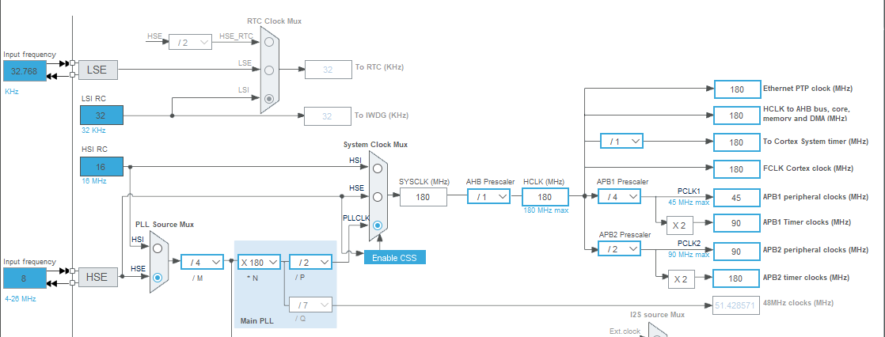
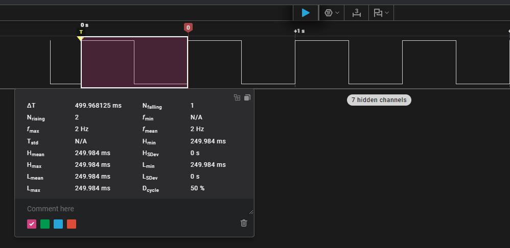

# 02_TIM_Basic: Gestión de Tiempo y Base de Tiempo con TIM1 ⏱️

Este proyecto documenta el uso de **Timers** de hardware para crear bases de tiempo precisas en la **Nucleo-F439ZI**. El objetivo es demostrar cómo el hardware gestiona tareas críticas de forma asíncrona, liberando al procesador para realizar otras tareas en el bucle principal sin usar funciones bloqueantes.

## 🚌 Arquitectura de Buses y Timers (APB1 vs APB2)

En la arquitectura STM32F4, los Timers se distribuyen en dos buses periféricos con distintas capacidades de velocidad. Es vital identificar en qué bus se encuentra el Timer para realizar los cálculos de tiempo correctos.

| Bus | Frecuencia Máxima (TIM) | Timers Manejados | Notas |
| :--- | :--- | :--- | :--- |
| **APB1** | **90 MHz** | TIM2, TIM3, TIM4, TIM5, TIM6, TIM7, TIM12, TIM13, TIM14 | Bus de periféricos de baja velocidad. |
| **APB2** | **180 MHz** | **TIM1**, TIM8, TIM9, TIM10, TIM11 | Bus de alta velocidad (Advanced Timers). |

> **Regla de Hardware:** Si el prescaler del bus APB es distinto de 1, la frecuencia del reloj del Timer se multiplica automáticamente por 2 respecto a la frecuencia del bus periférico (PCLK).

## 🧮 Matemática del Timer: Fórmulas de Cálculo

Para este ejemplo usamos el **TIM1**, que cuelga del bus **APB2**. Según nuestro **Clock Tree**, la frecuencia de entrada ($f_{clk}$) es de **180 MHz**.

> **Referencia del Clock Configuration:**
> 

### 1. Frecuencia de Conteo ($f_{CNT}$)
Es la velocidad a la que incrementa el contador interno tras pasar por el Prescaler (PSC).
$$f_{CNT} = \frac{f_{clk}}{(PSC + 1)}$$

### 2. Tiempo de Interrupción ($T_{Update}$)
Es el intervalo en el que el Timer llega al valor de Auto-Reload (ARR) y dispara la interrupción.
$$T_{Update} = \frac{(ARR + 1)}{f_{CNT}}$$

### 3. Aplicación real:
Configuramos $PSC = 8999$ y $ARR = 4999$:
* $f_{CNT} = \frac{180.000.000}{9000} = 20.000 \text{ Hz} (20 \text{ kHz})$
* $T_{Update} = \frac{5000}{20.000} = \mathbf{0.25 \text{ s} (250 \text{ ms})}$

## 🔬 Validación con Analizador Lógico

Conectamos un analizador lógico al pin **PF13** (`usr_led`) para verificar los tiempos calculados.

> **Captura del Analizador Lógico:**
> 
> *La medición confirma un tiempo en alto de 250 ms y un tiempo en bajo de 250 ms, validando la configuración de 180 MHz del APB2.*

## 💻 Lógica de Software Implementada

### 1. Interrupción de Hardware (Hard Real-Time)
El LED conmuta en el callback del TIM1. Esta tarea ocurre en "background" con prioridad de interrupción.

```c
void HAL_TIM_PeriodElapsedCallback(TIM_HandleTypeDef *htim) {
    if (htim->Instance == TIM1) {
        // Conmuta el estado cada 250ms
        HAL_GPIO_TogglePin(usr_led_GPIO_Port, usr_led_Pin); 
    }
}
```
### 2. Bucle no bloqueante (Soft Real-Time)
En lugar de usar *HAL_Delay()*, empleamos **HAL_GetTick()** (basado en el Systick del núcleo) para enviar logs por USART3 cada 1 segundo. Esto permite que el CPU ejecute miles de ciclos de while(1) mientras espera el tiempo de log, manteniendo el sistema reactivo.

```c
while (1) {
    if (HAL_GetTick() - last_log_time >= 1000) {
        last_log_time = HAL_GetTick();
        sprintf(msg_buffer, "Ciclo de Main: %lu\r\n", loop_counter++);
        Debug_Log(msg_buffer);
    }
    // El CPU está libre para procesar otras tareas aquí
}
```
## 📝 Conclusiones

- Independencia: El LED mantiene su ritmo perfecto aunque el while(1) realice comunicaciones pesadas o cálculos.
- Relación Toggle/Periodo: El periodo total de la señal del LED (500 ms) es el doble del tiempo de interrupción del Timer (250 ms), ya que se requieren dos eventos de Update para completar un ciclo (Encendido + Apagado).
- Importancia de la Medición: El analizador lógico es la herramienta definitiva para validar que el Clock Tree y los registros PSC/ARR están correctamente sincronizados.