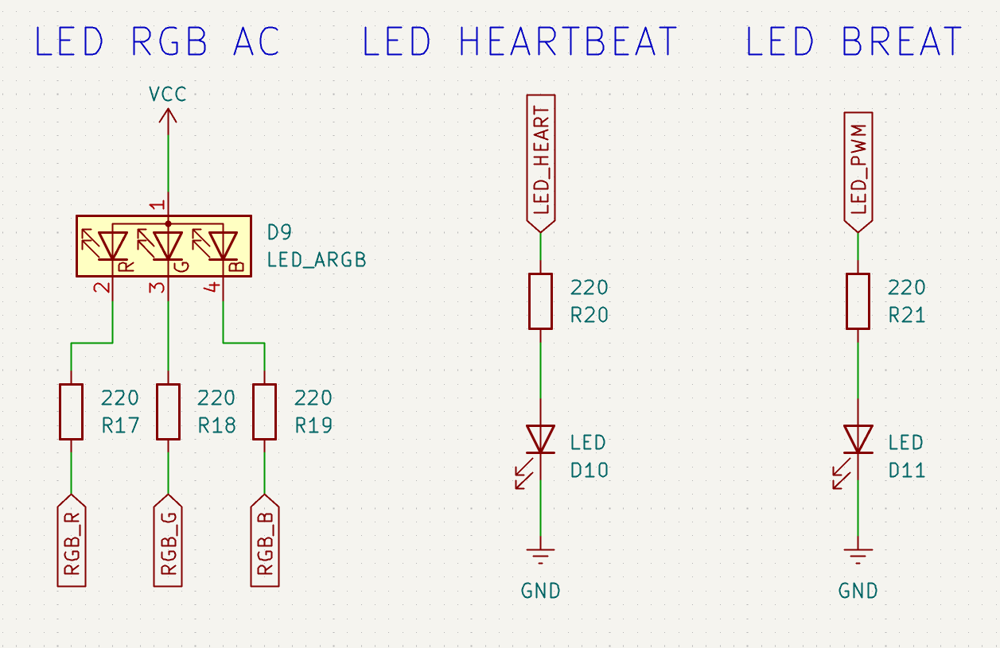
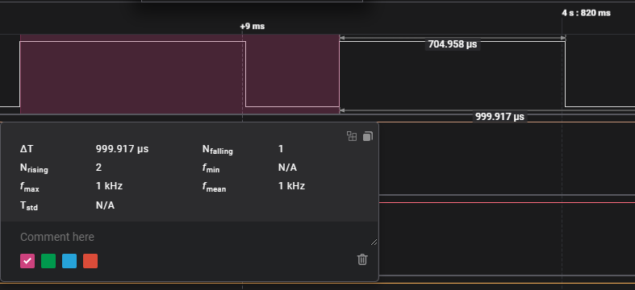

# 03_TIM_PWM: Dominando la energía: del control binario a la modulación por ancho de pulso (PWM) 

Este proyecto documenta el uso de los **Timers de hardware** para generar señales de Modulación por Ancho de Pulso (**PWM**) y la creación de un **Framework** para el manejo de LEDs RGB. El objetivo es controlar la entrega de energía a periféricos de potencia de forma eficiente y asíncrona, integrando un **Planificador Cooperativo (Scheduler)** para la gestión de tareas concurrentes y una capa **PAL (Platform Abstraction Layer)** que permite desacoplar la lógica del driver del hardware específico de la **Nucleo-F439ZI**.

## 🎯 Objetivos
- **Dominar la generación de señales PWM** mediante los registros de comparación (CCR) de los Timers.
- **Calcular la resolución y frecuencia** del PWM para optimizar el control de potencia y evitar el parpadeo visual (*Flicker*).
- **Implementar un Driver de control de leds RGB** capaz de gestionar leds RGB de ánodo o cátodo común.
- **Aplicar conceptos de colorimetría** (Modelo HSV y Corrección Gamma) para el control avanzado de LEDs RGB.
- **Implementar una PAL (Platform Abstraction Layer)** para eliminar dependencias directas de la HAL de ST dentro de los drivers.
- **Implementar un Kernel Cooperativo** no bloqueante para la gestión de múltiples tareas (*Tasks*).

---
## 🔌 Especificaciones de Circuito

<center>

</center>

*   **LED RGB:** 1 LED RGB Ánodo Común difuso (puede ser cátodo común).
*   **LED Difusos:** 2 leds *comunes* para visualizar efectos varios.

---

## 🔩 Teoría de Operación: Timers y PWM

### 1. Conceptos Fundamentales de PWM

El modo PWM (Modulación por Ancho de Pulso) emula un voltaje analógico variable mediante la conmutación rápida de una señal digital. Su comportamiento en los Timers de STM32 se rige por tres parámetros críticos:

* **Periodo (ARR - Auto-Reload Register):** Es el valor máximo del contador. Define la duración total de un ciclo y, junto con el reloj del sistema, determina la frecuencia.
* **Duty Cycle (CCR - Capture Compare Register):** Define el "ancho" del pulso. Es el valor contra el cual se compara el contador para conmutar la salida entre estado ALTO y BAJO.
* **Frecuencia (fpwm​):** Es la inversa del periodo. Para control de LEDs, se utiliza una f≥1 kHz para eliminar el flicker (parpadeo) perceptible por el ojo humano.

### 2. Cálculo de Frecuencia y Resolución

La frecuencia de la señal PWM está determinada por la frecuencia de reloj del periférico ($f_{clk}$) y la configuración de los divisores del Timer. La relación matemática es:

$$f_{pwm} = \frac{f_{clk}}{(PSC + 1) \cdot (ARR + 1)}$$

#### Parámetros de Configuración:

* **$f_{clk}$ (Timer Clock):** Frecuencia de entrada al Timer. En la **STM32F439ZI**, esta frecuencia depende del bus al que está conectado el Timer (APB1 o APB2). Si el divisor del bus es mayor a 1, el reloj del Timer se multiplica automáticamente por 2.
    * *Ejemplo:* Con el sistema a 180 MHz, los Timers en APB1 suelen correr a **90 MHz**.
* **PSC (Prescaler):** Registro de 16 bits que divide la frecuencia de entrada. Se le suma `1` en la fórmula porque el conteo es base cero.
* **ARR (Auto-Reload Register):** Conocido como *Counter Period*. Define el valor máximo del contador y, por ende, la resolución del Duty Cycle.

#### Resolución del Duty Cycle
La resolución (o precisión del control) está ligada directamente al valor del **ARR**. Un valor de $ARR = 999$ proporciona una resolución de **1000 niveles** (0.1% por paso), mientras que un $ARR = 65535$ maximiza la precisión en Timers de 16 bits.

> **Regla de oro:** Para obtener una frecuencia exacta de 1 kHz con un reloj de 180 MHz, una combinación común es:
> * **PSC = 89**
> * **ARR = 999**

### 3. Configuración en STM32CubeMX
Para replicar el comportamiento, los periféricos **TIM3** y **TIM4** deben configurarse con los siguientes parámetros:

| Parámetro | Valor | Descripción Técnica |
| :--- | :--- | :--- |
| **Clock Source** | Internal Clock | Uso del oscilador interno del sistema. |
| **Channel x** | PWM Generation | Activación del modo comparación para salida de pines. |
| **PWM Mode** | Mode 1 | Salida activa mientras `CNT < CCR`. |
| **CH Polarity** | High | Lógica directa. |
| **Preload** | Enable | Garantiza cambios de brillo suaves sin glitches. |

### 4. Control de Registros y Eficiencia
El control sobre el registro de comparación para el led RGB no se trata directamente en el driver, sino a traves de la función `void STM32_PWM_Write(generic_pwm_t ch, uint16_t value)`

```c
void STM32_PWM_Write(generic_pwm_t ch, uint16_t value) {
    // Cast del handle genérico al tipo de ST
    __HAL_TIM_SET_COMPARE((TIM_HandleTypeDef*)ch.timer_handle, ch.channel, value);
}
```

Esta función *negocia* con el archivo PAL y recién es tratado con el driver **led_rgb** esto es porque la esencia del driver es la portabilidad entre diversas plataformas.

Para el caso de otros **leds (no rgb)** se logra el efecto de *respiración*, trabajando con una función que modifica el valor del **duty cicle** en cada ciclo del programa/
```c
/* --- Definicion de efecto respiro en LED con PWN --- */
void Tarea_LED_Breathing(void) {
	// Actualizamos el valor del ciclo de trabajo
	pwm_duty += fade_step;

	// Invertimos la dirección al llegar a los extremos
	if (pwm_duty >= 1000) {
		pwm_duty = 1000;
		fade_step = -5;
	}
	else if (pwm_duty <= 0) {
		pwm_duty = 0;
		fade_step = 5;
	}

	// Escribimos directamente en el registro de comparación del Timer 3 Canal 4
	__HAL_TIM_SET_COMPARE(&htim3, TIM_CHANNEL_4, pwm_duty);
}
``` 

<center>

</center>

# 🚀 Arquitectura del Sistema

El firmware está diseñado bajo un esquema de planificación cooperativa, donde cada tarea se ejecuta en intervalos de tiempo predefinidos sin bloquear el procesador. Esto garantiza que el control de los periféricos sea fluido y estable.

## 🧠 Arquitectura: Kernel Cooperativo

El "cerebro" del proyecto es un planificador basado en una arquitectura orientada a tareas. Utiliza aritmética de tiempo para decidir cuándo ejecutar cada función, optimizando el uso de la CPU al eliminar funciones bloqueantes como `HAL_Delay()`.

### 1. Estructura de Tareas (`Task_t`)
Se define una estructura que permite gestionar cada tarea de forma independiente:

```c
typedef struct {
    void (*pTask)(void);    // Puntero a la función de la tarea
    uint32_t period;        // Período de ejecución en ms
    uint32_t lastTick;      // Último tiempo de ejecución
} Task_t;
```

### 2. Tabla de Planificación

Las tareas se organizan con diferentes prioridades implícitas según su frecuencia:
|   Tarea   |   Período |   Frecuencia  |   Propósito   |
|BreathingLED   |   15 ms   |   ~66.6 Hz    |   Fluidez visual en el efecto de respiración. |
|Task_RGB_Update |   30 ms   |   ~33.3 Hz    |   Control de un LED RGB con driver de contro. |
|Heartbeat  |   500 ms  |   2 Hz    |   Monitoreo de salud del Kernel.  |

Se define una tabla de tareas con su tiempo de ejecucion.

 ```c
/* --- Tabla de Tareas --- */
Task_t taskTable[] = {
	{ Task_BreathingLED, 15, 0 },	// Tarea 1: Cada 15ms
	{ Task_RGB_Update,  30, 0 },	// Tarea 2: Cada 30ms
	{ Task_Heartbeat,  500, 0 }		// Tarea 3: Cada 500ms
};
#define NUM_TASKS (sizeof(taskTable)/sizeof(Task_t))
```

#### 1. **Task_Heartbeat (GPIO Toggle)**
Funciona como el monitor de salud del sistema.
* Periférico: LED externo conectado al pin PB8 (LED_HEART).
* Función: Realiza un toggle (cambio de estado) del pin en un intervalo largo (ej. 500ms).
* Propósito: Si el LED deja de parpadear, indica que una de las otras tareas bloqueó el Kernel o hubo un fallo en el procesador.

#### 2. **Task_Breathing (Timer 3 - PWM)**
Controla un LED para generar un efecto de "respiración".
* Periférico: TIM3_CH4.
* Lógica: Modifica el ciclo de trabajo de forma incremental en cada llamada, invirtiendo el sentido al alcanzar los límites (0-1000).
* Frecuencia de ejecución: 30ms (típico para suavidad visual).

#### 3. **Task_RGB_Update (Timer 4 - Multi-Channel PWM)**
Es el núcleo visual del proyecto. Encapsula la lógica compleja de color para un LED RGB.
* Periférico: TIM4 (Canales 2, 3 y 4).
* Funcionalidad:

    **1. Abstracción:** El driver permite manejar el hardware independientemente de si el LED es de ánodo o cátodo común.

    **2. Modelo HSV:** Permite transiciones de color naturales (cambio de tono) sin saltos bruscos.

    **3. Corrección Gamma:** Mapea los valores de brillo para compensar la respuesta no lineal del ojo humano.

### 3. Ejecución del Despachador (Dispatcher)
El bucle principal compara el `currentTick` contra el tiempo acumulado de cada tarea, ejecutándolas solo cuando es necesario:

```c
for (int i = 0; i < NUM_TASKS; i++) {
    if (HAL_GetTick() - taskTable[i].lastTick >= taskTable[i].period) {
        taskTable[i].lastTick = HAL_GetTick();
        taskTable[i].pTask(); // Ejecución asíncrona de la tarea
    }
}
```

---

## 🗺️ Mapeo del Hardware (Hardware Mapping)

| Periférico | Pin (STM32) | Tipo | Label |
| :--- | :--- | :--- | :--- |
| **LED De Propósito General** | PB8 | GPIO Output | LED_HEART |
| **LED De Propósito General** | PB1 | TIM3_CH4 | LED_PWM |
| **LED RGB Ánodo Común -Difuso-** | PD13, PD14, PD15 | TIM4_CH2, TIM4_CH3, TIM4_CH4 | RGB_R, RGB_G, RGB_B |

---

## 🏁 Conclusión

Este proyecto representa:

- La consolidación de dos mundos: la precisión cronométrica de los Timers y la flexibilidad de la Modulación por Ancho de Pulso (PWM).
- Se logró la transición de una señal digital binaria a una señal analógica emulada, permitiendo un control granular sobre la energía entregada a los periféricos.
- La implementación de la **PAL** permite que el código sea escalable y portátil, sentando las bases para futuros desarrollos en sistemas complejos donde la interoperabilidad entre diferentes arquitecturas es crítica.
- La abstracción de hardware a través de un **Driver RGB** con corrección logarítmica y efectos de visualización.
- La implementación del **Planificador Cooperativo** demuestra que la eficiencia no depende de la velocidad del reloj, sino de la arquitectura del código. Al eliminar el uso de funciones bloqueantes, permitimos que el hardware de la **STM32F439ZI** despliegue su verdadero potencial multitarea.

---

*Nivel Intermedio: Desacoplamiento del software y optimización del CPU mediante hardware reactivo. El PWM es el puente definitivo entre el mundo digital del microcontrolador y la potencia del mundo físico.*

🛠️ **Carlos** | Estudiante de Ing. Electrónica @UTN_FRT.  
🚀 Apasionado Autodidacta por los Sistemas Embebidos.
