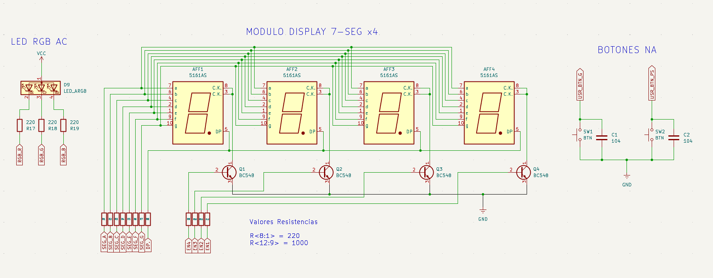

# 05_TIM_Output_Compare: Control de Movimiento y Generación de Eventos de Tiempo Real

Este proyecto documenta la implementación del periférico de **Output Compare (OC)** para el control preciso de un motor paso a paso **28BYJ-48**. Se integra una arquitectura de software estructurada en 3 capas de desacoplamiento que combina la generación de pulsos determinísticos mediante una Capa de Abstracción de Plataforma (PAL), modulación **PWM** para retroalimentación cromática y una interfaz visual multiplexada. La plataforma de desarrollo y pruebas físicas se basa en la placa **Nucleo-F439ZI** utilizando el entorno **STM32CubeIDE** y su **capa HAL**, implementando drivers de Capa 2 completamente **multiplataforma e independientes del fabricante**.

## 🎯 Objetivos
- **Dominar el modo Output Compare** para la generación de señales de temporización precisas e independientes del CPU.
- **Implementar un Driver Modular para Motores PAP** basado en estructuras de estado y tablas de secuencia (Half-Step/Full-Step).
- **Integrar un Sistema HMI Completo:** Control bidireccional mediante interrupciones externas (`EXTI`), visualización en display de 7 segmentos y estados mediante LED RGB.
- **Desarrollar un Scheduler Cooperativo No Bloqueante** en el lazo principal para la gestión de telemetría y lógica de negocio.

---

## 🔌 Especificaciones de Circuito

<center>

</center>


*   **Motor Paso a paso:** Motor paso a paso 28BYJ-48 + driver ULN2003.
*   **LED RGB:** 1 LED RGB Ánodo Común.
*   **Display:** 4 Dígitos 7-Segmentos (Multiplexado).
*   **Pulsadores:** 2 botones pulsadores NA (Play/Pausa-CW/CCW).

---

## 🔩 Teoría de Operación: Output Compare y Generación de Pulsos

### 1. El Concepto de Output Compare (OC)
A diferencia del modo PWM estándar, el **Output Compare** permite disparar una acción (o una interrupción) en el instante exacto en que el contador del Timer (`CNT`) coincide con un valor predefinido en el registro de comparación (`CCR`). 

* **Determinismo:** La generación de la base de tiempos para los pasos del motor no depende de bucles de software (`delay`), eliminando el *jitter* causado por otras tareas.
* **Frecuencia Variable:** Al modificar dinámicamente el valor de comparación, podemos ajustar la velocidad del motor (RPM) con una resolución de microsegundos.

### 2. El Motor 28BYJ-48: Secuenciamiento y Torque
El motor utilizado requiere una secuencia lógica de activación de 4 bobinas (IN1 a IN4). La precisión del movimiento depende de la regularidad de estos pulsos. Para este proyecto se optó por el modo **Half-Step** (secuencia de 8 estados) para lograr un movimiento más fluido y preciso.

### 3. Orquestación de Hardware: Triple Timer Workflow

El control temporal y la conmutación física del sistema se rigen por un esquema de temporización asíncrona distribuida en tres periféricos independientes de hardware. Esto evita cualquier tipo de bloqueo por software (`HAL_Delay` en *runtime*), liberando al núcleo principal para tareas de procesamiento superior:

### A. TIM5: Generador de Pasos (Output Compare Maestro)
El **TIM5** actúa como el "corazón" dinámico del movimiento. A diferencia de un PWM convencional donde el hardware cambia un pin de forma automática ante un desborde, aquí utilizamos el modo **Output Compare (OC)** para generar una base de tiempo elástica y ultra-precisa.

* **El Pin "Fantasma":** Aunque el canal 1 (`TIM5_CH1`) está configurado a nivel de registros internos, no se utiliza para conmutar un pin físico de salida directa. Funciona exclusivamente como una **alarma interna de hardware** de alta resolución.
* **Técnica de Acumulador de Fase:** Cada vez que el contador del Timer (`CNT`) alcanza el valor del registro de comparación (`CCR1`), se dispara de forma asíncrona la interrupción de hardware. La rutina lee este valor y le suma de forma elástica un delta lineal de tiempo variable (`step_delay`), reprogramando mecánicamente el próximo "despertador". Esto elimina por completo el *jitter* y el error acumulado por redondeo.

| Parámetro | Valor | Justificación Técnica |
| :--- | :--- | :--- |
| **Prescaler (PSC)** | 89 | Divide el reloj de 90MHz (APB1) para obtener una frecuencia de conteo de 1 MHz (**1 tick = 1 $\mu$s**). |
| **Counter Period (ARR)** | 4294967295 | Se utiliza el rango máximo de 32 bits para evitar desbordamientos continuos en el acumulador de fase. |
| **OC Mode** | Toggle / Frozen | Genera el evento de comparación por interrupción sin mover un pin físico de potencia. |
| **NVIC Priority** | 0 (Máxima) | Garantiza que el paso del motor no sea retrasado por ninguna otra tarea o multiplexado del sistema. |


#### B. TIM4: Estado Cromático (PWM)
Gestiona el LED RGB de ánodo común mediante tres canales independientes, transformando estados lógicos en una interfaz visual intuitiva y determinística:

* **Modulación de Ancho de Pulso:** Genera señales de $1 \text{ kHz}$ para controlar la intensidad de cada componente (R, G, B) con una resolución de 1000 niveles de *duty cycle*.
* **Corrección Gamma:** Se implementa un mapeo logarítmico en el driver para que la transición de colores y el brillo sean percibidos de forma lineal por el ojo humano, compensando la respuesta fisiológica no lineal de la visión.
* **Estados Visuales Definidos:** * **Rojo:** Sistema en `STOP` (Seguridad y reposo).
    * **Verde:** Giro horario (`CW`).
    * **Azul:** Giro antihorario (`CCW`).

**Configuración Técnica del Periférico:**

| Parámetro | Valor | Justificación Técnica |
| :--- | :--- | :--- |
| **Prescaler (PSC)** | 179 | Divide el reloj de 180MHz (APB1) para obtener una frecuencia de conteo de 1 MHz. |
| **Counter Period (ARR)** | 999 | Define una frecuencia PWM de 1 kHz, ideal para evitar parpadeos visibles en LEDs. |
| **Canales OC** | CH2, CH3, CH4 | Asignados a los pines PD13, PD14 y PD15 respectivamente. |
| **Modo PWM** | PWM Mode 1 | Los canales permanecen activos mientras el contador sea menor al valor de comparación (`CCR`). |


#### C. TIM2: Base de Tiempo para Display
Funciona como el "latido" de la interfaz visual. Genera una interrupción pura por desbordamiento (Update Event) cada **1 ms**, actuando como un reloj dedicado para la interfaz de usuario.

* **Multiplexado Asíncrono:** En cada interrupción, la rutina de servicio (ISR) conmuta el habilitador del dígito correspondiente y actualiza el estado de los segmentos. Este proceso se delega totalmente al hardware del Timer, liberando al `while(1)` de tareas cosméticas.
* **Persistencia de Visión:** Al ejecutarse a una frecuencia de refresco de $1 \text{ kHz}$, se garantiza una imagen estable y libre de parpadeos (*flicker*), ya que supera ampliamente la frecuencia crítica de fusión del ojo humano.
* **Independencia de Tareas:** La calidad visual del display es inmune a la velocidad del motor, a la carga de la telemetría UART o a cualquier latencia de procesamiento en el lazo principal.

**Configuración Técnica del Periférico:**

| Parámetro | Valor | Justificación Técnica |
| :--- | :--- | :--- |
| **Prescaler (PSC)** | 89 | Divide el reloj de 90MHz (APB1) para obtener una base de tiempo de 1 MHz. |
| **Counter Period (ARR)** | 1999 | Genera una interrupción cada 2000 ticks ($2 \text{ ms}$ por dígito, resultando en un refresco total muy fluido). |
| **NVIC Priority** | 2 | Se asigna una prioridad menor que el motor para asegurar que el control de movimiento sea siempre preferente. |
| **Modo** | Update Interrupt | Dispara el callback por desbordamiento del contador sin necesidad de pines externos. |


### 4. El Misterio del Pin "Fantasma" (OC sin Pin Físico)
Una duda común es por qué el pin **PA0 (TIM5_CH1)** no está conectado físicamente al motor. La respuesta reside en la arquitectura de interrupciones del STM32:

* **El Timer como Alarma:** En este proyecto, el periférico Output Compare no se usa para mover un pin externo, sino como un **despertador de alta precisión**. 
* **Evento Interno:** Cada vez que el contador del Timer alcanza el valor de comparación (`CCR`), se genera un evento interno que dispara una interrupción (`IT`).
* **Acción por Software:** En lugar de que el hardware mueva un pin, el CPU salta a la función `HAL_TIM_OC_DelayElapsedCallback`. Es allí donde nuestro código ejecuta la lógica del motor y conmuta los pines reales (**IN1 a IN4**).

**Ventaja Técnica:** Esto nos permite desacoplar la base de tiempo (el "cuándo" se da el paso) de la lógica de potencia (el "cómo" se activan las bobinas), permitiendo que el motor gire con una precisión de microsegundos sin bloquear el resto del sistema.

---

## 🏗️ Arquitectura de Software: Scheduler No Bloqueante y Gestión de Tareas

### Introducción de las 3 Capas
Para lograr la máxima robustez y cumplir con las directivas de diseño modular, el software se encuentra rígidamente estructurado bajo el modelo de inyección de dependencias:
* **Capa 1 (Hardware Mapping / Adaptadores - Dependiente de la Marca):** Ubicada en el archivo `main.c` de **STM32CubeIDE**. Implementa las funciones de envoltura (*wrappers*) reales de la **HAL de ST** que manipulan los registros físicos de GPIO y Timers de la Nucleo. Traduce los tipos universales booleanos de la PAL a los tipos propietarios (`GPIO_TypeDef*`, `TIM_HandleTypeDef*`).
* **Capa 2 (Drivers Agnósticos / Abstracción - Multiplataforma):** Módulos `step_motor_28BYJ48`, `rgb_led` y `Display_7Seg`. Son **100% independientes del fabricante**, definen las estructuras de datos privadas de los objetos, exigen tablas de funciones virtuales (`hal_interface_t`) y procesan secuencias lógicas de bits portátiles.
* **Capa 3 (Aplicación / FSM):** Lazo principal `while(1)` cooperativo y Callbacks de interrupción de EXTI. Coordina la lógica de negocio de la máquina de estados, procesa el filtrado de rebotes de los botones y despacha las tareas del Scheduler.

### Diagrama Mermaid

```mermaid
graph TD
    %% Capa 3: Aplicación
    subgraph Capa 3: Aplicación y FSM (Runtime Cooperativo)
        A[Lazo Principal while 1 / Scheduler] -->|Despacha Tareas Asíncronas| B(FSM de Aplicación)
        ISR_EXTI[HAL_GPIO_EXTI_Callback] -->|Modifica Estado por Software| B
    end

    %% Capa 2: Drivers Agnósticos
    subgraph Capa 2: Drivers Agnósticos - Capa Portátil e Independiente de la Marca
        B -->|Invoca Tareas No Bloqueantes| C[Driver RGB LED]
        B -->|Escribe Formato de Buffers| D[Driver Display 7 Seg]
        ISR_TIM5[HAL_TIM_OC_DelayElapsedCallback] -->|Wrapper Directo de Hardware| E[Driver Motor Stepper]
        
        C -->|Exige vtable Universal| PAL_U[hal_interface_t]
        E -->|Exige vtable Universal| PAL_U
        D -->|Exige vtable Dedicada| PAL_D[display_7seg_pal_t]
    end

    %% Capa 1: Hardware Mapping
    subgraph Capa 1: Hardware Mapping y Adaptadores - main.c STM32CubeIDE HAL
        PAL_U -->|Puntero .gpio_write| ADAPT_PP[PAL_STM32_GPIO_Write]
        PAL_U -->|Puntero .oc_read| ADAPT_OC_R[PAL_STM32_OC_Read]
        PAL_U -->|Puntero .oc_write| ADAPT_OC_W[PAL_STM32_OC_Write]
        PAL_D -->|Puntero .write_pin| ADAPT_DISP[PAL_Display_WritePin]
        
        ADAPT_PP -->|Manipula| HW_GPIO[GPIO Físico ST]
        ADAPT_OC_R -->|Lee Registro| HW_TIM5[TIM5 CCR1]
        ADAPT_OC_W -->|Escribe Registro| HW_TIM5
        ADAPT_DISP -->|Manipula| HW_DISPLAY[Pines Físicos Display]
    end

    style Capa 3 fill:#f9f,stroke:#333,stroke-width:2px
    style Capa 2 fill:#bbf,stroke:#333,stroke-width:2px
    style Capa 1 fill:#f96,stroke:#333,stroke-width:2px
```

### Detalle Capa 1 (+ código)
La Capa 1 resuelve el acoplamiento de tipos y la manipulación de registros específicos de la HAL de ST dentro del entorno STM32CubeIDE mediante adaptadores inyectados en la estructura virtual de la PAL.

```c
/* En el main.c - Sección de Adaptadores de Plataforma (Capa de Acoplamiento HAL de ST) */

void PAL_STM32_GPIO_Write(generic_gpio_t gpio, bool state) {
    HAL_GPIO_WritePin((GPIO_TypeDef*)gpio.port, gpio.pin, state ? GPIO_PIN_SET : GPIO_PIN_RESET);
}

uint32_t PAL_STM32_OC_Read(generic_pwm_t ch) {
    return HAL_TIM_ReadCapturedValue((TIM_HandleTypeDef*)ch.timer_handle, ch.channel);
}

void PAL_STM32_OC_Write(generic_pwm_t ch, uint32_t value) {
    __HAL_TIM_SET_COMPARE((TIM_HandleTypeDef*)ch.timer_handle, ch.channel, value);
}
```

### Detalle Capa 2 (+ código)
La Capa 2 procesa las secuencias dinámicas de bits de la tabla de paso (Half-Step) y ejecuta el acumulador elástico de forma completamente portátil, invocando las funciones virtuales de la PAL sin dependencias de marcas de silicio.

```c
/* En step_motor_28BYJ48.c - Lógica de Conmutación Agnóstica y Multiplataforma */

void Stepper_OC_Handler(Stepper_t* hstepper) {
    if (!hstepper || !hstepper->pal.gpio_write || !hstepper->pal.oc_read || !hstepper->pal.oc_write) return;

    /* 1. Lógica de avance mecánico y secuenciamiento de bobinas */
    if (hstepper->is_active) {
        uint8_t pattern;
        uint8_t max_steps = (hstepper->mode == MODE_HALF_STEP) ? 8 : 4;

        if (hstepper->direction == STEP_CW) {
            hstepper->current_step++;
            if (hstepper->current_step >= max_steps) hstepper->current_step = 0;
        } else {
            hstepper->current_step--;
            if (hstepper->current_step < 0) hstepper->current_step = max_steps - 1;
        }

        pattern = (hstepper->mode == MODE_HALF_STEP) ? HALF_STEP_TABLE[hstepper->current_step] : FULL_STEP_TABLE[hstepper->current_step];

        for (int i = 0; i < 4; i++) {
            bool pin_state = (pattern & (0x01 << i)) ? true : false;
            hstepper->pal.gpio_write(hstepper->pins[i], pin_state);
        }
    }

    /* 2. Ecuación elástica del Acumulador de Fase (Agnóstica) */
    uint32_t current_capture = hstepper->pal.oc_read(hstepper->oc_channel);
    hstepper->pal.oc_write(hstepper->oc_channel, current_capture + hstepper->step_delay);
}
```

### Detalle Capa 3 (+ código)
La Capa 3 implementa las rutinas de servicio físicas y la máquina de estados de control en la aplicación. El callback de Output Compare de la HAL actúa simplemente como un pasacables asíncrono hacia el objeto soberano de Capa 2.

```c
/* En main.c - Rutina de Servicio de Interrupción de Hardware de ST (ISR) */

void HAL_TIM_OC_DelayElapsedCallback(TIM_HandleTypeDef *htim) {
    if (htim->Instance == TIM5) {
        if (htim->Channel == HAL_TIM_ACTIVE_CHANNEL_1) {
            
            /* Delegar el control y el acumulador de fase al objeto agnóstico de Capa 2 */
            Stepper_OC_Handler(&motor1);
            
        }
    }
}
```


El sistema implementa un esquema de **Multitarea Cooperativa** utilizando el temporizador del sistema (`HAL_GetTick()`). Esta arquitectura permite que el procesador gestione la telemetría, el refresco visual y los efectos del LED sin detener la ejecución de las tareas críticas de tiempo real (como el movimiento del motor).

### Organización de Tareas en el Lazo Principal:
1.  **Tarea de Efectos RGB:** Ejecuta el `RGB_Effects_Handler` para procesar transiciones y parpadeos asíncronos.
2.  **Tarea de Gestión de Eventos (Banderas):** Al activarse `flag_update_display` desde los botones, se reconfigura el estado del LED RGB y el parpadeo del display.
3.  **Tarea de Telemetría UART (Cada 1000ms):** Envía un reporte detallado incluyendo dirección, índice de paso del driver y RPM calculadas.
4.  **Tarea de Refresco Visual (Cada 200ms):** Actualiza el *string* del display 7 segmentos para reflejar el estado actual del motor.

---

## ⚠️ Lecciones Aprendidas: El Rol Crítico de los Callbacks

La robustez de este proyecto reside en la delegación de tareas a las **Rutinas de Servicio de Interrupción (ISR)** mediante los Callbacks de la HAL. Se definieron tres niveles de respuesta asíncrona:

### 1. El Latido del Motor: `HAL_TIM_OC_DelayElapsedCallback` (TIM5)
Es la tarea más crítica. Utiliza la técnica de **Acumulador de Fase**: en cada interrupción, se lee el valor capturado y se reprograma el siguiente evento sumando el `step_delay`. Esto garantiza que los pasos del motor se ejecuten con un determinismo absoluto, independiente de cuánto tarde el código en el `while(1)`.

```c
/**
 * @brief Callback de comparación de salida (Output Compare) del Timer.
 * @details El hardware de ST genera la interrupción física y asíncrona.
 * La aplicación valida el canal correspondiente y le delega la
 * responsabilidad completa del movimiento y del acumulador de fase
 * al manejador de Capa 2 del objeto motor.
 * @param htim Puntero a la estructura nativa del Timer de ST que generó el evento.
 */
void HAL_TIM_OC_DelayElapsedCallback(TIM_HandleTypeDef *htim) {
    /* 1. Validar que la interrupción provenga del TIM5 y del Canal 1 (Alarma Fantasma) */
    if (htim->Instance == TIM5) {
        if (htim->Channel == HAL_TIM_ACTIVE_CHANNEL_1) {

            /* 2. Delegar TODA la lógica al manejador agnóstico de Capa 2 */
            Stepper_OC_Handler(&motor1);

        }
    }
}
```

### 2. El Refresco del Display: `HAL_TIM_PeriodElapsedCallback` (TIM2)
Gestiona el multiplexado de los 3 dígitos. Se configuró para dispararse periódicamente, asegurando que el barrido de los segmentos sea constante y libre de parpadeos (*flicker*), incluso bajo alta carga de telemetría UART.

```c
/**
 * @brief Callback de Interrupción de Base de Tiempo (TIM2).
 * @details El hardware de ST despierta al micro y delega el multiplexado físico
 * al método de la Capa 2.
 */
void HAL_TIM_PeriodElapsedCallback(TIM_HandleTypeDef *htim) {
	if (htim->Instance == TIM2) {
		Display7Seg_Refresh_ISR(&Display);
	}
}
```

### 3. La Reactividad del Usuario: `HAL_GPIO_EXTI_Callback` (PB10/PB11)
Implementa la lógica de control de marcha/parada y sentido de giro. 
* **Debouncing por Software:** Se utiliza una guarda de tiempo ($250 \text{ ms}$) para ignorar los rebotes mecánicos de los pulsadores, garantizando transiciones limpias entre estados.

```c
/**
 * @brief Callback de Interrupción Externa para pines GPIO.
 * @details Gestiona el pulsador en PB10 y PB11 (lógica negativa) para alternar giros y entre
 * los estados de marcha y parada del motor (Toggle). Incluye un
 * mecanismo de debouncing por software.
 * @param GPIO_Pin Pin que disparó la interrupción.
 */
void HAL_GPIO_EXTI_Callback(uint16_t GPIO_Pin) {
	uint32_t interrupt_time = HAL_GetTick();
	static uint32_t last_btn_start_time = 0;
	static uint32_t last_btn_dir_time = 0;

	/* --- Entrada Start/Stop (PB11) --- */
	if (GPIO_Pin == usr_btn_PS_Pin) {
		if (interrupt_time - last_btn_start_time > 250) {
			if (current_state == MOTOR_STOPPED) {
				current_state = MOTOR_RUNNING;
				Stepper_Start(&motor1);
			} else {
				current_state = MOTOR_STOPPED;
				Stepper_Stop(&motor1);
			}
			flag_update_display = 1;
			last_btn_start_time = interrupt_time;
		}
	}

	/* --- Entrada Cambio de Sentido (PB10) --- */
	if (GPIO_Pin == usr_btn_G_Pin) {
		if (interrupt_time - last_btn_dir_time > 250) {
			if (motor1.direction == STEP_CW) {
				Stepper_Set_Direction(&motor1, STEP_CCW);
			} else {
				Stepper_Set_Direction(&motor1, STEP_CW);
			}
			flag_update_display = 1;
			last_btn_dir_time = interrupt_time;
		}
	}
}
```

---

## 🗺️ Mapeo de Hardware y Configuración de Pines

La asignación de pines se realizó utilizando etiquetas (*Labels*) en STM32CubeMX para facilitar la legibilidad del código y la portabilidad:

### Control de Movimiento (Motor Stepper)
| Señal | Pin (Nucleo-F439ZI) | Función | Puerto / Canal |
| :--- | :--- | :--- | :--- |
| **Paso Preciso** | **PA0** | TIM5_CH1 | Output Compare (Toggle) |
| **IN1 / IN2** | **PE9 / PE11** | GPIO Out | Secuencia de Bobinas |
| **IN3 / IN4** | **PE13 / PE14**| GPIO Out | Secuencia de Bobinas |

### Interfaz de Usuario y Telemetría
| Periférico | Pin | Etiqueta / Función | Configuración |
| :--- | :--- | :--- | :--- |
| **Botón Start/Stop** | **PB11** | `usr_btn_PS_Pin` | EXTI Line 11 (Pull-up) |
| **Botón Dirección** | **PB10** | `usr_btn_G_Pin` | EXTI Line 10 (Pull-up) |
| **LED RGB** | **PD13-14-15** | R, G, B | TIM4 (PWM CH2, CH3, CH4) |
| **UART** | **PD8 / PD9** | ST-LINK VCP | USART3 (115200 bps) |

### Visualización (Display 7 Segmentos)
| Periférico | Pin | Etiqueta / Función | Configuración |
| :--- | :--- | :--- | :--- |
| SEGMENTO A | **PE5** | SEG_A | GPIO_OUTPUT |
| SEGMENTO B | **PE6** | SEG_B | GPIO_OUTPUT |
| SEGMENTO C | **PE3** | SEG_C | GPIO_OUTPUT |
| SEGMENTO D | **PF8** | SEG_D | GPIO_OUTPUT |
| SEGMENTO E | **PE7** | SEG_E | GPIO_OUTPUT |
| SEGMENTO F | **PE9** | SEG_F | GPIO_OUTPUT |
| SEGMENTO G | **PG1** | SEG_G | GPIO_OUTPUT |
| HABILITADOR 1 | **PC8** | EN_1 | GPIO_OUTPUT |
| HABILITADOR 2 | **PC9** | EN_2 | GPIO_OUTPUT |
| HABILITADOR 3 | **PC10** | EN_3 | GPIO_OUTPUT |
| HABILITADOR 4 | **PC11** | EN_4 | GPIO_OUTPUT |

---

## ⚠️ Detalles de Robustez

* **Bit-Shifting Deslizante:** Para mapear la tabla lógica de excitación hacia los cuatro pines físicos independientes, el driver de Capa 2 utiliza una máscara de bits dinámica `(pattern & (0x01 << i))`. Esto elimina la necesidad de estructuras de decisión condicionales pesadas (`if/else`) dentro de la ISR, garantizando una ejecución a tiempo constante **O(1)** en cualquier procesador.
* **Anti-Ghosting Visual:** En la rutina crítica de multiplexación del display, se implementa una desactivación total forzada de todos los comunes de los dígitos antes de cargar el nuevo valor del bus de segmentos. Esto extingue las corrientes remanentes en los parásitos capacitivos de las pistas y elimina el efecto fantasma.
* **Debouncing por Software en EXTI:** Los pulsadores de comando externo utilizan una guarda temporal diferencial basada en la estampa de tiempo del sistema `(interrupt_time - last_time > 250ms)`. Esto filtra eficazmente los rebotes mecánicos sin bloquear los hilos principales con retardos por software.
* **Límites Físicos Dinámicos:** En el banco de pruebas se determinó que valores de `step_delay` inferiores a **900 μs** provocan que el motor 28BYJ-48 pierda sincronismo y se bloquee. Esto se debe a la constante de tiempo eléctrica de las bobinas ($\tau = L/R$) y la inercia del rotor, lo que exige la implementación futura de rampas de aceleración progresivas.

---

## 🏁 Conclusión

El Laboratorio 05 demuestra cómo el modo **Output Compare** transforma al microcontrolador en un generador de eventos físicos de alta precisión. Al separar la lógica de negocio (en el `while`) de la generación de señales críticas (en los Callbacks), se logra un sistema embebido profesional capaz de controlar potencia y tiempo de forma simultánea y determinística.

---
*"Nivel Intermedio: La maestría de los Timers permite que el software gobierne el hardware no solo con lógica, sino con una precisión temporal quirúrgica."*

🛠️ **Carlos** | Estudiante de Ing. Electrónica @UTN_FRT.  
🚀 Apasionado Autodidacta por los Sistemas Embebidos.