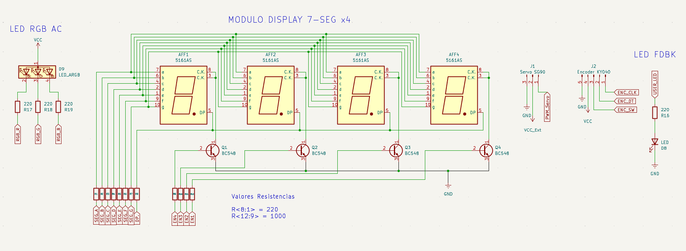
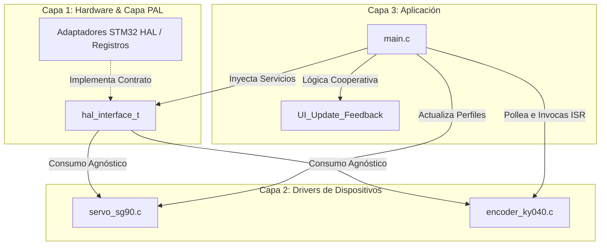

# 06_TIM_PWM_Advance: Control de Posición, Interpolación de Velocidad y HMI Multimodal

Este laboratorio documenta la implementación avanzada de señales **PWM (Pulse Width Modulation)** para el control de posición de un servomotor **SG90** y la decodificación por software de un encoder rotativo **KY-040**. Manteniendo el estándar de diseño multiplataforma del repositorio, ambos módulos operan de forma agnóstica a través de nuestra capa PAL (Platform Abstraction Layer), permitiendo que toda la lógica de control asíncrono e interpolación cinemática corra de forma idéntica en STM32, NXP o AVR.

## 🎯 Objetivos
* **Dominar el Protocolo PPM:** Configurar los registros de comparación del Timer para emular señales PPM de 50Hz con resolución de microsegundos.
* **Optimizar la Cinética del Actuador:** Implementar un algoritmo de interpolación de trayectoria (*Slew Rate Control*) para eliminar movimientos bruscos y picos de corriente.
* **Decodificación Robusta por Software:** Desarrollar un manejador de interrupciones unificado para las señales en cuadratura del encoder, aislando el ruido mecánico.
* **Sincronización de HMI Asíncrona:** Coordinar el lazo principal para actualizar dinámicamente un LED RGB y un display de 7 segmentos multiplexado según el ángulo actual.

---

## 🔌 Especificaciones de Circuito

<center>

</center>


*   **Servomotor:** Servo SG-90.
*   **Encoder:**    Encoder KY-040
*   **LED RGB:**    1 LED RGB Ánodo Común.
*   **Display:**    4 Dígitos 7-Segmentos (Multiplexado).

---

## 🔩 Teoría de Operación: PWM de Posición vs. PWM de Potencia

### 1. El Protocolo de Control del Servo SG90 (PPM)
A diferencia de un PWM clásico para control de potencia (como el brillo del LED RGB), donde el ciclo de trabajo (*Duty Cycle*) varía de 0% a 100%, el servomotor analógico utiliza el ancho del pulso positivo como un **mensaje de posición**.

* **Determinismo de Frecuencia:** La señal exige un período estricto de **20 ms (50 Hz)**. Desviaciones en esta base de tiempo desestabilizan el lazo analógico interno del servo, provocando vibraciones mecánicas (*jitter*), pérdida de torque y recalentamiento.
* **Resolución Temporal:** El rango útil se confina estrictamente entre **0.5 ms (500 μs) para 0°** y **2.5 ms (2500 μs) para 180°**. Configurando el Timer para que obtenga una resolución de **1 μs por cuenta**, logramos un control de posición sub-grado de alta precisión.

### 2. Algoritmo de Interpolación y Slew Rate
Para evitar que el servo intente alcanzar un nuevo objetivo de forma instantánea—lo que generaría un estrés mecánico masivo en los engranajes y caídas de tensión en la línea de alimentación—, el driver procesa la trayectoria en el tiempo:
* **Desacople de Objetivos:** El sistema separa la intención del usuario (`target_angle`) de la realidad cinemática (`current_angle`).
* **Cálculo por Delta-Time ($dT$):** El método `Update` pollea de forma no bloqueante el tiempo transcurrido en milisegundos. El ángulo real avanza hacia la meta a una velocidad constante expresada en Grados por Segundo (DPS), garantizando transiciones suaves.

---

## 🏗️ Orquestación de Hardware: Triple Timer Workflow

El sistema delega las tareas críticas a tres periféricos independientes para garantizar que el núcleo Cortex-M4 se enfoque en la lógica de control:

#### A. TIM3: Generador de Posición (PWM Avanzado)
Es el encargado de generar la señal de control para el servo. Se configuró para maximizar la resolución en el rango útil de 1ms a 2ms.


**Configuración Técnica:**
| Parámetro | Valor | Justificación Técnica |
| :--- | :--- | :--- |
| **Prescaler (PSC)** | 89 | Divide el reloj de 90MHz (APB1) para obtener **1 tick = 1 μs**. |
| **Period (ARR)** | 19999 | Define el periodo exacto de **20ms (50Hz)** requerido por el servo. |
| **Pulse (CCR)** | 520 - 2540 | Mapea el rango de 0.5ms a 2.5ms para cubrir los 180° de giro. |

#### B. TIM4: Feedback Cromático (PWM)
Controla el LED RGB mediante PWM de alta frecuencia ($1 \text{ kHz}$), permitiendo una mezcla de colores suave que indica la zona de trabajo del servo.

* **Lógica por Segmentos:** El color cambia dinámicamente:

    * **Rojo:** Posición mínima (0°).
    * **Verde:** Zona central (90°).
    * **Azul:** Posición máxima (180°).

#### C. TIM2: Multiplexado de Display
Genera una interrupción pura cada **2 ms** para el refresco del display de 7 segmentos. Al usar interrupciones, el brillo y la estabilidad del display son independientes de la carga de trabajo del procesador.

---

## 🏗️ Arquitectura de Software

El firmware se estructura bajo el modelo de **3 Capas independientes**, utilizando la inyección de dependencias de nuestra PAL universal para desacoplar el núcleo lógico del silicio del fabricante.



### Detalle Capa 1: Hardware Mapping & Adaptadores
Nivel inferior que asocia los periféricos físicos de la placa con el contrato abstracto. Se encarga de implementar funciones mínimas de lectura/escritura digital y escrituras en registros de comparación de los Timers (`__HAL_TIM_SET_COMPARE`).

### Detalle Capa 2: Core de los Drivers (Servo & Encoder)
Este nivel procesa la física intrínseca de los componentes. El código está completamente limpio de palabras clave de STM32, operando mediante abstracción.

#### Lógica del Control de Trayectoria Suave (`servo_sg90.c`):
```c
void SERVO_SG90_Update(Servo_t *servo) {
    if (servo == NULL || servo->pal.get_tick == NULL || servo->pal.pwm_write == NULL) return;
    if (servo->step_per_tick == 0.0f || (int)servo->current_angle == servo->target_angle) return;

    uint32_t now = servo->pal.get_tick();
    uint32_t delta = now - servo->last_time_ms;

    if (delta > 0) {
        servo->last_time_ms = now;
        float move = servo->step_per_tick * (float)delta;

        /* Aproximación lineal controlada hacia la meta */
        if (servo->current_angle < (float)servo->target_angle) {
            servo->current_angle += move;
            if (servo->current_angle > (float)servo->target_angle)
                servo->current_angle = (float)servo->target_angle;
        } else {
            servo->current_angle -= move;
            if (servo->current_angle < (float)servo->target_angle)
                servo->current_angle = (float)servo->target_angle;
        }

        /* Impacto directo al PWM a través de la PAL */
        uint32_t ccr_val = map_angle_to_ccr(servo, servo->current_angle);
        servo->pal.pwm_write(servo->pwm_chan, (uint16_t)ccr_val);
    }
}
```

#### Decodificación Unificada de Cuadratura por Software (`encoder_ky040.c`):
```c
void KY040_IRQ_Handler(KY040_t *dev, generic_gpio_t triggered_gpio) {
    if (dev == NULL || dev->pal.get_tick == NULL || dev->pal.gpio_read == NULL) return;
    uint32_t ahora = dev->pal.get_tick();

    /* --- FILTRADO Y PROCESAMIENTO DEL CANAL CLK --- */
    if (triggered_gpio.port == dev->pin_A.port && triggered_gpio.pin == dev->pin_A.pin) {
        if (ahora - dev->last_tick < 5) return; /* Filtro anti-rebote de cuadratura */

        bool estadoA = dev->pal.gpio_read(dev->pin_A);
        bool estadoB = dev->pal.gpio_read(dev->pin_B);

        /* Algoritmo de detección por flanco de bajada */
        if (dev->lastStateA == 1 && estadoA == false) {
            if (estadoB != estadoA) {
                dev->position++; /* Sentido Horario (CW) */
            } else {
                dev->position--; /* Sentido Antihorario (CCW) */
            }
            /* Saturación de límites */
            if (dev->position > dev->max_val) dev->position = dev->max_val;
            if (dev->position < dev->min_val) dev->position = dev->min_val;
            dev->last_tick = ahora;
        }
        dev->lastStateA = estadoA ? 1 : 0;
    }
}
```

### Detalle Capa 3: Lógica de Aplicación
El bloque de alto nivel en `main.c` ejecuta la orquestación cooperativa no bloqueante: sincroniza la posición del encoder hacia la meta del servo, despacha las tramas de depuración por UART y coordina el feedback visual (colores del LED RGB y visualización en el display multiplexado de 7 segmentos).

---

## 🛠️ Detalles de Robustez y Tolerancia a Fallos

* **Inmunidad al Ruido en Señales de Fase (CLK):** Las transiciones mecánicas de un encoder económico generan rebotes transitorios dañinos. El driver aplica un bloqueo de tiempo síncrono de **5 ms** en el canal CLK, ignorando ruidos térmicos y lecturas espurias en la ISR.
* **Debouncing de Transición en el Pulsador (SW):** El switch del encoder posee una guarda asíncrona por software de **200 ms**. El evento se convalida únicamente si, tras expirar la ventana de tiempo, el lector digital confirma que el pin continúa en estado bajo estable (Active Low con Pull-Up).
* **Protección Cinemática por Clamping:** El driver del servo implementa restricciones numéricas estrictas de acotamiento en punto flotante, asegurando que ante cualquier desborde o anomalía del encoder, las cuentas de PWM se confinen al rango calibrado seguro de 0° a 180°, tunneling o anulando el riesgo de rotura de los topes mecánicos del reductor.

---

## 🏗️ Orquestación de Hardware: Triple Timer Workflow

El sistema delega las subtareas cíclicas y de alta frecuencia a periféricos independientes de hardware, liberando ciclos de ejecución en el núcleo de procesamiento:

| Periférico | Función Técnica | Configuración de Reloj / Registros | Justificación de Ingeniería |
| :--- | :--- | :--- | :--- |
| **TIM3** | Generador de Posición (PPM) | Prescaler = 89, Período (ARR) = 19999 | Setea la base exacta de **20ms (50Hz)** requerida por el SG90, logrando un paso de cuenta equivalente a **1 μs**. |
| **TIM4** | Feedback Cromático (LED RGB) | Prescaler = 179, Período (ARR) = 999 | Modulación PWM a **1 kHz** para una mezcla de color fluida y libre de parpadeo perceptivo (*flicker*). |
| **TIM2** | Multiplexado del Display | Prescaler = 89, Período (ARR) = 1999 | Genera una interrupción determinística cada **2 ms** para el barrido secuencial de los dígitos, blindando el brillo contra retardos del lazo principal. |

---

## 🗺️ Mapeo de Hardware y Configuración de Pines

La asignación de recursos se ha diseñado para evitar conflictos entre los canales de los Timers y las líneas de interrupción externa, aprovechando el layout de la **Nucleo-F439ZI**:

| Periférico | Pin | Etiqueta | Función / Justificación Técnica |
| :--- | :--- | :--- | :--- |
| **TIM3_CH2** | **PA7** | `SERVO_PWM` | **Control de Posición:** Salida PWM con resolución de 1μs. |
| **TIM4_CH2-4**| **PD13-15** | `RGB_R/G/B` | **HMI Cromática:** Control de LED RGB mediante PWM de 1kHz. |
| **EXTI 9_5**  |   **PB9** | `ENC_SW`  |   **Switch Encoder:** Resetea el Servo a 90 grados.    |
| **EXTI 9_5** | **PB8** | `ENC_CLK` | **Reloj Encoder:** Dispara la IT para el conteo de pasos. |
| **GPIO Input** | **PA5** | `ENC_DT` | **Sentido Encoder:** Determina dirección (CW/CCW). |
| **TIM2** | **Interno** | `DISP_REFRESH` | **Base de Tiempo:** Interrupción de 2ms para multiplexado. |
| **UART3** | **PD8/PD9** | `STLINK_VCP` | **Telemetría:** Debug Log a 115200 bps vía USB. |


### Notas de Conexión:
* **Servo SG90:** Se alimenta desde los 5V **externos**, pero la señal PWM es de 3.3V (compatible con el driver interno del servo).
* **Encoder KY-040:** Requiere resistencias de *Pull-Up* activas (configuradas internamente en el STM32) debido a que es un dispositivo de colector abierto.
* **Display 7 Segmentos:** Los pines de segmentos utilizan resistencias limitadoras de corriente para proteger los GPIOs del puerto E, F y G.

## 🏁 Conclusión

El **Laboratorio 06** demuestra la versatilidad del periférico Timer para ir más allá de la simple generación de señales, convirtiéndose en un protocolo de comunicación (PPM). La integración de algoritmos de interpolación y decodificación por interrupciones eleva el proyecto a un nivel de control industrial, donde la suavidad del movimiento y la respuesta del sistema son prioritarias.

---

*"Nivel Intermedio: Superar los retardos por software es el primer paso hacia la ingeniería; aquí el PWM deja de ser una señal de potencia para ser un protocolo de control determinístico."*

🛠️ **Carlos** | Estudiante de Ing. Electrónica @UTN_FRT.  
🚀 Apasionado Autodidacta por los Sistemas Embebidos.