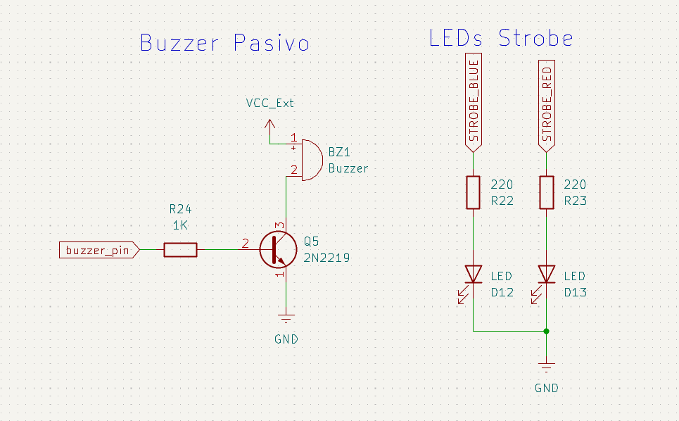
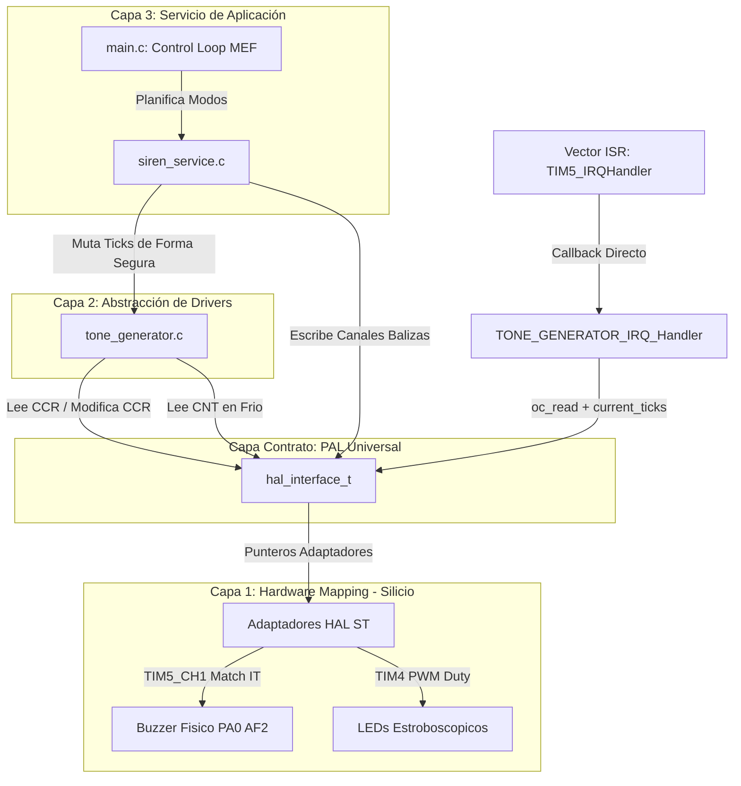
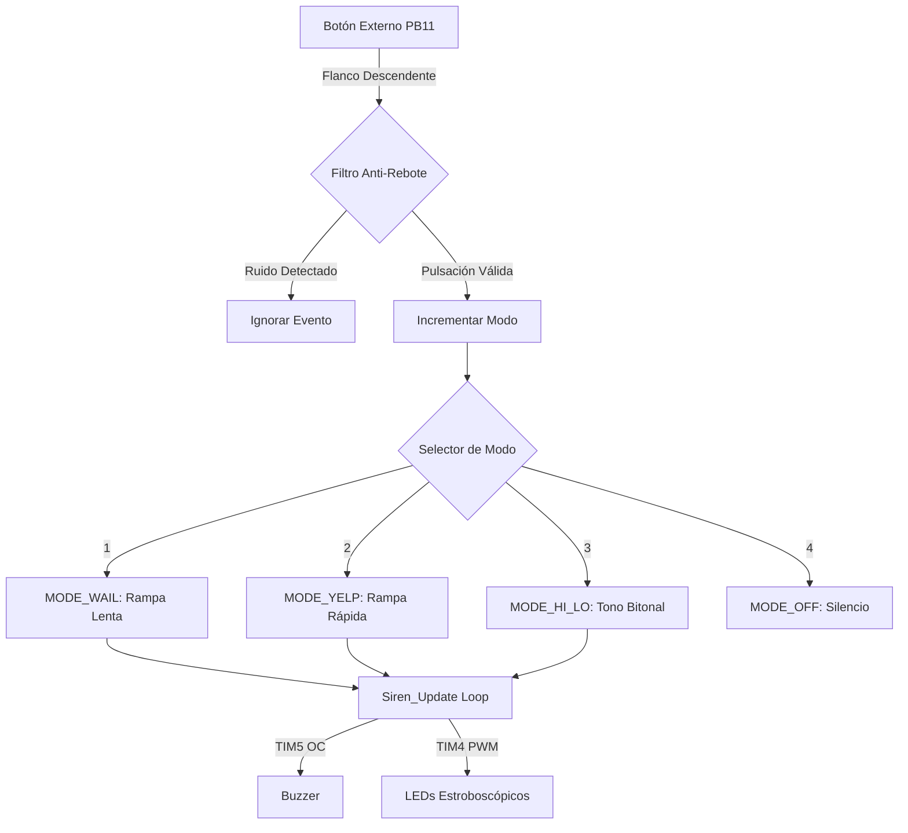

# 07_TIM_OC_Advance: Generación de Audio por Output Compare y Señalización de Emergencia Vehicular y Civil

Este laboratorio documenta la implementación avanzada del modo **Output Compare (OC)** de los Timers para la generación de frecuencias de audio precisas (Sirenas) y patrones de iluminación estroboscópica coordinados (Balizas). El proyecto destaca por su migración hacia un modelo **orientado a objetos (instanciable)** mediante el diseño de una **PAL (Platform Abstraction Layer) Universal** de tres capas. Esta arquitectura desacopla por completo la lógica cinemática y de control de los registros del silicio de ST, permitiendo portar el firmware hacia otras plataformas (AVR, NXP) sin recompilar el núcleo de la aplicación. Asimismo, introduce técnicas avanzadas de discriminación de pulsos en background para la coexistencia de modos automáticos y manuales en entornos expuestos a interferencia electromagnética (EMI).

## 🎯 Objetivos
* **Abstraer Periféricos por Inyección de Dependencias:** Diseñar un contrato universal (`hal_interface_t`) que encapsule los registros de comparación y conteo para independizar las Capas 2 y 3 del fabricante.
* **Dominar el Modo Output Compare:** Utilizar el registro de coincidencia para reprogramar de forma elástica el contador sin perturbar el periodo libre (`ARR`), logrando una síntesis armónica determinística.
* **Sintetizar Cinemáticas Multimodo Dinámicas:** Desarrollar perfiles cinemáticos lineales, discretos e inerciales para emular sirenas de emergencia y alertas de defensa civil (*Wail*, *Yelp*, *Hi-Lo*, *War Siren*).
* **Robustez de Control Temporal Avanzado:** Implementar una máquina de estados de pulsación no bloqueante basada en ventanas de tiempo para la discriminación atómica de gestos (*Click* corto para secuenciar / *Hold* largo para ráfaga manual de *Horn*)

---

<center>

</center>

## 🔩 Especificaciones del Circuito
* **Transductor Acústico:** Control de potencia mediante configuración de transistor NPN en corte y saturación, actuando como etapa de aislamiento galvánico de baja señal para amortiguar el contragolpe inductivo del transductor de audio.
* **Canales de Señalización Visual:** Dos canales independientes de LEDs (Rojo/Azul).
* **Filtro de Entrada Anti-EMI:** El pin de control mecánico (**PB11**) opera con configuración *Pull-Up* interna acoplada a una red de filtrado pasa-bajos pasiva por hardware mediante un capacitor cerámico de 100 nF en paralelo para mitigar el acoplamiento de ruido inductivo del buzzer.


---

## 🔩 Teoría de Operación: Acumulador Elástico por Output Compare

### 1. Generación de Audio Desacoplada (Modo Toggle)
A diferencia del PWM convencional, donde el periodo está rígidamente determinado por el registro de autorrecarga (`ARR`), en este sistema el Timer corre libremente en modo *Free Running* escalando de 0 a 2^32-1 ticks.

* **Acumulador de Fase Síncrono:** La rutina de interrupción de hardware de la Capa 2 lee el instante del match previo grabado en el registro de comparación y le suma dinámicamente un valor variable en memoria denominado `current_ticks`.
* **Cálculo Semiperiódico:** A partir de la frecuencia deseada, se determina la cantidad de ticks necesarios para cada semiciclo mediante la fórmula:
  ticks = F_timer / (2 * F_salida)
  El silicio cambia automáticamente el estado del pin físico de forma simétrica sin intervención de software en cada coincidencia, logrando inmunidad frente al *jitter* y eliminando los chasquidos (*clipping*) en las transiciones de rampa.

### 2. Sincronización Inicial de Fase
Para evitar que el hardware espere hasta una vuelta completa del contador (4.294.967.295 ticks) para emitir el primer sonido cuando se pasa del estado de reposo a activo, la Capa 2 consume la abstracción de lectura de tiempo real de hardware (`get_timer_cnt`) para capturar la posición física instantánea del contador (`CNT`) y clavar el primer match inmediatamente en el futuro absoluto:
  CCR = CNT + current_ticks

---

## 🏗️ Orquestación de Hardware: Dual Timer Workflow

El sistema separa los dominios de tiempo en dos periféricos para garantizar que el audio tenga prioridad y precisión, mientras las luces operan de fondo.

#### A. TIM5: Sintetizador de Audio (Output Compare 32-bit)
Configurado como la base de tiempo maestra para el sonido. Su resolución de 32 bits permite generar frecuencias precisas sin desbordamientos rápidos.

**Configuración Técnica:**
| Parámetro | Valor | Justificación Técnica |
| :--- | :--- | :--- |
| **Prescaler (PSC)** | 89 | Genera una base de tiempo de **1 MHz** ($1 \mu s$ por tick) desde el bus de 90MHz. |
| **Period (ARR)** | 0xFFFFFFFF | Conteo libre (Free Running) para modulación continua. |
| **Modo OC** | Toggle | Inversión automática del pin PA0 en cada coincidencia del CCR. |

#### B. TIM4: Controlador de Balizas (PWM)
Gestiona la intensidad y el encendido de los dos grupos de LEDs (Rojos y Azules).

* **Frecuencia:** 500 Hz (Libre de parpadeo visible).
* **Duty Cycle:** Variable (0% o 90%) controlado por el servicio de sirena para crear efectos de destello.

---

## 🏗️ Arquitectura del Software: Desacople en 3 Capas

El software se rige bajo un esquema modular estricto inyectado por dependencias que aísla por completo el silicio de la aplicación del usuario.

### Estructura de la PAL Universal (`hal_interface.h`)
```c
typedef struct {
	gpio_write_ptr    gpio_write;   /**< Servicio de salida digital */
	gpio_read_ptr     gpio_read;    /**< Servicio de entrada digital */
	pwm_write_ptr     pwm_write;    /**< Servicio de generación PWM */
	tick_get_ptr      get_tick;     /**< Servicio de base de tiempo (Systick) */
	delay_ms_ptr      delay_ms;     /**< Servicio de temporización bloqueante */
	get_us_ptr        get_us;       /**< Servicio de microsegundos */
	ic_read_ptr       ic_read;      /**< Abstracción de Input Capture */
	ic_set_edge_ptr   ic_set_edge;  /**< Modificación de polaridad de captura */
	oc_read_ptr       oc_read;      /**< Abstracción de lectura del registro de comparación (CCR) */
	oc_write_ptr      oc_write;     /**< Abstracción de escritura en el registro de comparación (CCR) */
	timer_cnt_get_ptr get_timer_cnt; /**< Abstracción de lectura del contador instantáneo (CNT) */
} hal_interface_t;
```

## 🔄 Diagrama de Interacción de Capas (Mermaid)



---

## 🔄 Diagrama de Flujo del Sistema



### Detalle de Capa 1: Mapeo de Hardware y Adaptadores (`main.c`)
La Capa 1 implementa las firmas del contrato de la PAL, interactuando de forma directa con las macros y funciones nativas de la HAL de STMicroelectronics.

```c
void PAL_STM32_PWM_Write(generic_pwm_t ch, uint16_t value) {
	__HAL_TIM_SET_COMPARE((TIM_HandleTypeDef*)ch.timer_handle, ch.channel, value);
}

uint32_t PAL_STM32_OC_Read(generic_pwm_t ch) {
	return HAL_TIM_ReadCapturedValue((TIM_HandleTypeDef*)ch.timer_handle, ch.channel);
}

void PAL_STM32_OC_Write(generic_pwm_t ch, uint32_t value) {
	__HAL_TIM_SET_COMPARE((TIM_HandleTypeDef*)ch.timer_handle, ch.channel, value);
}

uint32_t PAL_STM32_GetTimerCnt(generic_pwm_t ch) {
	return __HAL_TIM_GET_COUNTER((TIM_HandleTypeDef*)ch.timer_handle);
}
```

### Detalle de Capa 2: Driver Generador de Tonos (`tone_generator.c`)
Este controlador opera de manera puramente agnóstica. Durante la ejecución periódica, se blinda el acceso a los registros del microcontrolador modificando la variable en memoria de manera atómica, delegando la escritura física exclusivamente a la Rutina de Servicio de Interrupción (ISR) para neutralizar el ruido de conmutación.

```c
void TONE_GENERATOR_SetFrequency(tone_gen_t *tg, uint32_t freq) {
    if (tg == NULL) return;
    if (freq == 0) { TONE_GENERATOR_Stop(tg); return; }

    uint32_t nuevos_ticks = tg->timer_clk_freq / (2 * freq);

    if (!tg->is_active) {
        tg->current_ticks = nuevos_ticks;
        tg->is_active = 1;
        if (tg->pal.get_timer_cnt != NULL && tg->pal.oc_write != NULL) {
            uint32_t current_cnt = tg->pal.get_timer_cnt(tg->oc_chan); 
            tg->pal.oc_write(tg->oc_chan, current_cnt + tg->current_ticks);
        }
    } else {
        tg->current_ticks = nuevos_ticks; // Muta en caliente de forma segura
    }
}

void TONE_GENERATOR_IRQ_Handler(tone_gen_t *tg) {
    if (tg == NULL || !tg->is_active) return;
    if (tg->pal.oc_read != NULL && tg->pal.oc_write != NULL) {
        uint32_t pulse = tg->pal.oc_read(tg->oc_chan);
        tg->pal.oc_write(tg->oc_chan, pulse + tg->current_ticks); // Reprogramación elástica síncrona
    }
}
```

### Detalle de Capa 3: Orquestación del Servicio de Sirena (`siren_service.c`)
La Capa 3 implementa las cinemáticas de modulación de audio y las escalas variables de temporización de las luces baliza de manera asíncrona.

```c
void SIREN_SERVICE_Update(siren_service_t *siren) {
	if (siren == NULL || siren->current_mode == MODE_OFF || siren->pal.get_tick == NULL) return;
	uint32_t now = siren->pal.get_tick();

	/* 1. MÁQUINA DE MODULACIÓN DE AUDIO (Bases de Tiempo No Bloqueantes) */
	if (now - siren->last_siren_tick >= 20) {
		siren->last_siren_tick = now;
		switch (siren->current_mode) {
		case MODE_WAIL:
			siren->current_freq += siren->freq_step;
			if (siren->current_freq >= 1400 || siren->current_freq <= 600) siren->freq_step *= -1;
			TONE_GENERATOR_SetFrequency(siren->tone_gen, siren->current_freq);
			break;
		case MODE_YELP:
			siren->current_freq += siren->freq_step;
			if (siren->current_freq >= 1600 || siren->current_freq <= 700) siren->freq_step *= -1;
			TONE_GENERATOR_SetFrequency(siren->tone_gen, siren->current_freq);
			break;
		case MODE_HI_LO:
			{
				uint32_t nuevo_tono = ((now / 500) % 2 == 0) ? 700 : 1100;
				if (siren->current_freq != nuevo_tono) {
					siren->current_freq = nuevo_tono;
					TONE_GENERATOR_SetFrequency(siren->tone_gen, siren->current_freq);
				}
			}
			break;
		case MODE_WAR:
			siren->current_freq += siren->freq_step;
			if (siren->current_freq >= 900) siren->freq_step = -4; // Caída lenta por fricción
			else if (siren->current_freq <= 300) siren->freq_step = 6; // Subida por inercia de motor
			TONE_GENERATOR_SetFrequency(siren->tone_gen, siren->current_freq);
			break;
		default: break;
		}
	}

	/* 2. MÁQUINA ESTROBOSCÓPICA (Intervalos Escalonados Adaptativos) */
	uint32_t led_interval = 150;
	if (siren->current_mode == MODE_WAIL) led_interval = 400;
	else if (siren->current_mode == MODE_WAR) led_interval = 600;
	else if (siren->current_mode == MODE_HORN) led_interval = 80; // Ráfaga estroboscópica extrema

	if (now - siren->last_led_tick >= led_interval) {
		siren->last_led_tick = now;
		static uint8_t toggle = 0;
		toggle = !toggle;
		if (siren->pal.pwm_write != NULL) {
			siren->pal.pwm_write(siren->led_ch1, toggle ? 800 : 0);
			siren->pal.pwm_write(siren->led_ch2, toggle ? 0 : 800);
		}
	}
}
```
## 🛡️ Detalles de Robustez

### 1. Máquina de Estados para Discriminación de Pulsos (Click/Hold)
Para evitar que las interrupciones externas (`EXTI`) causadas por rebotes mecánicos e interferencia electromagnética (EMI) del buzzer alteren erróneamente los modos operativos, el loop principal implementa un filtro asíncrono por software.

La FSM mide el tiempo relativo de retención del pin: si el estímulo dura entre 50 ms y 400 ms, se interpreta como un **Click Corto** (avanza en la secuencia cíclica automática de sirenas excluyendo el *Horn*); si la pulsación supera el umbral crítico de los 400 ms, se cataloga como un **Hold Sostenido**, ejecutando un *bypass* de aplicación que salva el contexto previo e inyecta de forma instantánea el sonido continuo del `MODE_HORN`. Al liberarse el resorte del pulsador, se restaura atómicamente la sirena preexistente.

### 2. Blindaje de Registros en Caliente
Al aislar las escrituras en los registros de comparación (`CCR1`) únicamente al entorno de la rutina de interrupción de hardware de la Capa 2, se extirpan las condiciones de carrera (*race conditions*) que emergen cuando el bucle principal intenta reconfigurar los límites de tiempo en el mismo instante infinitesimal de conteo en el que el hardware calcula su flanco, neutralizando cualquier deformación armónica.

---

## 🗺️ Mapeo de Hardware

| Periférico | Pin | Etiqueta | Configuración Física / Nota de Hardware |
| :--- | :--- | :--- | :--- |
| **TIM5_CH1** | **PA0** | `buzzer_pin` | **Función Alterna (AF2_TIM5)**. Salida simétrica hacia etapa transistorizada. |
| **TIM4_CH1** | **PD12** | `STROBE_RED` | Salida PWM a 500 Hz destinada al bloque de potencia estroboscópico izquierdo. |
| **TIM4_CH2** | **PD13** | `STROBE_BLUE` | Salida PWM a 500 Hz destinada al bloque de potencia estroboscópico derecho. |
| **EXTI_11** | **PB11** | `usr_btn_ext` | Entrada Digital con interrupción por flanco descendente. Filtro RC externo acoplado. |

---

## 🏁 Conclusión

El **Laboratorio 07** marca la madurez de diseño en el desarrollo de drivers embebidos. La transición desde un esquema acoplado nativo hacia una arquitectura orientada a objetos inyectada por una PAL Universal demuestra que la portabilidad y el determinismo temporal estricto pueden coexistir de manera armónica. Al delegar el control de los tiempos críticos al silicio mediante la programación elástica por interrupciones, y gobernar la cinemática de la aplicación desde un lazo cooperativo no bloqueante, se consolida la robustez y escalabilidad necesarias para sistemas profesionales de tiempo real expuestos a ambientes industriales hostiles.

> *"Mientras que el PWM gobierna la potencia promedio, el **Output Compare** gobierna el tiempo exacto. Este laboratorio demuestra que la verdadera maestría en sistemas embebidos no es solo mover pines, sino delegar la precisión temporal al hardware mediante una PAL Universal para lograr una síntesis de frecuencia determinística y agnóstica."*


🛠️ **Carlos** | Estudiante de Ing. Electrónica @UTN_FRT.  
🚀 Apasionado Autodidacta por los Sistemas Embebidos.


