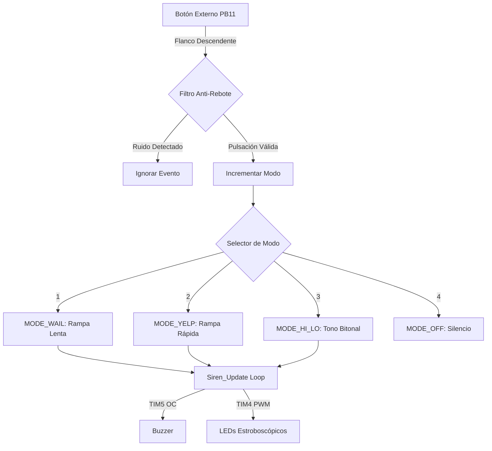

# 07_TIM_OC_Advance: Generación de Audio por Output Compare y Señalización de Emergencia

Este laboratorio documenta la implementación avanzada del modo **Output Compare (OC)** de los Timers para la generación de señales de audio de frecuencia variable (Sirena) y patrones de iluminación estroboscópica (Balizas). El proyecto destaca por el uso de una arquitectura no bloqueante que permite la modulación de frecuencia (FM) en tiempo real, la gestión de potencia mediante transistores y un filtrado de ruido robusto para interrupciones externas (**EXTI**) en un entorno con interferencia electromagnética (EMI).

## 🎯 Objetivos
- **Dominar el Modo Output Compare:** Utilizar el registro de comparación para conmutar pines GPIO manualmente, permitiendo un control total sobre la frecuencia de audio sin depender del periodo fijo del Timer (ARR).
- **Implementar Modulación de Frecuencia (FM):** Desarrollar algoritmos de barrido lineal (Linear Sweep) para emular diferentes tipos de sirenas de emergencia (Wail, Yelp, Hi-Lo).
- **Gestión de Cargas Inductivas:** Diseñar la interfaz de hardware mediante transistores NPN para el manejo seguro de un Buzzer y LEDs de alta potencia.
- **Robustez ante Ruido (Debounce por Software):** Implementar técnicas de validación temporal y confirmación de estado para filtrar disparos falsos en interrupciones EXTI causados por la EMI del buzzer.

---

## 🔩 Teoría de Operación: Output Compare vs. PWM Estándar

### 1. Generación de Audio de Precisión (Modo Toggle)
A diferencia del PWM convencional, donde la frecuencia es fija y solo varía el ciclo de trabajo, en este proyecto se utiliza el modo **Output Compare Toggle**.

* **Acumulador de Fase:** El Timer corre libremente (hasta $2^{32}-1$ ticks). En cada interrupción, en lugar de reiniciar el contador, se calcula el próximo "evento de disparo" sumando un valor calculado (`current_ticks`) al registro CCR actual.
* **Frecuencia Dinámica:** $F_{out} = \frac{F_{clk}}{2 \times ticks}$. Al modificar la variable `ticks` en tiempo real, logramos rampas de frecuencia suaves sin los "glitches" o chasquidos que ocurrirían al reconfigurar el Prescaler al vuelo.

### 2. Sincronización de Fase Inicial
Un desafío técnico resuelto fue la latencia de arranque. Al iniciar el sonido, se debe leer el valor actual del contador (`__HAL_TIM_GET_COUNTER`) y sumar el primer delta inmediatamente. Sin esto, el sistema podría esperar hasta una vuelta completa del timer (segundos) antes de emitir el primer sonido.

---

## 🏗️ Orquestación de Hardware: Dual Timer Workflow

El sistema separa los dominios de tiempo en dos periféricos para garantizar que el audio tenga prioridad y precisión, mientras las luces operan de fondo.

#### A. TIM5: Sintetizador de Audio (Output Compare 32-bit)
Configurado como la base de tiempo maestra para el sonido. Su resolución de 32 bits permite generar frecuencias precisas sin desbordamientos rápidos.

**Configuración Técnica:**
| Parámetro | Valor | Justificación Técnica |
| :--- | :--- | :--- |
| **Prescaler (PSC)** | 89 | Genera una base de tiempo de **1 MHz** ($1 \mu s$ por tick) desde el bus de 90MHz. |
| **Period (ARR)** | 0xFFFFFFFF | Conteo libre (Free Running) para modulación continua. |
| **Modo OC** | Toggle | Inversión automática del pin PA0 en cada coincidencia del CCR. |

#### B. TIM4: Controlador de Balizas (PWM)
Gestiona la intensidad y el encendido de los dos grupos de LEDs (Rojos y Azules).

* **Frecuencia:** 500 Hz (Libre de parpadeo visible).
* **Duty Cycle:** Variable (0% o 90%) controlado por el servicio de sirena para crear efectos de destello.

---

## 🏗️ Arquitectura de Software: Servicio de Sirena (FSM)

El núcleo del proyecto es el driver `siren_service.c`, que implementa una **Máquina de Estados Finitos (FSM)** cíclica controlada por el usuario.

### 1. Modos de Operación (Ciclo)
1.  **MODE_OFF:** Sistema en reposo (Bajo consumo).
2.  **MODE_WAIL (Ambulancia):** Barrido lento de 600Hz a 1400Hz (Ciclo ~1.5s). Balizas lentas.
3.  **MODE_YELP (Patrulla):** Barrido rápido de 700Hz a 1600Hz (Ciclo ~300ms). Balizas estroboscópicas.
4.  **MODE_HI_LO (Bitonal):** Salto discreto entre 700Hz y 1100Hz. Balizas alternadas.

### 2. Estrategia de Filtrado de Ruido (Anti-EMI)
Debido a la naturaleza inductiva del buzzer, se detectó ruido eléctrico en la línea del botón externo (**PB11**). Se implementó un algoritmo de debounce de dos etapas en el Callback `EXTI`:

```c
// Lógica simplificada del filtro implementado
if ((HAL_GetTick() - last_press) > 300) { // Etapa 1: Ventana de tiempo (Debounce)
    // Etapa 2: Confirmación de estado estable (Sampling)
    if (Is_Button_Stable_Low()) { 
        Change_Mode(); 
    }
}
```

---

## 🔄 Diagrama de Flujo del Sistema



---

## 🗺️ Mapeo de Hardware

| Periférico | Pin | Etiqueta | Función / Nota de Hardware |
| :--- | :--- | :--- | :--- |
| **TIM5_CH1** | **PA0** | `BUZZER_SIG` | Señal cuadrada variable. Requiere transistor NPN. |
| **TIM4_CH1** | **PD12** | `STROBE_RED` | PWM Grupo Rojo. |
| **TIM4_CH2** | **PD13** | `STROBE_BLUE` | PWM Grupo Azul. |
| **EXTI_11** | **PB11** | `usr_btn_ext` | Botón N.A. a GND. **Requiere Capacitor 100nF** (Filtro HW). |

---

## 🏁 Conclusión

El **Laboratorio 07** demuestra cómo separar la generación de señales críticas (Audio) de la lógica de aplicación. La transición de `HAL_Delay` a un modelo basado en `HAL_GetTick` permite que la sirena "fluya" mientras el procesador atiende eventos externos. Además, se validó experimentalmente la importancia del filtrado de hardware y software en sistemas embebidos expuestos a ruido eléctrico generado por actuadores de potencia.

---

*"Mientras que el PWM gobierna la potencia promedio, el **Output Compare** gobierna el tiempo exacto. Este laboratorio demuestra que la verdadera maestría en sistemas embebidos no es solo mover pines, sino delegar la precisión temporal al hardware para lograr una síntesis de frecuencia determinística."*