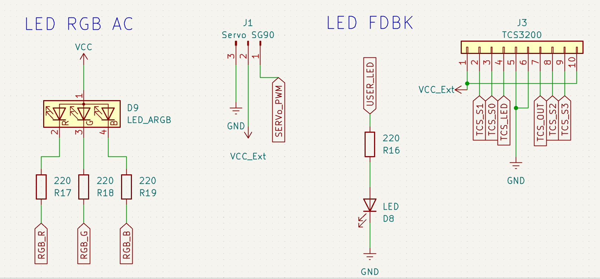
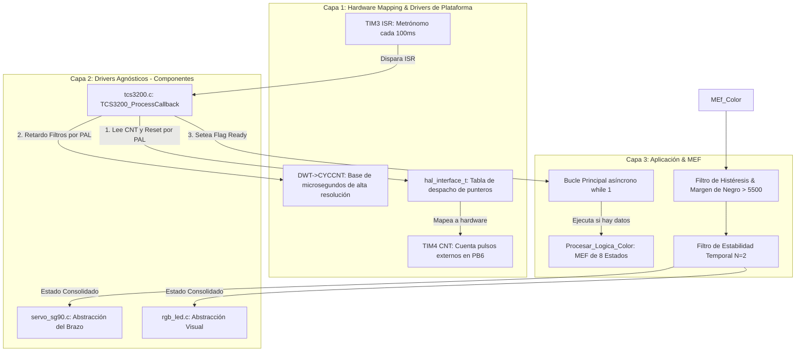

 # 08_TIM_Slave_Mode: Clasificación de materiales mediante digitalización de frecuencia por Hardware y Arquitectura PAL

Este proyecto documenta la implementación del modo **Timer Slave (External Clock Mode 1)** para la medición de alta velocidad de señales de frecuencia provenientes de un sensor de color **TCS3200**. Se integra una máquina de estados (MEF) de 8 niveles optimizada con firmas analíticas reales, un servo **SG90** con control de trayectoria suave y una arquitectura desacoplada multiplataforma mediante una **PAL (Platform Abstraction Layer)** y utilidades de bajo nivel de hardware (**DWT**) corriendo de forma asíncrona en la plataforma **Nucleo-F439ZI**.

## 🎯 Objetivos
- **Dominar el modo Slave (External Clock 1)** para automatizar la captura y conteo de pulsos digitales sin sobrecarga de interrupciones por software.
- **Desarrollar una Máquina de Estados (MEF)** capaz de discriminar entre colores primarios (RGB) y secundarios (CMY) aplicando histéresis y relaciones de aspecto dinámicas basadas en telemetría real.
- **Implementar una PAL Universal (Platform Abstraction Layer)** para garantizar el desacoplamiento total de la Capa 2 (Drivers de Componentes), permitiendo la portabilidad directa a NXP y AVR.
- **Utilizar el Contador de Ciclos del Núcleo (DWT)** para generar retardos e intervalos de microsegundos de alta resolución sin dependencia del SysTick nativo.

---

<center>

</center>

## 🔩 Especificaciones del Circuito

### 1. Sensor de Color TCS3200
* **Operación:** Conversión de irradiancia óptica a frecuencia digital proporcional ($f \propto \text{Intensidad}$).
* **Configuración:** Alimentado a **5V**. Pines `S0/S1` en **HIGH** fijos por PAL (Escala de salida al 100%, hasta $600\text{ kHz}$). Pines `S2/S3` controlados dinámicamente para el multiplexado RGB.
* **Iluminación:** 4 LEDs blancos frontales controlados por transistor desde el pin `PF13`.

### 2. Servomotor SG90 (Brazo Clasificador)
* **Operación:** Posicionamiento angular controlado por PWM a **50 Hz** (Periodo de $20\text{ ms}$) mediante el `TIM5_CH1` (32 bits).
* **Calibración PAL:** $520\,\mu\text{s}$ para $0^{\circ}$ y $2540\,\mu\text{s}$ para $180^{\circ}$.
* **Mapeo de Estados (Color vs. Ángulo):**

| Estado FSM | Color Detectado | Ángulo del Servo | Acción del Brazo |
| :--- | :--- | :---: | :--- |
| `ESTADO_NEGRO` | Fondo / Vacío | **$0^{\circ}$** | Retorno suave a posición de reposo. |
| `ESTADO_ROJO` | Rojo Puro | **$25^{\circ}$** | Clasificación de pieza Roja. |
| `ESTADO_AMARILLO`| Mezcla Amarillo | **$50^{\circ}$** | Clasificación de pieza Amarilla. |
| `ESTADO_VERDE` | Verde Puro | **$75^{\circ}$** | Clasificación de pieza Verde. |
| `ESTADO_CIAN` | Mezcla Cian | **$100^{\circ}$** | Clasificación de pieza Cian. |
| `ESTADO_AZUL` | Azul Puro | **$125^{\circ}$** | Clasificación de pieza Azul. |
| `ESTADO_MAGENTA` | Mezcla Magenta | **$150^{\circ}$** | Clasificación de pieza Magenta. |
| `ESTADO_BLANCO` | Blanco Saturation | **$180^{\circ}$** | Clasificación de pieza Blanca (Máximo rango). |

### 3. LED RGB (Feedback Visual)
* **Configuración:** Ánodo común conectado a **3.3V**. Cátodos a pines `PE9/11/13` con resistencias de limitación ($220\,\Omega$ y $330\,\Omega$).
* **Control:** PWM a $1\text{ kHz}$ (`TIM1` canales 1, 2 y 3) para replicar instantáneamente el color estable de la MEF.

### 4. LED de Estado (Heartbeat)
* **Componente:** LED Rojo de usuario (`LD3` / Pin **PB8**) integrado en la Nucleo.
* **Régimen:** Conmutación digital (*Toggle*) asíncrona cada **500 ms** controlada por `HAL_GetTick()`.

---

### 💡 ¿Qué es el Modo Slave (Esclavo) en un Timer?

En términos simples, usar un Timer en **Modo Slave** es como darle al cronómetro del microcontrolador la capacidad de "reaccionar" automáticamente a eventos externos sin que el procesador principal tenga que intervenir.

Normalmente, un Timer es **autónomo**: cuenta el tiempo por sí solo. En cambio, en **Modo Slave**, el Timer se convierte en un "empleado" que espera una orden o un estímulo de otro lugar (un sensor, otro timer o un pin) para realizar una acción específica.

#### ¿Para qué sirve?
Sirve para lograr una **precisión quirúrgica** en la medición de eventos rápidos. Al delegar la tarea al hardware del Timer:
1. **Liberamos al procesador:** El CPU no pierde tiempo contando pulsos; puede dedicarse a calcular la lógica del color o mover el servo.
2. **Eliminamos el error humano (del software):** Las interrupciones de software tienen latencia (retrasos). El Modo Slave reacciona instantáneamente a nivel de circuitos (silicio), lo que nos da mediciones mucho más estables.


#### ¿Cómo funciona?
El funcionamiento se basa en tres pasos clave:
* **El Disparo (Trigger):** El Timer está escuchando un pin específico (en nuestro caso, la señal del sensor TCS3200).
* **La Acción Automática:** En cuanto llega un flanco de la señal, el Timer realiza una acción preconfigurada. En este proyecto, usamos el **External Clock Mode**, donde cada pulso del sensor hace que el contador del Timer avance un paso.
* **El Resultado:** Al final de un tiempo determinado, simplemente leemos el valor acumulado. Es como tener un contador de personas automático en una puerta: no necesitas mirar quién entra, solo miras el número final en el tablero.

---

## 🔩 Teoría de Operación: Sincronización de Timers y Visión Artificial

El núcleo del proyecto reside en la digitalización precisa de señales de frecuencia y su posterior procesamiento mediante una arquitectura de software basada en eventos.

### 1. Digitalización de Frecuencia: Arquitectura Maestro-Esclavo por Ventana de Integración
A diferencia de la medición convencional por software (polling) o por captura de períodos que satura la CPU con ráfagas de interrupciones, este proyecto utiliza una **ventana de integración por hardware** asíncrona mediante la sincronización de dos temporizadores de la **Nucleo-F439ZI**:

* **TIM3 (Maestro de Tiempo):** Funciona como un "metrónomo" isócrono configurado para generar una interrupción exacta cada **100 ms** ($10\text{ Hz}$). Esta ventana temporal define el tiempo de exposición exacto de nuestra lectura.
* **TIM4 (Contador Esclavo):** Configurado en **Slave Mode: External Clock Mode 1** (`TIM_SLAVEMODE_EXTERNAL1`). En este modo, el Timer ignora el reloj interno del sistema (Internal Clock) y utiliza los pulsos digitales provenientes del pin `OUT` del sensor (Pin físico **PB6**) para incrementar directamente su registro físico `CNT`.

Al finalizar la ventana de 100ms impuesta por el TIM3, la Capa de Abstracción (PAL) toma una "fotografía" instantánea del registro `CNT` y lo resetea a cero de forma inmediata para la siguiente ventana. El cálculo de la frecuencia en Hz es directo y asíncrono:

$$\text{Frecuencia (Hz)} = \text{Pulsos} \times \left(\frac{1000}{\text{TCS\_MEASURE\_WINDOW\_MS}}\right)$$

### 2. Digitalización de Color: Reconstrucción del Vector RGB
El sensor **TCS3200** traduce la intensidad de luz filtrada en una onda cuadrada. Para procesar esta información de forma coherente, el sistema implementa un **Secuenciador de Filtros**:

* **Multiplexado Óptico:** El microcontrolador conmuta los pines `S2` y `S3` en cada ciclo de 100ms, alternando secuencialmente entre los filtros Rojo, Verde y Azul.
* **Sincronización de Datos:** La lógica de control de la MEF (Capa 3) asegura que la toma de decisiones críticas solo ocurra cuando se completa el ciclo completo ($R \rightarrow G \rightarrow B$, detectado en `filtro_actual == 2`). Esto garantiza que la comparación entre canales se realice sobre un vector de color coherente y sincronizado en el tiempo.

### 3. Lógica de Decisión con Histéresis Dinámica y Firmas Analíticas
Para gestionar la variabilidad física de los materiales y las condiciones lumínicas del entorno, se implementó una **Máquina de Estados Finita (MEF)** calibrada en base a datos empíricos de la terminal serial:

* **Histéresis en Estado Blanco:** El color **Blanco** (máxima frecuencia de saturación óptica) es propenso a oscilaciones por reflexiones espurias. Se utiliza la estructura `Config_Umbrales_t` para definir un umbral de entrada elástico (`blanco_entrar = 14000` ticks) y uno de salida (`blanco_salir = 11000` ticks), evitando falsos cambios de estado.
* **Blindaje contra Fondo Vacío (Negro):** Se fijó el umbral estricto `.negro = 5500`. Cualquier lectura simultánea por debajo de este límite apaga los actuadores, inmunizando al clasificador contra el ruido óptico ambiental ($< 5240\text{ ticks}$).
* **Discriminación Rojo vs Magenta:** La firma óptica determinó que en el Rojo Puro el canal Azul se planta en `6420`, mientras que en el Magenta real trepa a `8950`. El condicional de la MEF fue blindado con una compuerta rígida de suficiencia (`&& b > 7500`) para separar de raíz ambos estados.

---

## 🕒 Arquitectura de Timers y Orquestación de Hardware

En este sistema, el microcontrolador actúa como un director de orquesta, delegando tareas críticas de tiempo a cuatro periféricos independientes. Esta especialización libera al núcleo **Cortex-M4** para enfocarse en la lógica de clasificación de colores.

### 1. TIM3: El Metrónomo del Sistema (Base de Tiempo)
El **TIM3** funciona como el latido del sistema. Su rol no es medir, sino dictar el ritmo isócrono de la aplicación.
* **Configuración:** PSC: 8999, ARR: 999. Genera un evento de actualización exactamente cada **100 ms** (10 Hz).
* **Operación:** Al desbordar, dispara la interrupción `HAL_TIM_PeriodElapsedCallback`, ordenando al driver procesar la acumulación de pulsos. Esto garantiza que la tasa de muestreo sea constante, independientemente de la carga del CPU.

### 2. TIM4: Digitalización por Hardware (Slave Mode - External Clock)
Aquí ocurre la magia de la telemetría de frecuencia. El **TIM4** no cuenta tiempo, cuenta **eventos físicos**.
* **Modo Esclavo:** `TIM_SLAVEMODE_EXTERNAL1`. El Timer ignora el reloj interno y utiliza los pulsos del sensor (Pin PA6) como fuente de conteo.
* **Ventaja Técnica:** El hardware incrementa el registro `CNT` de forma autónoma. Si el TIM3 lee un valor de 5000 en su ventana de 100ms, el sistema deduce instantáneamente una frecuencia de 50 kHz sin haber ejecutado una sola línea de código durante el conteo.

### 3. TIM1: Generación de Color (PWM de Alta Velocidad)
El **TIM1** gestiona la interfaz visual mediante el LED RGB de ánodo común.
* **Configuración:** Genera tres señales PWM independientes (Canales 1, 2 y 3) con una resolución de 1000 niveles de brillo.
* **Precisión:** Al ser un Timer de control avanzado, permite cambios de color instantáneos mediante presets (`RGB_Set_Preset`), reflejando el estado de la MEF de color de forma visual.

### 4. TIM5: Control de Actuador (Servo de 32 bits)
Para el brazo robótico, se utiliza el **TIM5** debido a su registro de 32 bits.
* **Frecuencia:** 50 Hz (periodo de 20ms).
* **Resolución:** Con un PSC de 89, se obtiene una resolución de 1 microsegundo por tick, permitiendo que el driver del SG90 realice interpolaciones suaves y movimientos precisos entre los 8 estados de color.

---

### 🛠️ Resumen de Funciones

| Periférico | Rol | Configuración Clave | Resultado |
| :--- | :--- | :--- | :--- |
| **TIM3** | Maestro de Tiempo | Interrupción cada 100ms | Muestreo isócrono y estable. |
| **TIM4** | Contador de Pulsos | Slave Mode / External Clock 1 | Digitalización de frecuencia sin uso de CPU. |
| **TIM1** | Interfaz Visual | PWM (High Resolution) | Retroalimentación visual RGB. |
| **TIM5** | Actuador | PWM 50Hz (32 bits) | Control suave y preciso del servo SG90. |

**Counter Period (ARR)** | 19999 | Periodo de 20ms (50Hz), estándar para servos analógicos. |

---

## 🏗️ Arquitectura del Software: El Modelo de "Tres Capas"

El firmware está diseñado bajo un estricto modelo de abstracción de tres niveles, logrando el aislamiento total entre las bibliotecas nativas del fabricante y el negocio de la aplicación.



### 1. Detalle de Capa 1: Hardware Mapping y Utilidades de Bajo Nivel
Contiene las funciones adaptadoras que satisfacen los contratos de la PAL universal y el driver modular `utils.c` encargado de inicializar el periférico de rastreo **DWT (Data Watchpoint and Trace)** del núcleo **Cortex-M4**.

```c
// Adaptador de la PAL para leer de forma abstracta el contador físico del TIM4
uint32_t PAL_STM32_GetTimerCounter(generic_pwm_t ch) {
	return __HAL_TIM_GET_COUNTER((TIM_HandleTypeDef*)ch.timer_handle);
}

// Adaptador de la PAL para resetear el registro contador del Timer
void PAL_STM32_SetTimerCounter(generic_pwm_t ch, uint32_t value) {
	__HAL_TIM_SET_COUNTER((TIM_HandleTypeDef*)ch.timer_handle, value);
}

// Adaptador de la PAL para resolver microsegundos precisos consumiendo el driver utils
uint32_t PAL_STM32_GetUs(void) {
	return UTILS_GetUs(); // Acceso directo a DWT->CYCCNT
}
```
### 2. Detalle de Capa 2: Abstracción de Componentes (Driver Puro C)
El archivo `tcs3200.c` es **C puro (ANSI C)**, no incluye cabeceras de STMicroelectronics y opera exclusivamente mediante inyección de dependencias (`hal_interface_t`).

```c
void TCS3200_ProcessCallback(TCS3200_t *sensor) {
    /* Verificación de los contratos necesarios para la lectura atómica de pulsos */
    if (sensor == NULL || sensor->pal.get_timer_cnt == NULL || 
        sensor->pal.oc_write == NULL || sensor->pal.gpio_read == NULL) return;

    /* 1. Captura síncrona y agnóstica de los pulsos del hardware mediante la PAL */
    uint32_t pulses = sensor->pal.get_timer_cnt(sensor->ic_count_ch);
    sensor->pal.oc_write(sensor->ic_count_ch, 0); // Reset atómico inmediato del contador

    /* 2. Conversión a frecuencia basada en la ventana configurada */
    uint32_t frequency_hz = pulses * (1000 / TCS_MEASURE_WINDOW_MS);

    /* 3. Clasificación dinámica leyendo el estado lógico de los pines de forma abstracta */
    bool s2 = sensor->pal.gpio_read(sensor->pin_s2);
    bool s3 = sensor->pal.gpio_read(sensor->pin_s3);

    if      (!s2 && !s3) sensor->frequency_red   = frequency_hz;
    else if (!s2 &&  s3) sensor->frequency_blue  = frequency_hz;
    else if ( s2 && !s3) sensor->frequency_clear = frequency_hz;
    else if ( s2 &&  s3) sensor->frequency_green = frequency_hz;

    sensor->measurement_ready = 1; // Notificación asíncrona a Capa 3
}
```
### 3. Detalle de Capa 3: Lógica de Aplicación
Gobernada por el bucle principal no bloqueante (`while(1)`). Consume el vector de frecuencia limpio de la Capa 2 y aplica la lógica analítica de toma de decisiones e interpolación lineal de trayectoria del servo brazo.

```c
// Sección crítica del clasificador analítico de la MEF (Diferenciación de Mezclas)

// AMARILLO (R y G explotan hacia arriba, superan holgadamente al Azul)
if (r > (b * 1.3f) && g > (b * 1.1f) && r > 12000) {
    nuevo_estado_raw = ESTADO_AMARILLO;
}
// MAGENTA (Exigimos que B supere los 7500 para dejar afuera al Rojo Puro de 6420)
else if (r > (g * 1.5f) && b > (g * 1.5f) && b > 7500) {
    nuevo_estado_raw = ESTADO_MAGENTA;
}
```
## 🛡️ Detalles de Robustez y Optimización

1. **Filtro de Estabilidad Temporal (Debounce de Capa 3):** Para neutralizar rebotes ópticos transitorios en los bordes de las piezas en movimiento y proteger la vida útil de los engranajes mecánicos del **Servo SG90**, se exige que el estado del color detectado sea persistente durante al menos $N=2$ ciclos de vector RGB completos antes de validar y ejecutar el cambio físico del actuador.
2. **Aritmética de Desborde Protegida en `utils.c`:** El lazo cerrado de retrasos de microsegundos del DWT utiliza de forma estratégica la propiedad matemática del complemento a dos mediante la instrucción `while ((DWT->CYCCNT - start_cycles) < delay_cycles);`. Esto garantiza inmunidad total y cálculo correcto del tiempo transcurrido, incluso ante el desborde natural del registro físico contador de 32 bits.
3. **Flujo de Ejecución Totalmente No Bloqueante:** Se eliminó de raíz el uso de la función `HAL_Delay()` de todo el mapa del firmware. Las tareas críticas de visión (MEF), la interpolación lineal de trayectoria del brazo robótico y el parpadeo de diagnóstico de CPU viva (**Heartbeat**) corren de forma independiente y asíncrona en la ronda del lazo principal.

---

## 🔩 Mapeo de Hardware: Nucleo-F439ZI

La asignación de pines se realizó optimizando el uso de las funciones alternativas nativas del mapa del silicio para garantizar operaciones directas por hardware y evitar conflictos de líneas.

| Periférico | Pin | Función | Configuración Técnica / Nivel de Robustez |
| :--- | :--- | :--- | :--- |
| **Cortex-M4** | **Interno** | **DWT (Utils Driver)** | Registro `CYCCNT` activo para base de tiempo elástica de microsegundos. |
| **TIM3** | **Interno** | **Maestro de Tiempo** | Genera interrupción periódica a 10 Hz ($100\text{ ms}$) para muestreo isócrono. |
| **TIM4_CH1** | **PB6** | **Entrada de Frecuencia** | Modo Esclavo (`EXTERNAL1`) para conteo determinístico de pulsos ópticos. |
| **TIM5_CH1** | **PA0** | **Control PWM Servo** | Resolución avanzada de 32 bits para interpolación lineal suave sin estrés mecánico. |
| **TIM1_CH1/2/3**| **PE9/11/13**| **Interfaz RGB** | PWM de alta frecuencia para feedback visual libre de parpadeo (*flicker*). |
| **GPIO Out** | **PC10 / PC11**| **Control de Filtros** | Conmutación abstracta por PAL de los pines **S2** y **S3** (Multiplexado). |
| **GPIO Out** | **PG2 / PG3** | **Escala de Frecuencia**| Configuración estática por PAL para salida al 100% (**S0/S1 = H**). |
| **GPIO Out** | **PF13** | **LED del Sensor** | Control del bloque emisor frontal para normalizar la reflectancia del material. |
| **UART3** | **PD8 / PD9** | **Telemetría Debug** | Transmisión serial a 115200 bps para volcado y análisis de firmas ópticas. |
| **GPIO Out** | **PB8** | **LED de Estado** | Indicador **Heartbeat** (LD3 - Rojo) de CPU viva independiente del sensor. |

---

## 🏁 Conclusión

Este laboratorio consolida de forma empírica la enorme importancia de la **arquitectura de software orientada a capas y la delegación de control al hardware de bajo nivel**. Al estructurar el proyecto mediante una **PAL Universal**, el núcleo del driver del TCS3200 queda completamente blindado y protegido ante la obsolescencia técnica o cambios en el proveedor de silicio.

Asimismo, la sustitución de la captura de períodos clásica por una ventana de integración basada en el **Modo Contador de Eventos Externos** por hardware demuestra que es posible lograr un procesamiento de señales de alta velocidad determinístico y robusto de grado industrial, permitiendo al procesador Cortex-M4 dedicarse con absoluta holgura a la orquestación asíncrona y lógica superior del sistema.

---

 *"Nivel Intermedio: Automatización por hardware y procesamiento de señales. El Modo Slave es la clave para la captura de eventos de alta frecuencia donde cada microsegundo cuenta para la precisión del dato final."*

🛠️ **Carlos** | Estudiante de Ing. Electrónica @UTN_FRT.  
🚀 Apasionado Autodidacta por los Sistemas Embebidos.