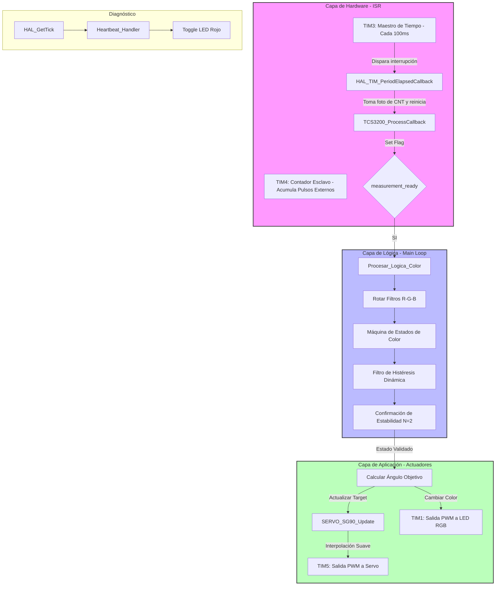

# 08_TIM_Slave_Mode: Clasificación de materiales mediante digitalización de frecuencia por Hardware

Este proyecto documenta la implementación del modo **Timer Slave (Reset Mode)** para la medición de alta velocidad de señales de frecuencia provenientes de un sensor de color **TCS3200**. Se integra un sistema de visión artificial de 8 estados, un brazo robótico basado en el servo **SG90** con control de trayectoria suave y una arquitectura asíncrona optimizada para la plataforma **Nucleo-F439ZI**.

## 🎯 Objetivos
- **Dominar el modo Slave (Reset)** para automatizar la captura de periodos sin sobrecarga de interrupciones por software.
- **Desarrollar una Máquina de Estados (FSM)** capaz de discriminar entre colores primarios (RGB) y secundarios (CMY) con histéresis.
- **Implementar un Driver de Servomotor Proporcional** con control de velocidad (`speed_dps`) para evitar estrés mecánico.
- **Garantizar la estabilidad de lectura** mediante técnicas de filtrado de rebotes (debounce) y sincronización de filtros ópticos.

---
### 💡 ¿Qué es el Modo Slave (Esclavo) en un Timer?

En términos simples, usar un Timer en **Modo Slave** es como darle al cronómetro del microcontrolador la capacidad de "reaccionar" automáticamente a eventos externos sin que el procesador principal tenga que intervenir.

Normalmente, un Timer es **autónomo**: cuenta el tiempo por sí solo. En cambio, en **Modo Slave**, el Timer se convierte en un "empleado" que espera una orden o un estímulo de otro lugar (un sensor, otro timer o un pin) para realizar una acción específica.

#### ¿Para qué sirve?
Sirve para lograr una **precisión quirúrgica** en la medición de eventos rápidos. Al delegar la tarea al hardware del Timer:
1. **Liberamos al procesador:** El CPU no pierde tiempo contando pulsos; puede dedicarse a calcular la lógica del color o mover el servo.
2. **Eliminamos el error humano (del software):** Las interrupciones de software tienen latencia (retrasos). El Modo Slave reacciona instantáneamente a nivel de circuitos (silicio), lo que nos da mediciones mucho más estables.


#### ¿Cómo funciona?
El funcionamiento se basa en tres pasos clave:
* **El Disparo (Trigger):** El Timer está escuchando un pin específico (en nuestro caso, la señal del sensor TCS3200).
* **La Acción Automática:** En cuanto llega un flanco de la señal, el Timer realiza una acción preconfigurada. En este proyecto, usamos el **External Clock Mode**, donde cada pulso del sensor hace que el contador del Timer avance un paso.
* **El Resultado:** Al final de un tiempo determinado, simplemente leemos el valor acumulado. Es como tener un contador de personas automático en una puerta: no necesitas mirar quién entra, solo miras el número final en el tablero.

---

## 🔩 Teoría de Operación: Sincronización de Timers y Visión Artificial

El núcleo del proyecto reside en la digitalización precisa de señales de frecuencia y su posterior procesamiento mediante una arquitectura de software basada en eventos.

### 1. Digitalización de Frecuencia: Arquitectura Maestro-Esclavo
A diferencia de la medición convencional por software (polling), este proyecto utiliza una **ventana de integración por hardware** mediante la sincronización de dos temporizadores de la **Nucleo-F439ZI**:

* **TIM3 (Maestro de Tiempo):** Funciona como un "metrónomo" configurado para generar una interrupción exacta cada **100 ms**. Esta ventana temporal define la resolución y el tiempo de exposición de nuestra lectura.
* **TIM4 (Contador Esclavo):** Configurado en **Slave Mode: External Clock Mode 1**. En este modo, el Timer ignora el reloj interno del sistema (Internal Clock) y utiliza los pulsos provenientes del sensor (Pin PA6) como fuente de conteo directa para su registro `CNT`.


> **Ventaja Técnica:** El conteo es **100% determinístico**. El CPU no interviene mientras los pulsos incrementan el contador del TIM4. Al finalizar los 100ms, el valor acumulado representa directamente la frecuencia proporcional a la irradiancia ($f \propto \text{intensidad}$), eliminando el *jitter* y el error por latencia de interrupción.

### 2. Digitalización de Color: Reconstrucción del Vector RGB
El sensor **TCS3200** traduce la intensidad de luz filtrada en una onda cuadrada. Para procesar esta información, el sistema implementa un **Secuenciador de Filtros**:

* **Multiplexado Óptico:** El microcontrolador conmuta los pines `S2` y `S3` en cada ciclo de 100ms, alternando entre los filtros Rojo, Verde y Azul.
* **Sincronización de Datos:** La lógica de control asegura que la toma de decisiones solo ocurra cuando se completa el ciclo completo ($R \rightarrow G \rightarrow B$). Esto garantiza que la comparación entre canales se realice sobre un vector de color coherente y sincronizado.


### 3. Lógica de Decisión con Histéresis Dinámica
Para gestionar la variabilidad física de los materiales y las condiciones lumínicas del entorno (UTN FRT Lab), se implementó una **Máquina de Estados Finita (FSM)** con control de histéresis:

* **Histéresis en Estado Crítico:** El color **Blanco** (máxima frecuencia) es propenso a oscilaciones. Se utiliza la estructura `Config_Umbrales_t` para definir un umbral de entrada ($30,000$ Hz) y uno de salida ($12,000$ Hz). Esto evita que pequeñas sombras o vibraciones del objeto disparen cambios de estado erráticos.
* **Filtro de Estabilidad (Software Debounce):** Para proteger la vida útil de los engranajes del **Servo SG90**, se exige que el `nuevo_estado_raw` se mantenga constante durante al menos 2 ciclos completos de lectura antes de validar y ejecutar el movimiento del actuador.

---

## 🕒 Arquitectura de Timers y Orquestación de Hardware

En este sistema, el microcontrolador actúa como un director de orquesta, delegando tareas críticas de tiempo a cuatro periféricos independientes. Esta especialización libera al núcleo **Cortex-M4** para enfocarse en la lógica de clasificación de colores.

### 1. TIM3: El Metrónomo del Sistema (Base de Tiempo)
El **TIM3** funciona como el latido del sistema. Su rol no es medir, sino dictar el ritmo isócrono de la aplicación.
* **Configuración:** PSC: 8999, ARR: 999. Genera un evento de actualización exactamente cada **100 ms** (10 Hz).
* **Operación:** Al desbordar, dispara la interrupción `HAL_TIM_PeriodElapsedCallback`, ordenando al driver procesar la acumulación de pulsos. Esto garantiza que la tasa de muestreo sea constante, independientemente de la carga del CPU.

### 2. TIM4: Digitalización por Hardware (Slave Mode - External Clock)
Aquí ocurre la magia de la telemetría de frecuencia. El **TIM4** no cuenta tiempo, cuenta **eventos físicos**.
* **Modo Esclavo:** `TIM_SLAVEMODE_EXTERNAL1`. El Timer ignora el reloj interno y utiliza los pulsos del sensor (Pin PA6) como fuente de conteo.
* **Ventaja Técnica:** El hardware incrementa el registro `CNT` de forma autónoma. Si el TIM3 lee un valor de 5000 en su ventana de 100ms, el sistema deduce instantáneamente una frecuencia de 50 kHz sin haber ejecutado una sola línea de código durante el conteo.

### 3. TIM1: Generación de Color (PWM de Alta Velocidad)
El **TIM1** gestiona la interfaz visual mediante el LED RGB de ánodo común.
* **Configuración:** Genera tres señales PWM independientes (Canales 1, 2 y 3) con una resolución de 1000 niveles de brillo.
* **Precisión:** Al ser un Timer de control avanzado, permite cambios de color instantáneos mediante presets (`RGB_Set_Preset`), reflejando el estado de la FSM de color de forma visual.

### 4. TIM5: Control de Actuador (Servo de 32 bits)
Para el brazo robótico, se utiliza el **TIM5** debido a su registro de 32 bits.
* **Frecuencia:** 50 Hz (periodo de 20ms).
* **Resolución:** Con un PSC de 89, se obtiene una resolución de 1 microsegundo por tick, permitiendo que el driver del SG90 realice interpolaciones suaves y movimientos precisos entre los 8 estados de color.

---

### 🛠️ Resumen de Funciones

| Periférico | Rol | Configuración Clave | Resultado |
| :--- | :--- | :--- | :--- |
| **TIM3** | Maestro de Tiempo | Interrupción cada 100ms | Muestreo isócrono y estable. |
| **TIM4** | Contador de Pulsos | Slave Mode / External Clock 1 | Digitalización de frecuencia sin uso de CPU. |
| **TIM1** | Interfaz Visual | PWM (High Resolution) | Retroalimentación visual RGB. |
| **TIM5** | Actuador | PWM 50Hz (32 bits) | Control suave y preciso del servo SG90. |

**Counter Period (ARR)** | 19999 | Periodo de 20ms (50Hz), estándar para servos analógicos. |

---

## 🏗️ Arquitectura del Software: El Modelo de "Tres Capas"

El firmware de este proyecto está diseñado bajo un modelo de abstracción de tres niveles. Esta estructura garantiza que el sistema sea **robusto, escalable y fácil de mantener**, separando la adquisición física de datos de la lógica de aplicación.

### 1. Capa de Hardware y Captura (Segundo Plano / ISR)
Esta capa opera mediante interrupciones y hardware autónomo, permitiendo que el procesador no pierda ciclos en tareas de cronometría básica:

* **Contador de Pulsos (TIM4):** Funciona de forma totalmente autónoma contando los pulsos digitales del sensor TCS3200 directamente en su registro `CNT`.
* **Callback de Tiempo (TIM3):** Actúa como el "latido" del sistema. Cada 100ms se ejecuta la rutina `HAL_TIM_PeriodElapsedCallback`, cuya única misión es llamar a `TCS3200_ProcessCallback`. Esta función toma la "fotografía" del contador del TIM4 y levanta el flag `measurement_ready`.


### 2. Capa de Lógica y Decisión (Primer Plano / Middleware)
Es el "cerebro" del firmware. Transforma frecuencias crudas en conceptos de color. Se ejecuta en el bucle principal (`while(1)`) pero de forma asíncrona:

* **Secuenciador RGB:** Dentro de `Procesar_Logica_Color`, se gestiona la variable `filtro_actual` para rotar los filtros ópticos. La lógica de decisión se bloquea hasta obtener el vector completo ($R+G+B$) para garantizar coherencia.
* **Máquina de Estados de Color (FSM):**
    * **Discriminación:** Evalúa las relaciones de magnitud entre canales para determinar el color dominante.
    * **Histéresis:** Implementa la estructura `Config_Umbrales_t` para otorgar estabilidad al estado Blanco, evitando oscilaciones por variaciones lumínicas.
    * **Confirmación (Debounce):** Utiliza un acumulador de estabilidad. Solo si un color es detectado de forma persistente durante 2 ciclos consecutivos, se valida el cambio de `estado_actual`.


### 3. Capa de Aplicación y Actuadores (Salida)
Representa la respuesta física del sistema ante los estímulos procesados:

* **Control de Trayectoria (Servo):** Mediante la función `SERVO_SG90_Update`, el servomotor implementa una interpolación lineal. Esto evita movimientos bruscos ("latigazos"), calculando pequeños incrementos de ángulo en cada iteración del bucle principal para lograr un movimiento fluido.
* **Retroalimentación Visual:** El driver de LED RGB traduce el estado de la FSM en una señal lumínica en tiempo real, facilitando el diagnóstico visual del proceso de clasificación.



---

### 🔄 Flujo de Ejecución No Bloqueante
El bucle principal (`main loop`) opera sin el uso de `HAL_Delay()`, permitiendo la concurrencia de tareas:

```c
while (1) {
    // Tarea de Visión: Solo procesa cuando hay datos nuevos del sensor
    if (colorSensor.measurement_ready) {
        Procesar_Logica_Color(); 
    }

    // Tarea de Movimiento: Calcula la trayectoria del servo continuamente
    SERVO_SG90_Update(&servoBrazo);

    // Tarea de Monitoreo: Gestión independiente del LED de estado
    Heartbeat_Handler();
}
```

## 🛡️ Detalles de Robustez y Optimización

El desarrollo de este firmware no solo se centró en la funcionalidad, sino también en la eficiencia y la resiliencia del sistema ante fallos o cambios de entorno.

### 1. Encapsulamiento de Umbrales (Configuración vs. Lógica)
Al implementar la estructura `Config_Umbrales_t umbrales`, se logra una separación clara entre los parámetros de configuración y el algoritmo de decisión. 
* **Ventaja:** Esto permite que el sistema sea reutilizable en diferentes condiciones de iluminación (laboratorio vs. exterior) simplemente modificando los valores de la estructura al inicio del código, sin necesidad de alterar la lógica interna de la máquina de estados.


### 2. Optimización por Bit-Shifting (Eficiencia de CPU)
En la lógica de discriminación de colores (específicamente en el duelo entre **Cian** y **Azul**), se utiliza el operador de desplazamiento de bits a la derecha (`b >> 1`) en lugar de una división por punto flotante (`/ 2.0f`).
* **Justificación Técnica:** El procesador ARM Cortex-M4 ejecuta el desplazamiento de bits en un solo ciclo de reloj, mientras que las operaciones de punto flotante son más costosas en términos de ciclos de CPU. Esta es una práctica estándar en sistemas de tiempo real para maximizar el rendimiento.

### 3. Independencia del "Heartbeat" (Diagnóstico en tiempo real)
El uso de `HAL_GetTick()` en el `Heartbeat_Handler` permite que el LED de estado parpadee de forma totalmente independiente a la lógica del sensor.
* **Resiliencia:** Si el sensor de color se desconecta o falla, el LED de la placa seguirá parpadeando. Esto funciona como un watchdog visual que indica que el núcleo del sistema sigue vivo y ejecutando el bucle principal, facilitando enormemente las tareas de depuración en campo.

---

### Mapeo de Hardware: Nucleo-F439ZI

Para este proyecto se han seleccionado periféricos con acceso directo a canales de Timer de 32 bits y comunicación asíncrona, optimizando el ruteo de señales en la placa:

| Periférico | Pin | Función | Configuración Técnica |
| :--- | :--- | :--- | :--- |
| **TIM3_CH1** | **PA6** | **Entrada de Frecuencia** | Captura del sensor TCS3200 (Slave Mode) |
| **GPIO Out** | **PB2 / PB10** | **Control de Filtros** | Selección de S2 y S3 para multiplexado RGB |
| **TIM5_CH1** | **PA0** | **Control PWM Servo** | Salida de 32 bits para control suave de SG90 |
| **UART3** | **PD8 / PD9** | **Debug Log** | Telemetría serie y calibración en tiempo real |
| **GPIO Out** | **PB0** | **LED de Estado** | Indicador Heartbeat (LD3 - Rojo) |

---

## ⚠️ Lecciones Aprendidas: Integridad de Señal y Debounce

Durante la fase de integración, se identificó una situación crítica con la detección del color **Cian**.

* **Problema:** Debido a que el canal Azul y Verde del sensor TCS3200 tienen una respuesta espectral solapada, se producían "rebotes" lógicos entre el `ESTADO_AZUL` y el `ESTADO_CIAN` bajo ciertas condiciones de iluminación, provocando movimientos erráticos en el servomotor.
* **Solución:** Se implementó un **Filtro de Estabilidad Temporal (Software Debounce)**. El sistema no actualiza la posición del brazo robótico hasta que el sensor confirma el mismo color durante $N$ ciclos de medición consecutivos ($N=2$). Esto garantiza la eliminación de ruidos transitorios y garantiza que el actuador solo responda a estados de color plenamente confirmados.


---

## 🏁 Conclusión

Este laboratorio consolida la importancia de la **delegación de tareas al hardware**. El uso correcto de los **Modos Esclavos (Slave Mode)** en los Timers permite que el microcontrolador digitalice intervalos temporales con precisión de microsegundos sin consumir ciclos de CPU en tareas de cronometría básica. 

La integración de técnicas de **histéresis dinámica** y **filtrado digital** demuestra que es posible transformar un sensor de bajo costo en un sistema de clasificación robusto de grado industrial, permitiendo al núcleo Cortex-M4 enfocarse en la lógica de control de trayectoria y la orquestación asíncrona de periféricos.

---

 *"Nivel Avanzado: Automatización por hardware y procesamiento de señales. El Modo Slave es la clave para la captura de eventos de alta frecuencia donde cada microsegundo cuenta para la precisión del dato final."*