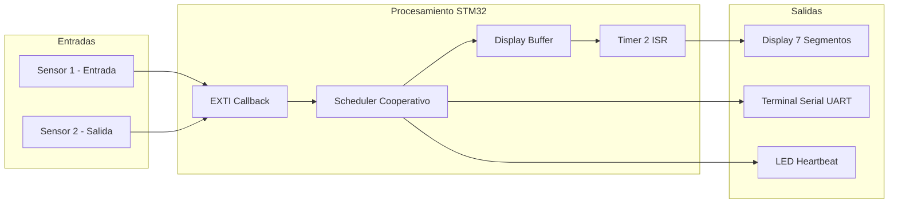

# 🚀 Proyecto Integrador: Contador de Personas Real-Time con Scheduler Cooperativo

Este proyecto representa un hito en el **Nivel Intermedio** de mi formación en sistemas embebidos. Se ha diseñado un sistema de conteo bidireccional robusto, modular y dirigido por eventos, utilizando la potencia de la plataforma **STM32F439ZI (Nucleo-144)**.

## 🎯 Objetivos
- **Implementar una arquitectura orientada a tareas** mediante un despachador (*Task Scheduler*) cooperativo.
- **Desarrollar un Middleware (Driver)** para la gestión autónoma de displays de 7 segmentos.
- **Sincronizar eventos asíncronos (EXTI)** con tareas de refresco periódico (TIM) y telemetría (UART).
- **Garantizar el determinismo** del sistema mediante el uso de interrupciones para tareas de tiempo crítico.

---

## 🧠 Arquitectura de Software: El Kernel Cooperativo

El sistema evoluciona del flujo secuencial tradicional hacia una **Arquitectura Basada en Tareas**, estructurada bajo los siguientes pilares:

### 1. Planificador (Task Scheduler)
Se implementó un despachador de tareas no bloqueante en el `while(1)`. Las tareas se ejecutan basándose en una tabla de control (`task_t`) que compara el tiempo transcurrido mediante el `SysTick` de la HAL.

### 2. Driver Display_7Seg_stm32 (Middleware)

Se desarrolló un driver genérico desacoplado del hardware con las siguientes características:

* **Multiplexación por Hardware:** Utiliza el Timer 2 para el refresco automático de los dígitos en segundo plano.
* **Buffer de Video:** Implementa una variable de memoria que actúa como buffer, separando la lógica del contador de la visualización física.
* **Interfaz Avanzada:** Soporte para control de brillo, efectos de parpadeo (Flash) y mapeo de caracteres alfanuméricos básicos.

---

## ⚙️ Configuración Técnica y Sincronismo
### Temporización (Timer 2)

Configurado sobre el bus **APB1 a 90 MHz** para el refresco de los displays:

* **Prescaler:** 8999 (Frecuencia de conteo de 10 kHz).
* **ARR (Period):** 54 (Evento de interrupción cada ~5.5 ms).
* **Frecuencia de Refresco:** ~181 Hz globales (~60 Hz por dígito), garantizando una imagen estable y libre de parpadeo (Flicker-free).

### Interrupciones Externas (EXTI)

Los sensores de proximidad HW-201 operan mediante interrupciones para garantizar latencia cero en la detección:
* **Modo:** *Falling Edge* (Detección por flanco de bajada).
* **Debounce por Software:** Filtro de tiempo de 600ms para evitar falsos disparos por ruido o rebotes mecánicos.

---

## 🛠️ Diagrama de Bloques Lógico

---

## 🔬 Conceptos de Programación Aplicados

* **Modificador `volatile`:** Aplicado a las variables compartidas entre el `main` y las ISR (como el contador de personas), asegurando que el compilador no optimice lecturas erróneamente.
* **Variables `static` locales:** Utilizadas dentro de las funciones de tarea para persistir estados de tiempo sin exponer variables al ámbito global.
* **Encapsulamiento:** La lógica de multiplexado está contenida en el driver, permitiendo que la aplicación solo se preocupe por actualizar el valor numérico.

---
*“Nivel Intermedio: La maestría reside en orquestar el hardware para que el sistema parezca inteligente y autónomo, mientras el CPU permanece eficiente y disponible para la siguiente tarea.”*