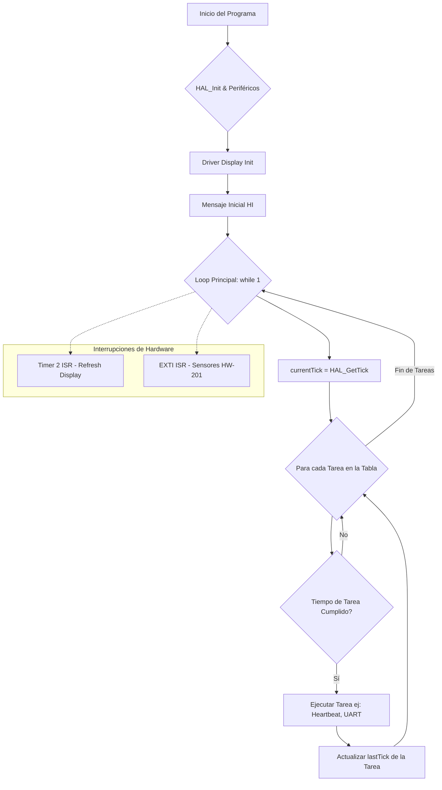
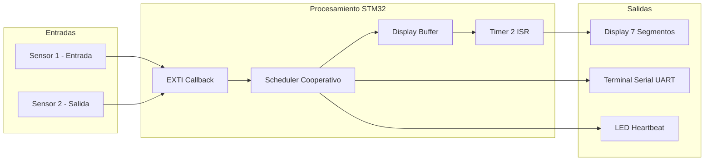

# 🚀 Proyecto Integrador: Contador de Personas Real-Time con Scheduler Cooperativo

Este proyecto representa un hito en el **Nivel Intermedio** de mi formación en sistemas embebidos. Se ha rediseñado un contador básico para convertirlo en un sistema robusto, modular y dirigido por eventos, utilizando una placa **STM32F439ZI (Nucleo-144)**.

## 🧠 Arquitectura de Software

El sistema evoluciona del flujo secuencial tradicional hacia una Arquitectura Basada en Tareas y Eventos, estructurada bajo los siguientes pilares:

### 1. Planificador Cooperativo (Task Scheduler)
Se implementó un despachador de tareas no bloqueante en el `while(1)`. Las tareas se ejecutan basándose en una tabla de control (`task_t`) que compara el tiempo transcurrido mediante el `SysTick`.
* **Ventaja:** El CPU está libre para procesar múltiples funciones (Heartbeat, UART, Lógica) sin que una interfiera con el tiempo de la otra.
#### Flujo del Scheduler y Eventos:

### 2. Driver `Display_7Seg_stm32` (Middleware)
Se desarrolló un driver genérico para displays de **Cátodo Común** con las siguientes características:
* **Multiplexación por Hardware:** Utiliza el **Timer 2** para el refresco automático de los dígitos.
* **Buffer de Video:** Uso de una variable `uint8_t bufferDisplay[3]` que desacopla la lógica de negocio de la visualización física.
* **Interfaz Avanzada:** Soporte para control de brillo (PWM por software), parpadeo (Flash) y mensajes alfanuméricos (ASCII map).

---

## ⚙️ Configuración Técnica

### Temporización (Timer 2)
Configurado sobre el bus **APB1 a 90 MHz**:
* **Prescaler:** `8999` (Reloj interno de 10 kHz).
* **ARR (Period):** `54` (Interrupción cada ~5.5 ms).
* **Frecuencia de Refresco:** ~181 Hz (60 Hz efectivos por dígito, garantizando una imagen *flicker-free*).

### Interrupciones Externas (EXTI)
Los sensores de proximidad **HW-201** operan mediante interrupciones externas para garantizar latencia cero:
* **Modo:** Falling Edge (detección por flanco de bajada).
* **Debounce:** Filtro de tiempo por software (600ms) para evitar falsos conteos o re-disparos por ruido.
* **Etiquetas (Labels):** Uso de etiquetas definidas en el `.ioc` (`SENSOR_1_Pin`, `SENSOR_2_Pin`) para mayor legibilidad y portabilidad.

---

## 🔬 Conceptos de Programación Avanzada

* **Variables `static` locales:** Utilizadas en el Scheduler y la ISR para persistir datos de tiempo y estados sin contaminar el espacio global de nombres.
* **Modificador `volatile`:** Aplicado al contador de personas para asegurar que el compilador no optimice lecturas de una variable que cambia dentro de una interrupción.
* **Encapsulamiento:** Toda la configuración del hardware está contenida en el Handle del driver, permitiendo escalar a más dígitos con cambios mínimos.

---

## 🛠️ Diagrama de Bloques Lógico

1. **Entrada:** Sensores HW-201 disparan EXTI.
2. **Procesamiento:** El CPU actualiza el Buffer en el Scheduler.
3. **Salida:** El Timer 2 vuelca el Buffer a los pines GPIO a través del Driver.

---
*Desarrollado como parte de la carpeta de Proyectos Integradores - CarlitozMF 2026*