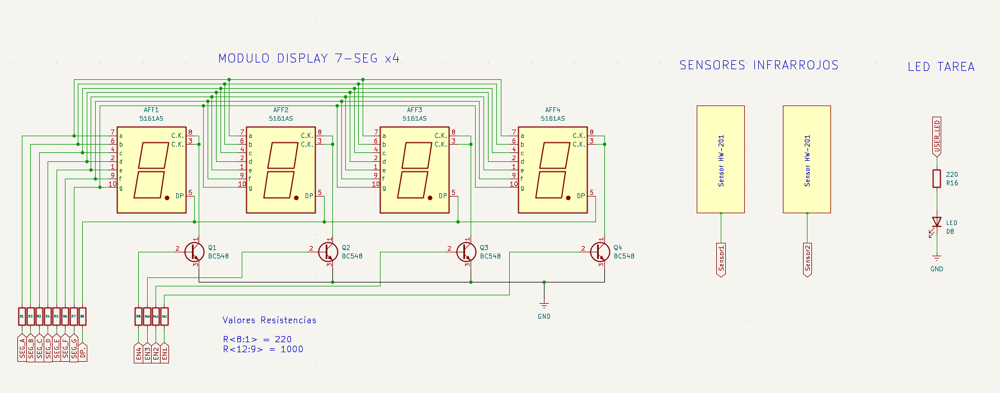
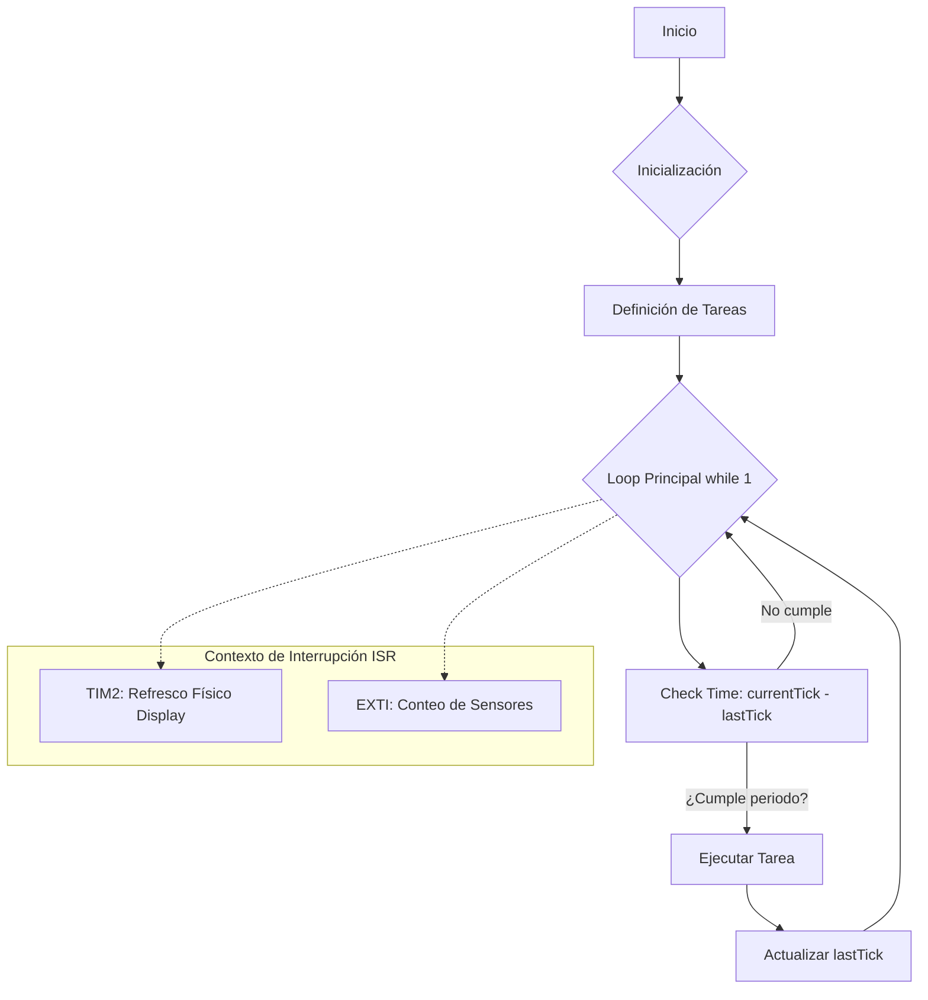

# EI_1: Contador de Personas Real-Time con Scheduler Cooperativo

### 📝 Descripción
Este proyecto consiste en un sistema embebido de conteo bidireccional de personas diseñado bajo estándares de ingeniería de firmware profesional. Utiliza una **Arquitectura de Software de 3 Capas** con una **PAL (Platform Abstraction Layer)**, permitiendo que el sistema sea completamente reactivo, asíncrono y portable entre diferentes microcontroladores (STM32, AVR, PIC).

---

## 🎯 Objetivos del Proyecto
*   **Abstracción de Hardware:** Implementar un middleware (driver) agnóstico para displays de 7 segmentos.
*   **Determinismo:** Gestionar tareas de tiempo crítico mediante interrupciones y un planificador cooperativo.
*   **Escalabilidad:** Diseñar un sistema capaz de crecer en número de tareas sin bloquear el flujo principal.
*   **Robustez:** Mitigar ruidos de sensores y parpadeos visuales mediante técnicas de software avanzadas.

---

## 🔌 Especificaciones de Circuito

<center>

</center>

*   **Sensores:** 2x Sensores infrarrojos HW-201 (Detección por corte de haz).
*   **Visualización:** Módulo de 4 displays de 7 segmentos (Cátodo Común).
*   **Protocolo:** Telemetría por UART a 115200 baudios.

---

## 📖 Teoría de Operación
El sistema utiliza **Multiplexación por División de Tiempo (TDM)**. El ojo humano percibe una imagen estática gracias a la persistencia retiniana cuando los dígitos se refrescan a más de 60Hz.

### ⏱️ Configuración de Temporización (Timer 2)

Para obtener una imagen estable y libre de parpadeo (*flicker-free*) en el módulo de 4 dígitos, el **Timer 2** se ha sintonizado para disparar la ISR de multiplexación con los siguientes parámetros técnicos (basados en un bus **PCLK1 de 90 MHz**):

*   **Prescaler (PSC):** `8999`
    *   Frecuencia de conteo: $$\frac{90 \text{ MHz}}{8999 + 1} = 10 \text{ kHz}$$
*   **Auto-Reload Register (ARR):** `41`
    *   Frecuencia de interrupción: $$\frac{10 \text{ kHz}}{41 + 1} \approx 238 \text{ Hz}$$
*   **Resultado Visual:** Dado que disponemos de 4 dígitos multiplexados, la frecuencia efectiva por dígito es de $$\frac{238 \text{ Hz}}{4 \text{ dígitos}} \approx 60 \text{ Hz}$$. Esto cumple estrictamente con el umbral de **persistencia retiniana**, garantizando una visualización fluida y profesional.

> **Nota de Robustez:** Se eligió una frecuencia global de ~240 Hz para asegurar que, incluso bajo la carga de ejecución del scheduler cooperativo, el refresco de los dígitos se mantenga constante y por encima del límite crítico de percepción humana.

La lógica de conteo se dispara mediante **Interrupciones Externas (EXTI)**. El orden en que los sensores se activan determina el sentido del flujo (entrada o salida), actualizando un contador protegido por el modificador `volatile`.

### ⚡ Gestión de Eventos Críticos (EXTI)

La detección de personas se realiza mediante **Interrupciones Externas (EXTI)** disparadas por los sensores infrarrojos HW-201. Para garantizar una respuesta inmediata y evitar el bloqueo del procesador, se utiliza el siguiente callback de interrupción:
```c
/**
 * @brief Callback de EXTI para los sensores HW-201.
 * @note Detección por flanco de bajada (Falling Edge).
 */
void HAL_GPIO_EXTI_Callback(uint16_t GPIO_Pin) {
    static uint32_t lastITTick1 = 0;
    static uint32_t lastITTick2 = 0;
    uint32_t currentTick = HAL_GetTick();

    /* Sensor 1: Incremento de contador (Entrada) */
    if (GPIO_Pin == Sensor1_Pin) {
        if (currentTick - lastITTick1 > 600) { // Software Debounce de 600ms
            contadorPersonas++;
            lastITTick1 = currentTick;
        }
    }

    /* Sensor 2: Decremento de contador (Salida) */
    if (GPIO_Pin == Sensor2_Pin) {
        if (currentTick - lastITTick2 > 600) { // Software Debounce de 600ms
            if (contadorPersonas > 0) contadorPersonas--;
            lastITTick2 = currentTick;
        }
    }
}
```

### 💡 Puntos clave de la implementación

*   **Detección Asíncrona:** El uso de **EXTI** permite que el sistema reaccione instantáneamente al paso de una persona, con latencia mínima y sin importar qué tarea esté ejecutando el *scheduler* en ese momento.
*   **Filtro de Rebotes (Debounce):** Al trabajar con sensores infrarrojos, pueden ocurrir múltiples disparos espurios por ruidos ópticos o bordes difusos. El umbral de **600ms** garantiza que un solo cruce físico sea procesado como un único evento de conteo.
*   **Uso de Variables `static`:** Se implementaron variables `static uint32_t` dentro del callback para preservar las marcas de tiempo entre llamadas. Esto evita la polución del espacio global de nombres y respeta el principio de **encapsulamiento**, limitando el alcance de las variables solo a la función que las necesita.

---

## 🏗️ Arquitectura del Software: Modelo de 3 Capas

El software se ha estructurado para separar la lógica de negocio del silicio específico:

1.  **Capa de Aplicación (Level 3):** Contiene el **Scheduler Cooperativo**. Recorre una tabla de tareas (`task_t`) ejecutando procesos de forma no bloqueante.
2.  **Capa de Middleware / Driver (Level 2):** Driver `Display_7Seg` agnóstico. No contiene código de ST; se comunica mediante punteros a funciones.
3.  **Capa de Abstracción de Plataforma - PAL (Level 1):** Funciones "puente" (`STM32_WritePin`, `STM32_GetTick`) que vinculan el driver con la HAL de ST.

### Flujo del Planificador


---

## 🗺️ Mapeo del Hardware (Hardware Mapping)

| Periférico | Pin (STM32) | Tipo | Label |
| :--- | :--- | :--- | :--- |
| **Sensor Entrada** | PB10 | EXTI (Falling/Rising) | Sensor1 |
| **Sensor Salida** | PB11 | EXTI (Falling/Rising) | Sensor2 |
| **Bus de Segmentos** | PB8, PB9, PA5, PA6, PA7, PD14, PD15 | GPIO Output | SEG_A..G |
| **Control Dígitos** | PC8, PC9, PC10, PC11 | GPIO Output | EN1, EN2, EN3, EN4 |
| **LED Externo** | PF13 | GPIO Output | led_user |
| **UART TX/RX** | PD8 / PD9 | Alternativo | USART3 |

## 💪 Detalles de Robustez

*   **Software Debounce:** Filtro de **600ms** en la detección de sensores para evitar conteos falsos por rebotes o vibraciones mecánicas.
*   **Anti-Ghosting:** El driver garantiza un estado de "limpieza" (puertos comunes apagados) antes de conmutar segmentos, eliminando el brillo residual (flicker) en la transición de dígitos.
*   **Brillo Variable:** Implementación de **PWM por Software** dentro de la ISR de multiplexación, permitiendo 10 niveles de intensidad lumínica configurables.
*   **Protección de Datos:** Uso del calificador `volatile` en variables compartidas (como el contador) para evitar optimizaciones indeseadas del compilador en contextos de interrupción.

---

## 🔬 Lógica del Driver Universal

El driver ha sido diseñado para ser completamente versátil frente a las variaciones de hardware. Soporta Displays tanto **Ánodo como Cátodo Común** mediante una configuración de enumeración inyectada en la inicialización:
```c
/* Ejemplo de inicialización para Cátodo Común */
Display7Seg_Init(&hDisp, stm32_pal, segmentos, comunes, 4, buffer, DISPLAY_CATHODE);
```

### 🔄 Versatilidad Técnica

*   **Inversión Lógica Automática:** El driver detecta el tipo de hardware configurado y ajusta internamente los niveles de salida (**HIGH/LOW**) tanto para el bus de segmentos como para los pines de habilitación (comunes). Esto garantiza que el patrón de bits sea siempre el correcto sin importar la polaridad eléctrica.
*   **Reutilización (Caja Negra):** Esta abstracción permite que el núcleo del driver (`Display_7Seg.c`) funcione como un componente de "Caja Negra" reutilizable en cualquier cátedra o proyecto de la carrera, independientemente de los displays disponibles en el pañol o laboratorio.
*   **Agnosticismo Eléctrico:** Al gestionar la polaridad desde el **Middleware**, se simplifica el diseño del circuito impreso (PCB) y el prototipado, permitiendo cambios de hardware de último momento (ej. pasar de un display a otro por falta de stock) sin necesidad de reescribir una sola línea de la lógica de aplicación.

---

## 🚀 Roadmap de Mejoras

- [ ] **Persistencia de Datos:** Implementar almacenamiento en memoria **Flash (EEPROM Emulation)** para recuperar el último conteo tras un reinicio o pérdida de energía.
- [ ] **Conectividad IIoT:** Integrar el stack **LwIP** para enviar la telemetría y el estado del aforo vía Ethernet utilizando el protocolo **MQTT**.
- [ ] **Eficiencia Energética:** Añadir una tarea de **Power Management** que apague el display tras un periodo de inactividad programado, despertando el sistema mediante interrupciones de los sensores.

---

## 📝 Conclusión

Este proyecto **EI_1** representa la consolidación de los pilares fundamentales en el diseño de sistemas embebidos de alta calidad: **Modularidad, Determinismo y Portabilidad**. 

La transición de un flujo de código secuencial hacia un **Scheduler Cooperativo** permite que el microcontrolador gestione múltiples procesos simultáneamente con una carga de CPU mínima. Al desacoplar la lógica de hardware mediante una **PAL**, se sientan las bases para desarrollos de complejidad industrial, garantizando un código mantenible y escalable para el futuro.

---

🛠️ **Carlos** | Estudiante de Ing. Electrónica @UTN_FRT.  
🚀 Apasionado Autodidacta por los Sistemas Embebidos.