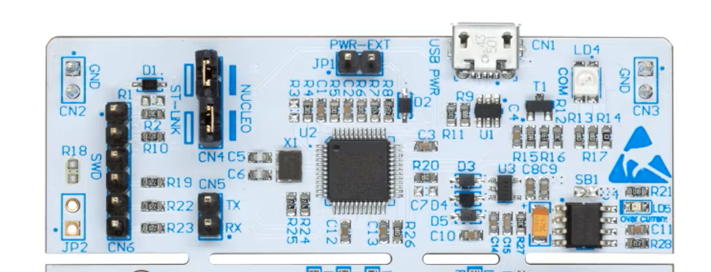
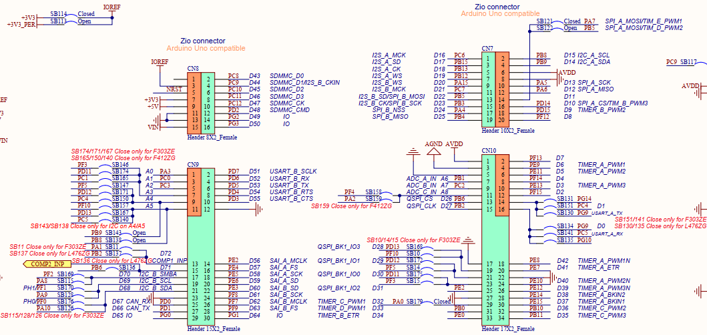
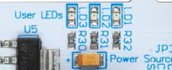
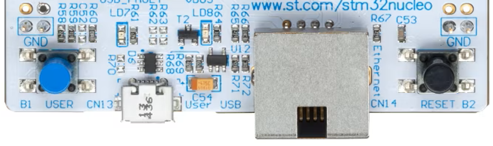

# 00. 🛠️ Hardware Overview: STM32 Nucleo-144 (F439ZI)ZI)

  
   
  <em>Figura 1: Placa de desarrollo NUCLEO-F439ZI con conectores Zio y ST morpho.</em>

Este documento proporciona una visión general del hardware utilizado en este repositorio. Comprender la infraestructura del microcontrolador y la placa de desarrollo es el primer paso crítico antes de la implementación de drivers en la **Capa 1**.

---

## 1. 🏗️ La Placa de Desarrollo: Nucleo-144
La placa **NUCLEO-F439ZI** es una plataforma robusta que permite el prototipado rápido con acceso total a los periféricos del microcontrolador.

### Características Principales
*   **ST-LINK/V2-1:** Debugger y programador integrado en placa. No requiere herramientas externas.

  
   
  <em>Figura 2: ST-LINK integrado.</em>

*   **Puerto COM Virtual:** El ST-LINK mapea una UART a USB para comunicación serie con la PC (por defecto conectada a la `USART3`).
*   **Flexibilidad de Alimentación:**
    *   Vía USB (VBUS).
    *   Fuente externa $VIN$ ($7\text{V} - 12\text{V}$).
    *   Fuente externa $E5V$ ($5\text{V}$).
*   **Conectores:** 
    *   **ST Zio:** Extensión de Arduino Uno V3 para mayor conectividad.
    *   **ST morpho:** Acceso directo a todos los pines del MCU.

### 1.1 ⏱️ Gestión de Reloj y Cristales
La placa ofrece flexibilidad en la fuente de clock, lo cual es vital para la estabilidad del sistema:
* **LSE (Low Speed External):** Cristal `NX3215SA` de $32.768 \text{ kHz}$ (X2) conectado a los pines `PC14` y `PC15` para el RTC.
* **HSE (High Speed External):** Recibe una señal de reloj de $8 \text{ MHz}$ proveniente del ST-LINK a través del pin `PH0` (OSC_IN).

### 1.2 👤 Interfaz de Usuario Física
Además de los pines de expansión, la placa cuenta con elementos de interacción directa para debug visual:
*   **LED Tricolor (LD4):** Proporciona información sobre el estado de la comunicación del ST-LINK (USB enumerando, comunicación activa o error).
*   **User LEDs (LD1, LD2, LD3):** Mapeados a GPIOs específicos para señalización de estados del firmware.
*   **User Button (B1):** Pulsador para generar entradas digitales o disparar interrupciones externas (EXTI).

### 1.3 📍 Distribución de Pines (Connectors)
La placa utiliza el estándar de conectores para Nucleo-144, detallado en el esquemático de referencia **MB1137**.

*   **Zio Connectors (CN7, CN8, CN9, CN10):** Proporcionan compatibilidad con Arduino™ Uno V3 (pines internos) y extienden las señales del F439ZI en las filas externas.
*   **ST Morpho (CN11, CN12):** Dos conectores de 36x2 pines que brindan acceso directo a todos los puertos del MCU ($PA$ a $PI$).

> [!TIP]
> **Referencia de Diseño:** Según el esquemático (Figura abajo), existen puentes de soldadura (SB) que definen la conectividad de periféricos específicos como $I2C$, $CAN$ y $Timers$. Siempre verificar el estado de los Solder Bridges si un periférico no responde como se espera.

  
   
  <em>Figura 3: Distribución conectores Zio.</em>

### 1.4 🛡️ Protección y Seguridad
*   **Fusible USB:** La placa cuenta con protección por sobrecorriente en el conector USB del ST-LINK para proteger el puerto de la PC ante cortocircuitos accidentales en el prototipado.

### 1.5 🌐 Conectividad Avanzada
* **Ethernet (RJ45):** El transceptor LAN8742A utiliza un cristal dedicado de $25 \text{ MHz}$ (X4) para su propia generación de clock de red.
* **USB OTG:** Incorpora un switch de potencia `STMPS215ISTR` (U12) para la gestión de corriente en modo Host y protección contra sobrecargas.

---

## 2. 🧠 Especificaciones del Microcontrolador (STM32F439ZI)
El corazón de este proyecto es un MCU de alto rendimiento basado en la arquitectura **Cortex-M4**.

| Parámetro | Detalle |
| :--- | :--- |
| **Núcleo** | ARM® 32-bit Cortex®-M4 con FPU y DSP |
| **Frecuencia Máxima** | $180 \text{ MHz}$ |
| **Memoria Flash** | $2 \text{ MB}$ |
| **SRAM** | $256 \text{ KB}$ |
| **Voltaje de Operación** | $1.7 \text{V}$ a $3.6 \text{V}$ |
| **Arquitectura de Bus** | Multi-AHB Matrix (permite acceso concurrente) |

### Potencia de Cálculo
Gracias a la **FPU (Floating Point Unit)** y a las instrucciones **DSP**, este microcontrolador es capaz de realizar cálculos matemáticos complejos en pocos ciclos de reloj, lo cual es fundamental para nuestros futuros proyectos de control y medición de energía.

---

## 3. ⌨️ Recursos de Usuario Disponibles
Para las primeras etapas de desarrollo y pruebas de "Sanity Check", la placa dispone de los siguientes recursos mapeados:

### LEDs de Usuario
| LED | Color | Pin GPIO |
| :--- | :--- | :--- |
| **LD1** | Verde | `PB0` |
| **LD2** | Azul | `PB7` |
| **LD3** | Rojo | `PB14` |

  
   
  <em>Figura 4: LEDs disponibles "on-board" .</em>

### Pulsadores
*   **B1 (USER):** Pulsador azul conectado al pin `PC13`. (Configuración lógica: Alto cuando se presiona).
*   **Reset:** Pulsador negro para reiniciar el sistema.

  
   
  <em>Figura 5: Botones disponibles "on-board" .</em>

### 3.1 📟 Comunicación Serie (Debug)
Para la depuración mediante el puerto serie virtual (VCP), la placa utiliza los siguientes pines ruteados internamente al ST-LINK:

| Señal | Pin MCU | Función Alternativa | Nota Esquemático |
| :--- | :--- | :--- | :--- |
| **USART3_TX** | `PD8` | AF7 | Conectado vía SB133 |
| **USART3_RX** | `PD9` | AF7 | Conectado vía SB132 |

---

## 4. 🌳 Diagrama de Reloj (Clock Tree)
Aunque el microcontrolador puede funcionar con un oscilador interno (HSI), la placa Nucleo utiliza un cristal externo (HSE) de $8 \text{ MHz}$ derivado del ST-LINK. 

*   A través del **PLL (Phase-Locked Loop)** interno, elevamos esta frecuencia hasta los **180 MHz** para obtener el máximo rendimiento del sistema.

> [!NOTE]
> **Configuración de Buses:** Al configurar el PLL para alcanzar los $180 \text{ MHz}$, es fundamental ajustar los prescalers de los buses periféricos para no exceder sus límites operativos: **APB1** ($45 \text{ MHz}$ máx.) y **APB2** ($90 \text{ MHz}$ máx.).

> [!IMPORTANT]
> **Nota de Seguridad:** La mayoría de los pines son tolerantes a $5\text{V}$, pero la tensión de trabajo lógica es de **3.3V**. Siempre verificar el Datasheet antes de conectar sensores externos para evitar daños permanentes en el silicio.

---

## 5. 🖇️ Configuración de Hardware (Solder Bridges)
Según la hoja 6 del esquema **MB1137**, la conectividad de ciertos pines está sujeta a puentes de soldadura (SB). Por defecto, la placa viene configurada para la compatibilidad total con la serie F4:
* **SB114 (Cerrado):** Fija la referencia **IOREF** en $3.3\text{V}$.
* **SB132/133 (Cerrados):** Habilitan el enlace de la UART con el ST-LINK.

---

## 6. 📚 Referencias Técnicas
Para profundizar en el hardware, se recomienda la consulta de los manuales originales almacenados en la nube:

* [📘 Reference Manual (RM0090)](https://drive.google.com/file/d/18hRySsF9LAKmBoLBhTNoEcsgNZ_8bCPm/view?usp=drive_link) - Detalle exhaustivo de registros y periféricos.
* [📑 User Manual Nucleo-144 (UM1974)](https://drive.google.com/file/d/1tb_dSGkydypyDabQayG07V7fC0ld1eAZ/view?usp=drive_link) - Configuración física y jumpers de la placa.
* [📉 Datasheet STM32F439ZI](https://drive.google.com/file/d/1W0dJb6TY7y_mT_luX7gTRSvXkfKqDEnQ/view?usp=drive_link) - Especificaciones eléctricas, consumos y pinout.
* [🗺️ Esquemático MB1137 (PDF)](https://drive.google.com/file/d/1j4aaprW6rypFNvTEEWEgJdY0yeW67kbx/view?usp=drive_link) - Plano circuital completo de la placa Nucleo.

---

**Siguiente paso:** [01_Conociendo_Al_STM32F439ZI](../01_STM32F439ZI/README.md)

🛠️ **Carlos** | Estudiante de Ing. Electrónica @UTN_FRT.  
🚀 Apasionado Autodidacta por los Sistemas Embebidos.
