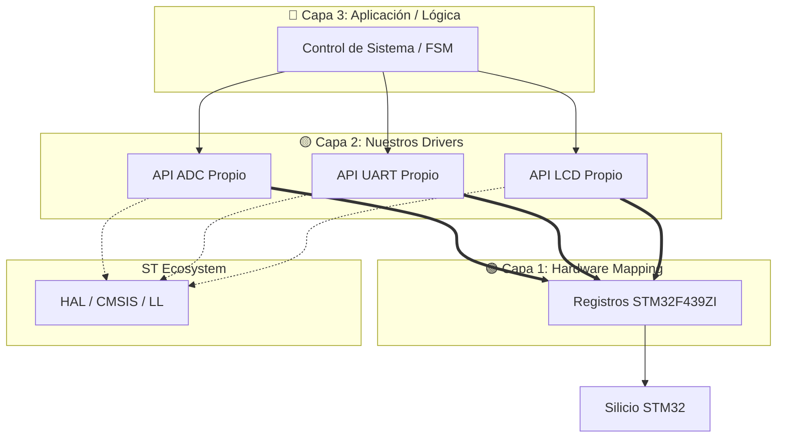

# 02. 🏗️ Arquitectura de Software: Modelo de 3 Capas

Este repositorio implementa una metodología de diseño desacoplada. El objetivo principal es la **soberanía del código**: aunque se utiliza la **HAL de ST** para la inicialización básica del sistema (Clock Tree, etc.), los drivers de periféricos se desarrollan de forma independiente para garantizar la portabilidad hacia otras arquitecturas (AVR, NXP, LPC).

## 1. 📂 Estructura de Capas (Independencia y Abstracción)

Para evitar la dependencia total de un solo fabricante, el software se organiza en tres niveles de abstracción claramente definidos:

### 🟢 Capa 1: Hardware Mapping (Direct Register Access)
Es el nivel de contacto directo con el silicio.
* **Definición:** Basada en el **RM0090** y el **DS9484**, esta capa define las estructuras de datos que representan los registros del STM32F439ZI y sus direcciones base.
* **Misión:** Proporcionar acceso de bajo nivel mediante punteros a registros, evitando el "overhead" de funciones genéricas del fabricante cuando se requiere máxima velocidad.
* **Dependencia:** Es la única capa vinculada físicamente al hardware de ST.

### 🟡 Capa 2: Drivers & Abstraction (Nuestra propia API)
Donde reside la lógica de control de los periféricos.
* **Independencia de la HAL:** Los drivers (UART, ADC, LTDC, I2C) se construyen desde cero. Se busca que la implementación interna sea modular; para portar el driver a otro micro, solo se debería cambiar el mapeo de la Capa 1.
* **Robustez:** Implementación de técnicas de **bit-shifting** para configuraciones atómicas y gestión de **histéresis** para el tratamiento de señales analógicas.
* **Eficiencia:** Gestión inteligente de la **Multi-AHB Matrix** y controladores **DMA** para transferencias sin bloqueo de CPU.

### 🔴 Capa 3: Application & FSM (High-Level)
El nivel más alto de abstracción, donde reside la inteligencia del proyecto.
* **Responsabilidad:** Gestión de **Máquinas de Estados Finitos (FSM)** y algoritmos de aplicación (ej. cálculo de potencia, interfaz de usuario).
* **Portabilidad:** Esta capa es totalmente agnóstica al hardware. No conoce registros ni protocolos físicos; solo consume las APIs de la Capa 2.

---

## 2. 📊 Diagrama de Arquitectura (Mermaid)

El siguiente flujo muestra cómo nuestros drivers se mantienen independientes del ecosistema del fabricante:

### 3. 🛡️ Detalles de Robustez y Calidad
Siguiendo los pilares técnicos establecidos para este repositorio, cada módulo de software debe garantizar:

* [cite_start]**Determinismo:** El uso de **FSM (Finite State Machines)** asegura que el sistema siempre se encuentre en un estado conocido, facilitando la depuración y garantizando un comportamiento predecible del firmware[cite: 1, 2].
* **Modularidad:** El código se organiza estrictamente en archivos `.c` y `.h` independientes por cada periférico, evitando acoplamientos innecesarios y facilitando el mantenimiento.
* [cite_start]**Control de Errores:** Implementación de manejadores para *timeouts* de bus y errores de desbordamiento (overrun), especialmente críticos en el **ADC** y comunicaciones de alta velocidad como SPI o I2C[cite: 2].
* [cite_start]**Bit-shifting y Máscaras:** Uso de operaciones a nivel de bit para la configuración atómica de registros según el **RM0090**, garantizando que no se alteren bits adyacentes de forma involuntaria durante la escritura[cite: 2].
* **Tratamiento de Señales:** Implementación de técnicas de **histéresis** y filtrado digital en la Capa 2 para estabilizar las lecturas analógicas y evitar disparos falsos en la lógica de control.

### 4. 🧭 Estrategia de Portabilidad
Si se requiere migrar este firmware a otra plataforma (ej. **EDU-CIAA** o **Bluepill**):

1.  [cite_start]**Reemplazar Capa 1:** Actualizar el archivo de definiciones de registros (`regs.h`) con las direcciones base y offsets del nuevo MCU según su propio *Memory Map*[cite: 1, 2].
2.  **Ajustar Capa 2:** Adaptar la implementación interna de los drivers (la forma en que se manipulan los bits de los registros específicos), manteniendo intacta la firma de las funciones (la API) para que las capas superiores no sufran cambios.
3.  **Mantener Capa 3:** La lógica de aplicación, los algoritmos de control y las máquinas de estados permanecen intactas, acelerando drásticamente el tiempo de migración y eliminando errores de lógica de negocio.

---

**Siguiente paso:** [03_STM32Cube IDE](../03_STM32CubeIDE/README.md)

🛠️ **Carlos** | Estudiante de Ing. Electrónica @UTN_FRT.  
🚀 Apasionado Autodidacta por los Sistemas Embebidos.