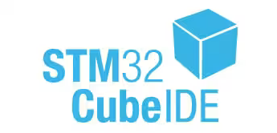

# 03. 🛠️ Introducción al STM32CubeIDE

  
   

El **STM32CubeIDE** es el entorno de desarrollo integrado (IDE) principal para este repositorio. Se trata de una herramienta basada en Eclipse que integra la configuración gráfica de periféricos y el conjunto de herramientas de compilación **GCC** para sistemas embebidos, permitiéndonos gestionar el ciclo de vida completo del software desde la inicialización hasta el debug avanzado.

## 1. 🏗️ Componentes del Entorno
El IDE centraliza tres funciones críticas que aprovecharemos de forma estratégica:
* **Generador de Configuración (CubeMX):** Utilizado para la gestión visual del **Clock Tree**, la resolución de conflictos en el pinout y la generación de la capa de inicialización de la **HAL**.
* **Editor y Compilador C/C++:** Optimizado para la arquitectura ARM, donde implementaremos nuestra estructura de **3 capas** manteniendo la independencia de los drivers soberanos.
* **Interfaz de Depuración:** Conexión nativa con el **ST-LINK V2-1** para inspección de memoria y registros en tiempo real.

## 2. 🔌 Integración con el Hardware
El IDE interactúa con la placa Nucleo-144 mediante el protocolo **SWD (Serial Wire Debug)**. Esta conexión permite:
* **Programación:** Carga de binarios directamente en la memoria Flash del **STM32F439ZI**.
* **VCP (Virtual COM Port):** Comunicación bidireccional entre la PC y el microcontrolador a través de la **USART3** (pines PD8/PD9).
* **Análisis en Vivo:** Visualización de variables y estados internos del procesador sin detener su ejecución.

## 3. ⚙️ Stack Técnico y Herramientas
Aunque el IDE simplifica el flujo, trabajamos bajo pilares de código abierto:
* **Toolchain:** `arm-none-eabi-gcc` para la compilación de binarios.
* **Depurador:** `GDB` integrado con interfaz gráfica.
* **Bibliotecas:** Uso de **CMSIS** para el acceso directo a hardware y la **HAL** de ST para la base de infraestructura.

---

## 📺 Video Tutorial: Instalación Paso a Paso
Para asegurar una configuración correcta del entorno desde cero, puedes seguir este tutorial en mi canal:

> [!TIP]
> **Contenido del video:** Guía detallada sobre cómo descargar e instalar STM32CubeIDE para comenzar con el desarrollo profesional de sistemas embebidos.

---

## 🧭 Mapa de Ruta en el IDE
Este documento es la introducción a la fase práctica. El flujo de trabajo continúa con las siguientes guías detalladas:
1.  **Guía 04:** Creación y organización de proyectos.
2.  **Guía 05:** Configuración del archivo `.ioc` (Etiquetas, IO y Clock).
3.  **Guía 06:** Anatomía y flujo de ejecución en el `main.c`.

---
**Siguiente paso:** [04_Creacion_Proyectos](../05_Creacion_Proyectos/README.md)

🛠️ **Carlos** | Estudiante de Ing. Electrónica @UTN_FRT.  
🚀 Apasionado Autodidacta por los Sistemas Embebidos.