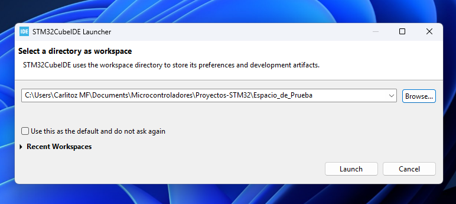
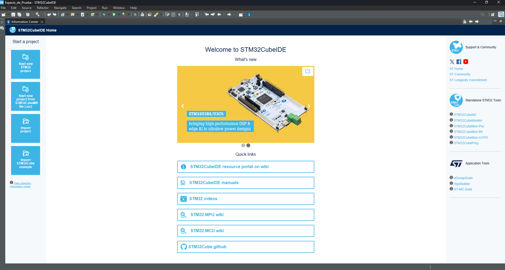
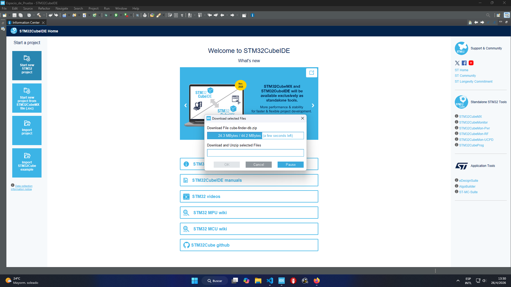
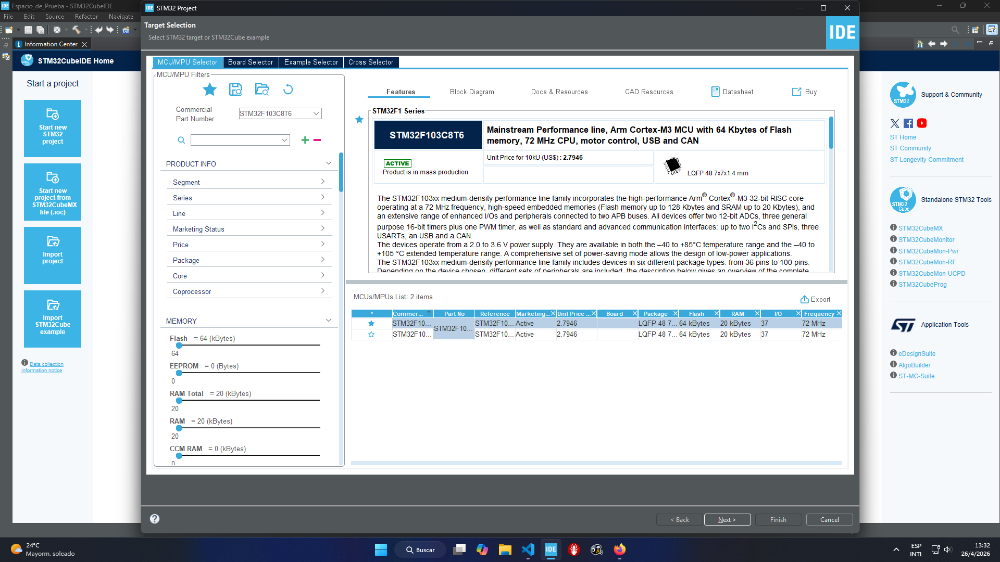
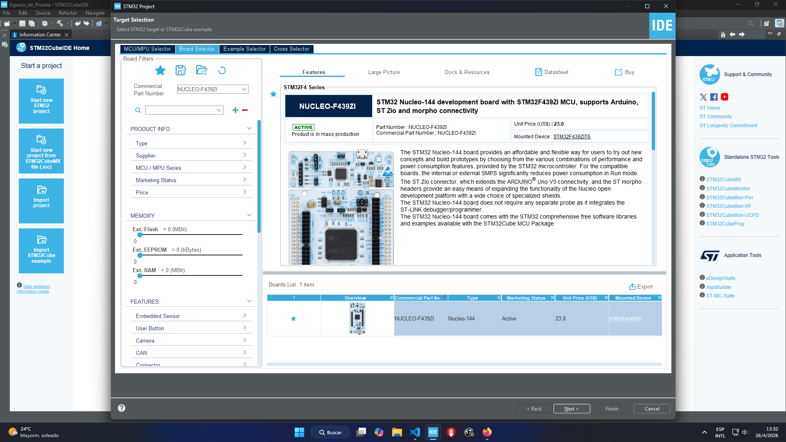
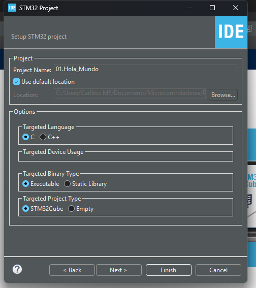
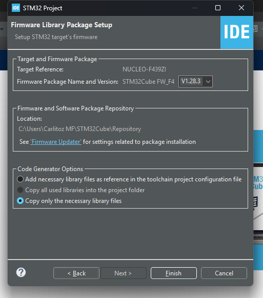
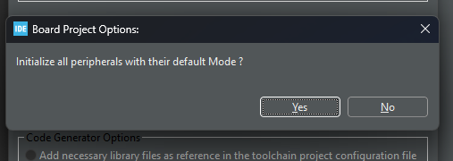
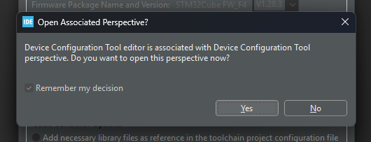
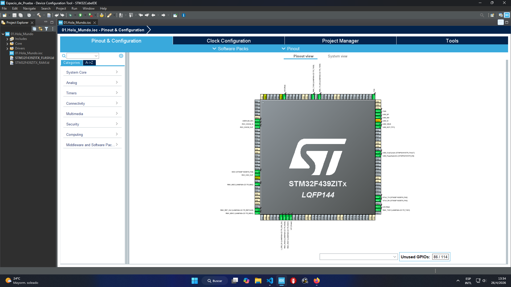

# 04. 🛠️ Guía de Creación de Proyectos en STM32CubeIDE

En esta guía detallamos el proceso desde la apertura del IDE hasta la generación del archivo de configuración `.ioc`. El objetivo es establecer una base sólida que respete nuestra arquitectura de capas desde el primer momento.

---

## 📺 Video Tutorial: Instalación y Primeros Pasos
Si aún no tienes el entorno configurado, puedes seguir este tutorial detallado de mi canal:

> [!TIP]
> **Recomendación:** Mirar el video para asegurar que los drivers del ST-LINK y las herramientas de compilación GCC quedaron correctamente vinculadas al sistema.

---

## 1. 🚀 Inicio del Proyecto (Project Wizard)
Para nuestra placa **NUCLEO-F439ZI**, seguimos estos pasos específicos para asegurar la compatibilidad con el hardware:

0.  * Al iniciar el programa, debemos seleccionar el *Directorio* en donde se guardaran, los proyectos que iremos creando a lo largo de este repositorio. Cabe destacar que un solo directorio denominado **raíz** se pueden guardar todos los proyectos que sean necesarios independientemente uno del otro. Luego *clickear* en **launch**

  
   
  <em>Figura 1: Panel de elección del directorio raíz.</em>

1. * En la pantalla principal, una vez iniciado el IDE buscamos la opción:

  
   
  <em>Figura 2: Pantalla principal del IDE.</em>

**File -> New -> STM32 Project:** Se abrirá el asistente de selección de hardware.

> [!IMPORTANTE]
> **Nota:** Es recomendable tener siempre la base de datos de los archivos utilizados por el IDE actualizado, por lo tanto esta pantalla es de suma importancia no saltearla.

  
   
  <em>Figura 3: Ventana de **Actualización de Base de Datos**.</em>

2. Una vez actualizada la base de datos, en esta pantalla podemos elegir la opción 
    **MCU/MPU Selector:** En esta pantalla encontraremos los micros como el STM32F1038ct6, microcontrolador utilizado en la placa no oficial *bluepill o blackpill*.

  
   
  <em>Figura 4: Ventana de **Selección de Microcontrolador**.</em>

3.  **Board Selector:** Es fundamental usar esta pestaña en lugar de "MCU Selector" por que en ella encontraremos la NUCLEO.
    * Buscamos **NUCLEO-F439ZI**.
    * **Ventaja:** Al elegir la placa, el IDE ya conoce la conexión del ST-LINK, los LEDs de usuario y el puerto serie de debug (USART3).

  
   
  <em>Figura 5: Ventana de **Selección de Placa**.</em>

4. Una vez seleccionada la plataforma en donde se trabajará, aparecerá la ventana de configuración del proyecto:

  
   
  <em>Figura 6: Ventana de **Configuración del Proyecto**.</em>

  **Project Setup:** * **Project Name:** Asignar un nombre descriptivo (ej. `STM32F439_Base_Project`).
    * **Targeted Language:** Seleccionar **C**.
    * **Targeted Binary Type:** Executable.
    * **Targeted Project Type:** STM32Cube.

Al *clickear* sobre next nos aparecerán las opciones versiones de firmware que contiene las definiciones del micro seleccionado (se recomienda trabajar siempre con la ultima versión), y las opciones de generación de código. Una vez seleccionadas las configuraciones estamos en condiciones de *clickear* en **Finish** para generar el proyecto.

  
   
  <em>Figura 7: Ventana de **Control de Versiones**.</em>

## 2. 🏗️ Configuración de Inicialización
Al finalizar el asistente, el IDE lanzará dos preguntas críticas:

  
   
  <em>Figura 8: Ventana de **Inicializacion de Perifericos**.</em>

* **"Initialize all peripherals with their default Mode?":** Seleccionamos **YES**. 
    * Esto configura automáticamente el reloj externo y los periféricos *on-board* (LEDs y Botón) según el esquemático **MB1137**.

  
   
  <em>Figura 9: Ventana de **Finalización de Configuración de Proyecto**.</em>

* **"Device Configuration Tool perspective?":** Seleccionamos **YES**.
    * Esto abrirá la interfaz gráfica del archivo `.ioc`.

## 3. 📄 El Archivo .ioc (Configurador Gráfico)
Una vez creado el proyecto, el archivo con extensión `.ioc` es nuestro centro de mando inicial. Este archivo nos permite:

* **Pinout View:** Visualizar gráficamente los 144 pines del microcontrolador y sus funciones asignadas.
* **Peripherals Tree:** Activar o desactivar periféricos (ADC, Timers, Ethernet) de forma visual.
* **Clock Configuration:** Gestionar el árbol de relojes para garantizar la máxima estabilidad del sistema.

  
   
  <em>Figura 10: Ventana de **CUBE MX .IOC**.</em>

---

## 🛡️ Soberanía del Código
Aunque el archivo `.ioc` genera código basado en la **HAL de ST**, en este repositorio mantenemos una política de **Soberanía del Código**:

1.  Utilizamos el código generado para la **infraestructura básica** (inicialización de hardware).
2.  Nuestros **Drivers de Capa 2** se escribirán en archivos independientes para no depender exclusivamente de las herramientas del fabricante y garantizar la portabilidad futura.

---

## 📺 Video Tutorial: Creación de Proyecto paso a paso
Para seguir el proceso de forma visual y asegurar que la configuración inicial sea la correcta, podés ver este resumen en mi canal:

---

## 🧭 Mapa de Ruta
El flujo de configuración continúa en las siguientes guías:
1.  **Guía 05:** Configuración de I/O, Etiquetas (User Labels) y System Clock (180 MHz).
2.  **Guía 06:** Anatomía y flujo de ejecución en el archivo `main.c`.

---
**Siguiente paso:** [05_Configuracion_IOC](../05_Configuracion_IOC/README.md)

🛠️ **Carlos** | Estudiante de Ing. Electrónica @UTN_FRT.  
🚀 Apasionado Autodidacta por los Sistemas Embebidos.