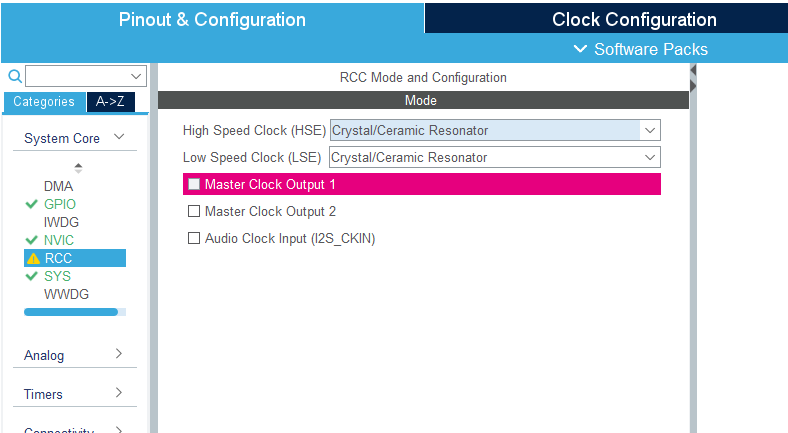
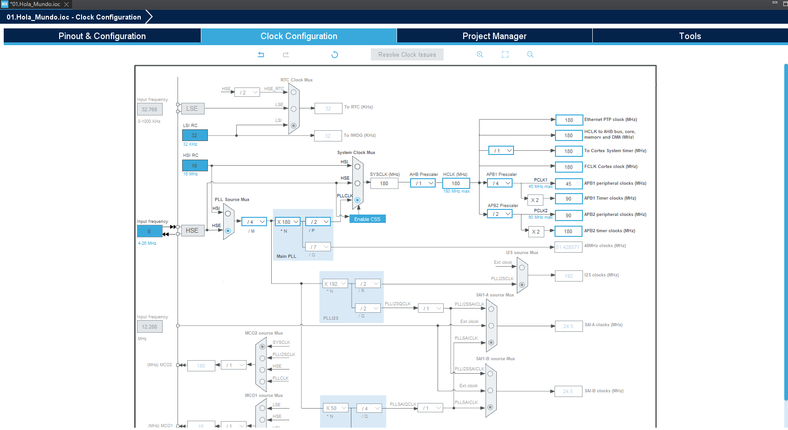
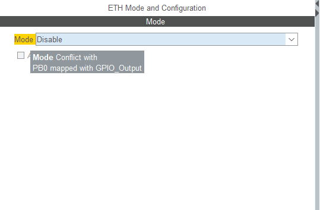
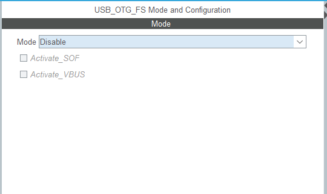
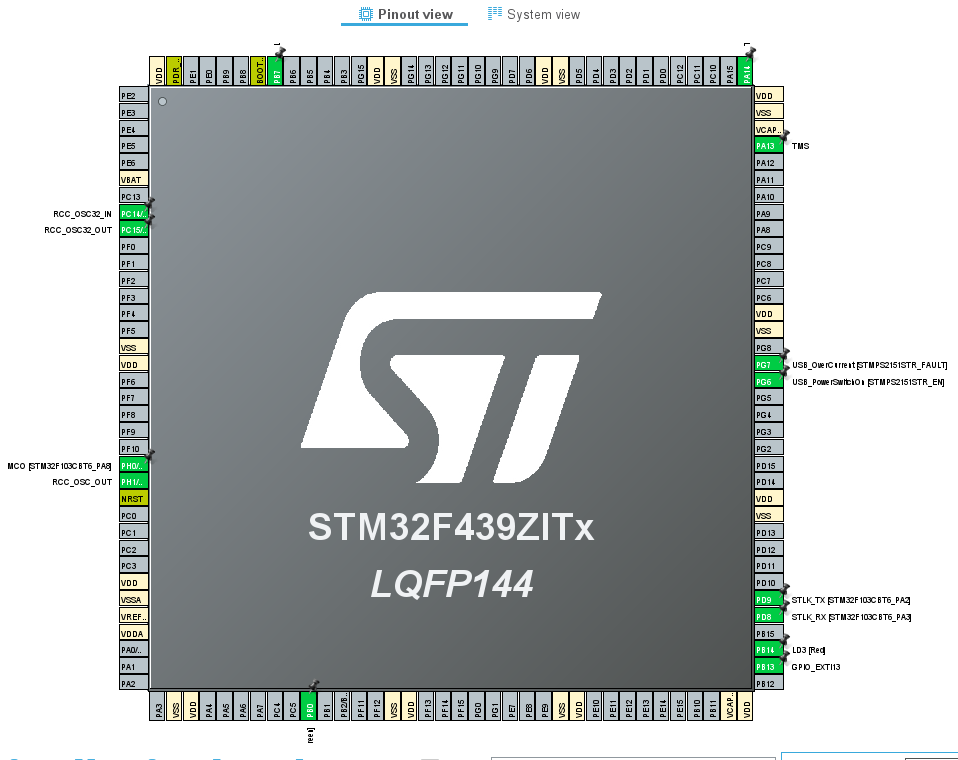
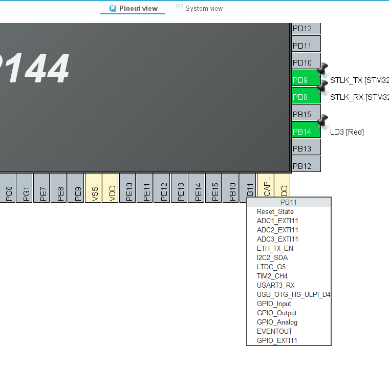
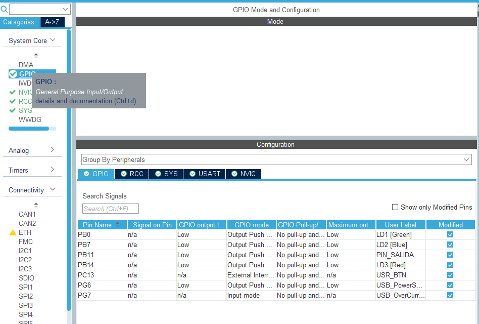
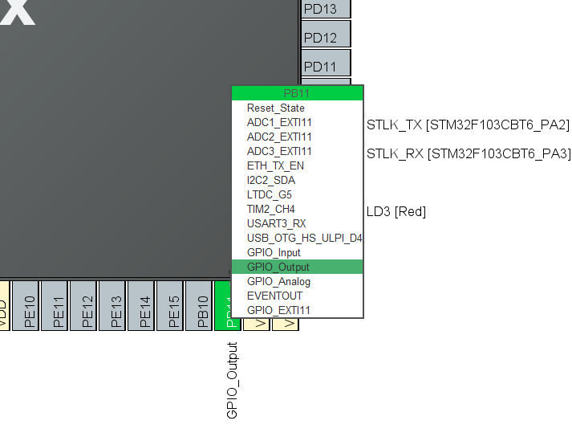
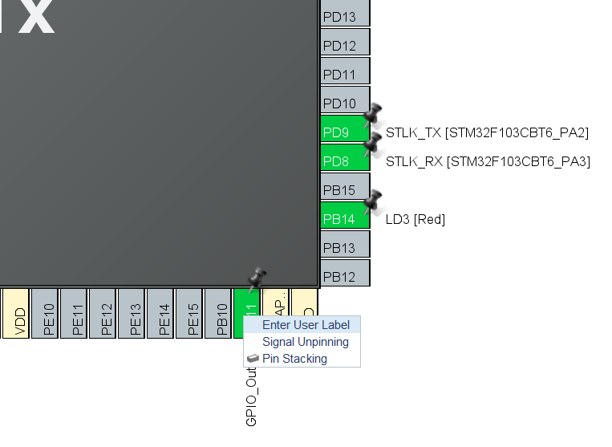
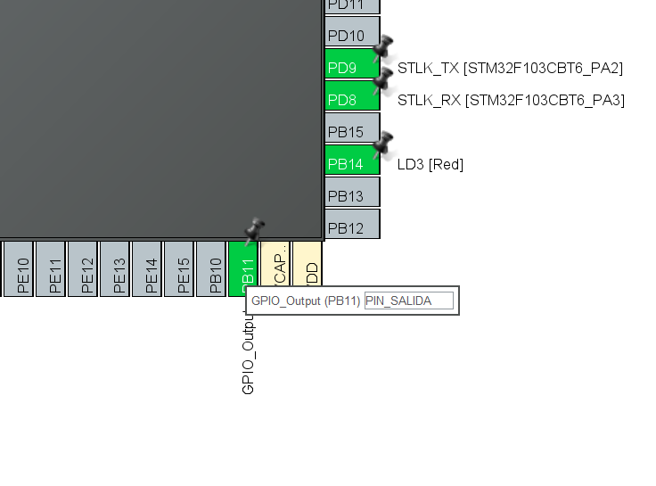

# 05. ⚙️ Configuración de Periféricos e Infraestructura (.ioc)

En esta guía abordamos la configuración lógica del microcontrolador utilizando la interfaz gráfica. Estableceremos el corazón del sistema (Clock) y la interfaz de entrada/salida (GPIO), sentando las bases para que nuestros drivers de **Capa 2** operen de forma eficiente.

---

## 1. ⏱️ Configuración del System Clock (180 MHz)
Para que el STM32F439ZI rinda al máximo de su capacidad según el **Reference Manual (RM0090)**, debemos configurar correctamente el **RCC (Reset and Clock Control)**.
1.  **Pestaña System Core:**
    * Sobre el Item RCC y en la ventana *RCC Mode and Configuration* habilitar la opción **Crystal/Ceramic Resonator** para poder usar el cristal externo y poder llegar a la maxima frecuencia *HCLK* (180 MHz).

    

      
       
      <em>Figura 1: Habilitar cristal externo para RCC.</em>
    

2.  **Pestaña Clock Configuration:**
    * **Input Frequency:** Aseguramos que la entrada desde el ST-LINK (HSE) esté en **8 MHz**.
    * **PLL Source Mux:** Seleccionamos **HSE** (High Speed External).
    * **System Clock Mux:** Seleccionamos **PLLCLK**.
    * **HCLK (MHz):** Escribimos **180** y presionamos Enter. El IDE calculará automáticamente los divisores $M, N, P, Q$.

    

      
       
      <em>Figura 2: Configurar HCLK a 180 MHz.</em>
    
 [!CAUTION]
> **Recomendación:** Las placas que tienen la conexión ethernet y otg inician por defecto y su pre configuración altera el calculo de la frecuencia máxima de la placa por ello, para llegar a los 180 MHz se recomienda desactivarlos.

> [!CAUTION]
> **Límites de Bus:** Al configurar 180 MHz, es vital verificar que el bus **APB1** no supere los $45\text{ MHz}$ y el **APB2** los $90\text{ MHz}$. El configurador gráfico resaltará en rojo si los periféricos están fuera de rango, lo que podría causar fallos en comunicaciones I2C o UART.

    
       
      <em>Figura 3: Deshabilitar el modo RMII del módulo ETHERNET.</em>

    
       
      <em>Figura 4: Deshabilitar el modo Device_Only del módulo USB-OTG.</em>

    
       
      <em>Figura 5: Pinout por defecto.</em>

 [!IMPORTANT]
> Para configurar cualquier pin de la placa basta con posarse sobre el cuadro gris asociado al pin que queremos configurar y clickear con el boton izquierdo para desplegar todas las posibles configuraciones del mismo.

    
       
      <em>Figura 6: Ejemplo de posibles configuraciones del pin PB11.</em>

 GPIO**, ajustamos los parámetros que definen el comportamiento eléctrico del pin:
* **GPIO Mode:** *Push-Pull* (estándar) o *Open Drain* (para buses como I2C).
* **GPIO Pull-up/Pull-down:** Activar resistencias internas para evitar estados flotantes en entradas.
* **Maximum Output Speed:** Determina el *Slew Rate*. Para LEDs, se recomienda **Low** para minimizar el ruido electromagnético y el consumo.

    
       
      <em>Figura 7: Ventana GPIO Mode and Configuration.</em>

    
       
      <em>Figura 8: Configuración PB11 como Salida (OUTPUT).</em>

    
       
      <em>Figura 9: Cargar Label asociado a PB11.</em>

    
       
      <em>Figura 10: Etiqueta PIN_SALIDA asociada al Pin PB11.</em>

 Code Generator**:

* **Marcado:** *"Generate peripheral initialization as a pair of '.c/.h' files per peripheral"*. 
    * Esto evita tener un `main.c` gigante y facilita la integración con nuestra **Capa 2**.

---

## 🧭 Mapa de Ruta
1.  **Guía 06:** Anatomía del archivo `main.c` y gestión de Secciones de Usuario.

---
**Siguiente paso:** [06_Estructura_Main](../06_Estructura_Main/README.md)

🛠️ **Carlos** | Estudiante de Ing. Electrónica @UTN_FRT.  
🚀 Apasionado Autodidacta por los Sistemas Embebidos.