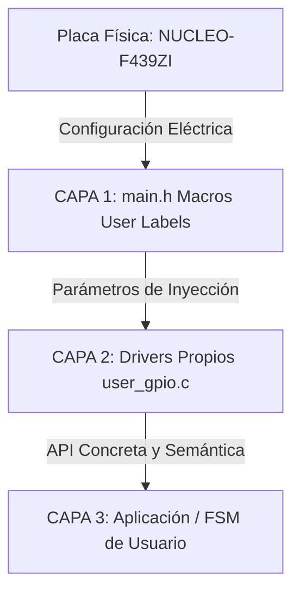

# 07. 🗺️ Hardware Mapping e Infraestructura de la HAL (Capa 1)

## 📌 1. Título y Objetivos
El objetivo de esta guía es analizar e implementar la **Capa 1 (Hardware Mapping)** de nuestra arquitectura utilizando los recursos nativos del ecosistema de ST. A diferencia de otras plataformas (como AVR o EDU-CIAA) donde creamos un archivo de mapeo manual, en este repositorio explotaremos el archivo **`main.h`** autogenerado como nuestra Capa 1 oficial, demostrando cómo las **User Labels** del configurador gráfico aíslan el hardware y alimentan directamente a nuestros drivers de la Capa 2.

---

## 🔬 2. Teoría de Operación (Pines Crudos vs. User Labels)

Para comprender el valor del mapeo de hardware, es necesario contrastar las dos metodologías de desarrollo que conviven al momento de ejecutar la tarea más básica: conmutar un pin de salida (GPIO).

### Enfoque A: El "Hola Mundo" Directo (Sin Etiquetas en el .ioc)
Si se configuran los pines en la interfaz gráfica manteniendo sus nombres nativos de silicio (`PB0`, `PB7`, etc.), el desarrollador se ve obligado a invocar las funciones de la HAL utilizando los registros base y números de pines nativos directamente en la lógica:

```c
/* USER CODE BEGIN WHILE */
while (1)
{
    HAL_GPIO_WritePin(GPIOB, GPIO_PIN_0, GPIO_PIN_SET);   // Enciende el LED Verde
    HAL_Delay(500);                                       // Bloqueo de 500 ms
    HAL_GPIO_WritePin(GPIOB, GPIO_PIN_0, GPIO_PIN_RESET); // Apaga el LED Verde
    HAL_Delay(500);
}
```

* **Pros**: Es inmediato y útil para pruebas rápidas de laboratorio o depuración con instrumental (osciloscopio/tester), ya que el código refleja textualmente la pata física del integrado.
* **Contras (Nula Portabilidad)**: El código queda completamente acoplado a la distribución eléctrica de la placa actual. Si en una revisión de hardware el LED se muda de pin, es necesario rastrear y modificar cada archivo `.c` del proyecto. Además, carece de semántica (al leer `GPIOB, GPIO_PIN_0` el software no explica qué está controlando).

### Enfoque B: El "Hola Mundo" Profesional (Con User Labels en el .ioc)
Al asignar una etiqueta de usuario (ej. `LED_VERDE`) en el configurador gráfico del `.ioc`, el motor de CubeMX exporta e inyecta de forma automática en la cabecera maestra `main.h` un par de macros del preprocesador:

```c
#define LED_VERDE_Pin         GPIO_PIN_0
#define LED_VERDE_GPIO_Port    GPIOB
```
Esto permite reescribir el bucle con un nivel de abstracción superior:

```c
/* USER CODE BEGIN WHILE */
while (1)
{
    HAL_GPIO_WritePin(LED_VERDE_GPIO_Port, LED_VERDE_Pin, GPIO_PIN_SET);   // Enciende
    HAL_Delay(500);
    HAL_GPIO_WritePin(LED_VERDE_GPIO_Port, LED_VERDE_Pin, GPIO_PIN_RESET); // Apaga
    HAL_Delay(500);
}
```

* **Pros**: Legibilidad e independencia frente al cambio de hardware. Si el LED se reubica en otro puerto o pin, basta con reasignar la etiqueta en el entorno gráfico; el generador reescribirá `main.h` y el código compilará perfectamente sin tocar una sola línea de código C.
* **Contras**: La sintaxis nativa de la HAL (`LED_VERDE_GPIO_Port`, `LED_VERDE_Pin`) tiende a volverse un poco extensa, pero es el precio a pagar para mantener el proyecto modular y limpio.

---

## 🏗️ 3. Arquitectura del Software (main.h como Capa 1)

En este esquema de trabajo, **`main.h` es nuestra Capa 1**. No necesitamos añadir archivos intermediarios redundantes. Nuestros drivers de la **Capa 2** (`user_gpio.h`, `user_usart.h`, etc.) incluirán directamente a `main.h` para absorber estas macros y exponer una API limpia hacia la aplicación.

### 📊 Diagrama Arquitectónico (Flujo de Abstracción)


### 💻 Conexión de Capa 1 con Capa 2

Cuando desarrollemos, por ejemplo, nuestro driver nativo de GPIO en la **Capa 2**, el archivo de implementación recibirá los datos de la Capa 1 simplemente haciendo la inclusión correspondiente:

```c
// En tu archivo de Capa 2: user_gpio.c
#include "user_gpio.h"
#include "main.h" // Inclusión de la Capa 1 para heredar el Hardware Mapping

void User_GPIO_Toggle_Green_LED(void)
{
    // Consumimos las macros de la Capa 1 de forma semántica
    HAL_GPIO_TogglePin(LED_VERDE_GPIO_Port, LED_VERDE_Pin);
}
```

## 🛡️ 4. Detalles de Robustez (Seguridad Eléctrica mediante HAL)

Delegar el mapa de hardware al `main.h` generado por el entorno nos aporta dos ventajas críticas de robustez:

* **Sincronización Atómica del Entorno**: Al modificar cualquier pin en el `.ioc` (por ejemplo, cambiar el pulsador a otro puerto por cuestiones de ruteo del PCB), el IDE regenera las macros en `main.h` al instante. Esto elimina el "error humano" de actualizar el código en un lado y olvidarse de cambiarlo en el archivo de configuración de pines, evitando cortocircuitos o lecturas de pines flotantes.
* **Coherencia de Tipos de Datos**: Las macros generadas se asocian directamente con los tipos nativos de la HAL (`GPIO_TypeDef*` y `uint16_t`). Al usarlas en par (`Port` y `Pin`), nuestros drivers de la **Capa 2** manipulan el hardware garantizando que no se inyecten valores de registros cruzados.

---

## 🎛️ 5. Mapeo de Hardware (Tabla de Pines de la Nucleo)

A continuación se detalla la matriz de correspondencia cruzada entre la topología física de la placa de desarrollo **NUCLEO-F439ZI**, los recursos del silicio del MCU y las macros de Capa 1 que utilizaremos:

| Componente Físico | Pin del MCU | Puerto HAL | Macro Autogenerada (Capa 1 en `main.h`) | Uso en el Driver (Capa 2) |
| :--- | :--- | :--- | :--- | :--- |
| **LED Verde (LD1)** | `PB0` | `GPIOB` | `LED_VERDE_Pin` / `LED_VERDE_GPIO_Port` | Control de Estado Interno / Debug |
| **LED Azul (LD2)** | `PB7` | `GPIOB` | `LED_AZUL_Pin` / `LED_AZUL_GPIO_Port` | Estado de la FSM / Comunicaciones |
| **LED Rojo (LD3)** | `PB14` | `GPIOB` | `LED_ROJO_Pin` / `LED_ROJO_GPIO_Port` | Bloqueo por Error Crítico |
| **Pulsador Usuario**| `PC13` | `GPIOC` | `USR_BTN_Pin` / `USR_BTN_GPIO_Port` | Disparo de Interrupción EXTI |

---

## 🏁 6. Conclusión

En este repositorio, la **Capa 1 (Hardware Mapping)** no requiere código manual extra: está resuelta de forma elegante y nativa por el archivo `main.h`. Al asignarle nombres semánticos a los pines desde el configurador gráfico, transformamos una herramienta automática en el cimiento de nuestra arquitectura. De esta manera, separamos las dependencias físicas de la placa y dejamos el terreno pavimentado para que la **Capa 2** desarrolle sus drivers soberanos con total libertad.

---
**Siguiente paso:** [08_Drivers_Propios_GPIO](../08_Drivers_Propios_GPIO/README.md)

🛠️ **Carlos** | Estudiante de Ing. Electrónica @UTN_FRT.  
🚀 Apasionado Autodidacta por los Sistemas Embebidos.