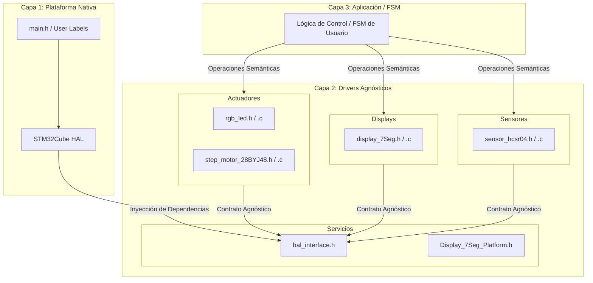

# 🔌 Drivers Genéricos y Arquitectura de Abstracción (Capa 2)

## 📌 1. Título y Objetivos
El objetivo de este directorio es centralizar, estructurar y desarrollar las APIs de control para todos los componentes y periféricos externos del sistema, agrupados en cuatro subcapas funcionales: **Actuadores**, **Displays**, **Sensores** y **Servicios**. Toda la **Capa 2** se diseña bajo un paradigma estrictamente **agnóstico al silicio**, utilizando una Capa de Abstracción de Plataforma (PAL) para garantizar que la lógica de los componentes sea 100% portable a otras arquitecturas (como AVR o EDU-CIAA) sin necesidad de modificar el núcleo algorítmico del firmware.

---

## 🔬 2. Teoría de Operación (Inyección de Dependencias y la PAL)

El mayor desafío al desarrollar drivers en sistemas embebidos de nivel profesional es evitar el acoplamiento rígido al hardware. Si un driver de LED RGB o de motor paso a paso invoca directamente a macros o funciones nativas de un fabricante (como `HAL_TIM_PWM_Start()`), ese código queda encadenado a esa línea de microcontroladores.

Para romper este lazo de dependencia, implementamos una **PAL (Platform Abstraction Layer)** basada en **Inyección de Dependencias por Punteros a Función** (Tablas de despacho / *vtables* en C).

### El Contrato de Software (`hal_interface_t`)
En lugar de que el driver conozca las funciones específicas de STMicroelectronics, se define un "contrato" universal de servicios dentro de `Drivers/Servicios/hal_interface.h`:

```c
typedef void (*pwm_write_ptr)(generic_pwm_t ch, uint16_t value);
typedef uint32_t (*tick_get_ptr)(void);
typedef void (*gpio_write_ptr)(generic_gpio_t gpio, bool state);

typedef struct {
    gpio_write_ptr  gpio_write;
    pwm_write_ptr   pwm_write;
    tick_get_ptr    get_tick;
    /* ... otros servicios ... */
} hal_interface_t;
```

* **El Driver (Consumidor)**: Recibe esta estructura de servicios durante su inicialización (`Init`) y la almacena localmente en su instancia de objeto. Cuando necesita alterar un estado lógico o un ciclo de trabajo PWM, ejecuta el puntero a función correspondiente (ej: `led->pal.pwm_write(...)`). El driver desconoce por completo qué pasa a nivel de registros; solo sabe qué acción solicita.
* **La Plataforma (Proveedor)**: El código específico de la placa (en nuestro caso, dentro de las secciones de usuario de **STM32CubeIDE**) crea pequeñas funciones "adaptadoras" que envuelven a la HAL de ST y las vincula a la estructura del driver durante el arranque del sistema.

---

## 🏗️ 3. Arquitectura del Software (Organización de la Capa 2)

Para mantener una cohesión alta y un bajo acoplamiento, la Capa 2 se divide en subdirectorios bien definidos según la naturaleza funcional de cada periférico:

### 📊 Diagrama Arquitectónico de Drivers


### 💻 Detalle de Subdirectorios

* **[`Actuadores/`](./Actuadores/)**: Módulos encargados de modificar el estado físico del entorno o dar alertas visuales (ej: controlador de LEDs RGB mediante PWM o secuencias lógicas para motores paso a paso).
* **[`Displays/`](./Displays/)**: Controladores dedicados a la interfaz hombre-máquina (HMI). Abstraen la multiplexación de displays de 7 segmentos o los *timings* de pantallas analizadas.
* **[`Sensores/`](./Sensores/)**: Módulos destinados a la adquisición, filtrado primario y conversión de magnitudes físicas (ej: cálculo de distancia por tiempo de eco). Transmutan cuentas de silicio en unidades puras de ingeniería.
* **[`Servicios/`](./Servicios/)**: Infraestructura lógica de soporte que provee herramientas al sistema (ej: la definición de la interfaz de la PAL) sin interactuar con hardware físico externo.

---

## 🛡️ 4. Detalles de Robustez (Aislamiento y Multitarea Cooperativa)

Para asegurar el comportamiento determinista de la arquitectura en entornos de tiempo real, aplicamos reglas estrictas de diseño de software:

* **Ocultamiento de Tipos Nativa (`void*`)**: Descriptores como `generic_gpio_t` o `generic_pwm_t` utilizan punteros genéricos (`void* port`, `void* timer_handle`). Esto impide la filtración de dependencias (*dependency bleed*), logrando que los archivos de la **Capa 2** no necesiten incluir cabeceras pesadas del fabricante (como `stm32f4xx_hal.h`).
* **Asincronismo por Diseño (Non-blocking Code)**: Queda terminantemente prohibido el uso de lazos de espera activa o retrasos bloqueantes dentro de las funciones de actualización periódica (`Task`) de los drivers. El control temporal se realiza por diferencias de Ticks (`get_tick()`), liberando al procesador Cortex-M4 para ejecutar multitarea cooperativa real.

---

## 🎛️ 5. Mapeo de Infraestructura de Drivers

A continuación se detalla la matriz de correspondencia de los módulos de la **Capa 2** actualmente desarrollados o en proceso de refactorización dentro de este repositorio:

| Módulo Driver | Subcarpeta | Servicio PAL Requerido | Hardware Físico Asociado (Nucleo-F439ZI) | Estado |
| :--- | :--- | :--- | :--- | :--- |
| **`hal_interface`** | `Servicios` | N/A (Define el Contrato) | Infraestructura Lógica de Abstracción | ✅ Listo |
| **`Display_7Seg_Platform`** | `Servicios` | N/A (Define el Contrato) | Infraestructura Lógica de Abstracción para driver **display_7Seg** | ✅ Listo |
| **`rgb_led`** | `Actuadores` | `pwm_write`, `get_tick` | LEDs RGB mediante canales TIM PWM | ✅ Listo |
| **`step_motor_28BYJ48`**| `Actuadores` | `gpio_write`, `get_tick` | Motor Paso a Paso 28BYJ-48 / ULN2003 | 🚀 Refactorizando |
| **`display_7Seg`** | `Displays` | `gpio_write` | Displays de 7 Segmentos (Ánodo/Cátodo) | ✅ Listo |
| **`sensor_hcsr04`** | `Sensores` | `gpio_write`, `gpio_read`, `get_tick` | Sensor de Ultrasonido (Trigger / Echo) | ✅ Listo |

---

## 🏁 6. Conclusión

La organización del directorio `Drivers/` consolida la soberanía de nuestro desarrollo. Al relegar la HAL de STMicroelectronics al rol de un simple "proveedor de servicios de bajo nivel", garantizamos que las horas de ingeniería invertidas en refinar algoritmos complejos (como transiciones HSV, multiplexación de displays o rampas de aceleración del motor paso a paso) queden resguardadas de la obsolescencia del hardware o cambios imprevistos en el diseño eléctrico.

---

🛠️ **Carlos** | Estudiante de Ing. Electrónica @UTN_FRT.  
🚀 Apasionado Autodidacta por los Sistemas Embebidos.