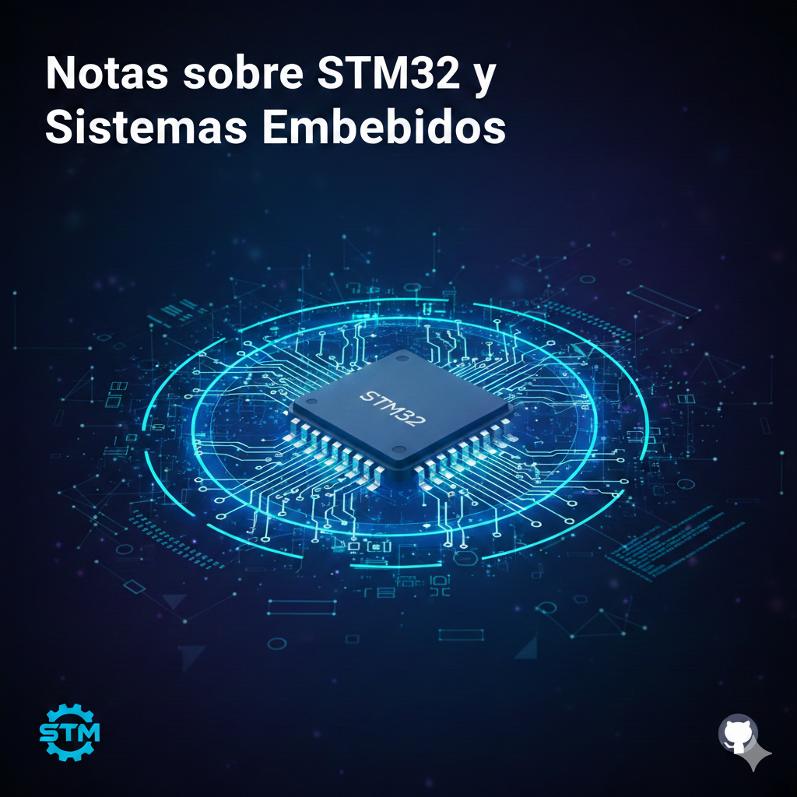

  

  # Notas sobre STM32 y Sistemas Embebidos 🚀
  
  
  
  

  Este repositorio es mi bitácora personal de aprendizaje sobre microcontroladores **STM32** y el desarrollo de sistemas embebidos profesionales.

---

## 🛠️ Entorno de Desarrollo

Para este proyecto utilizo un stack de herramientas estándar de la industria:

* **Placa:** STM32 Nucleo-F439ZI (Cortex-M4 @ 180MHz)
* **IDE:** STM32CubeIDE
* **Framework:** STM32Cube HAL (Hardware Abstraction Layer)

---

## 📂 Estructura del Aprendizaje

### 📘 [Documentación y Guías](./Documentacion/)
*Fundamentos técnicos y buenas prácticas antes de programar:*
* **Guía de Supervivencia:** *Particularidades del IDE y regeneración de código.*
* **Arquitectura HAL:** *Estructura de funciones, Handles y Timeouts.*
* **Diccionario de Funciones:** *Sintaxis de WritePin, ReadPin y Delay.*
* **Troubleshooting:** *Solución de errores comunes y Debugging.*

### 🏗️ [01_Nivel Básico (GPIO & Lógica de Control)](./01_Nivel_Basico/) - ✅ ACTUALIZADO 22/01/2026 -
* **01_Hola_Mundo:** *Hola Mundo visual controlando los LEDs de la placa.*
* **02_Tipos_De_Variables:** *Gestión de memoria y tipos de datos de ancho fijo (`stdint.h`).*
* **03_Estructuras:** *Optimización de memoria RAM mediante structs.*
* **04_Bitwise_Logic:** *Manipulación de registros con lógica de bits.*
* **05_GPIO_Input_Polling:** *Lectura de entradas digitales mediante escaneo.*
* **06_LED_Bus_Structures:** *Automatización de secuencias de salida.*
* **07_Display_7_Segmentos:** *Control de display numérico.*
* **08_Multiplex_7Seg:** *Nociones Básicas de Multiplexación.*
* **09_Intro_MEF:** *Introducción y aplicación de MEF simples.*
* **10_API_Drivers:** *Crecion de Drivers Personalizados para gestión de tareas y abstracción de hardware.*
* **11_Debounce_Avanzado:** *Driver para eliminar debounce con MEF y Gestion de Tiempo No Bloqueante.*

#### **[Proyectos Integradores](./01_Nivel_Basico/Proyectos_Integradores/)**
* **01. Contador_Up_Down_7Seg:** *Uso de Active-Low, Debounce y ventana de Reset.*
* **02. Semaforo_Smart:** *Aplicación de Máquina de Estados Finitos (MEF).*
* **03. Simon_Dice:** *Gestión de memoria, arreglos y lógica de juego física.*
* **04.Integracion_Apis:** *Integración de arquitectura de software, modularidad y máquinas de estados.*

### ⚙️ [02_Nivel Intermedio (Periféricos y Eficiencia)](./02_Nivel_Intermedio/)- 🚀 EN CURSO -
* **01_EXTI_Pulsadores:** *Manejo de interrupciones externas para respuesta inmediata.*
* **02_TIM_Basic:** *Introduccion al manejo de base de Tiempos con Timers.*
* **03_TIM_PWM:** *Señales PWM y gestión de Tareas mediante un Planificador -Kernel-*

#### **[Proyectos Integradores](./02_Nivel_Intermedio/Proyectos_Integradores/)**
* **01. Contador_Contador_Displays_7Seg:** *Evolucion del flujo secuencial tradicional hacia una Arquitectura Basada en Tareas y Eventos.*

### 🚀 03_Nivel Avanzado (Arquitectura de alto rendimiento) - PROXIMAMENTE -
* **DMA & RTOS:** *Gestión de tareas paralelas y transferencia de datos eficiente.*
* **Low Power:** *Optimización de consumo energético.*

---

  
<i>Notas creadas durante mi proceso de estudio y experimentación en San Miguel de Tucumán.</i>

